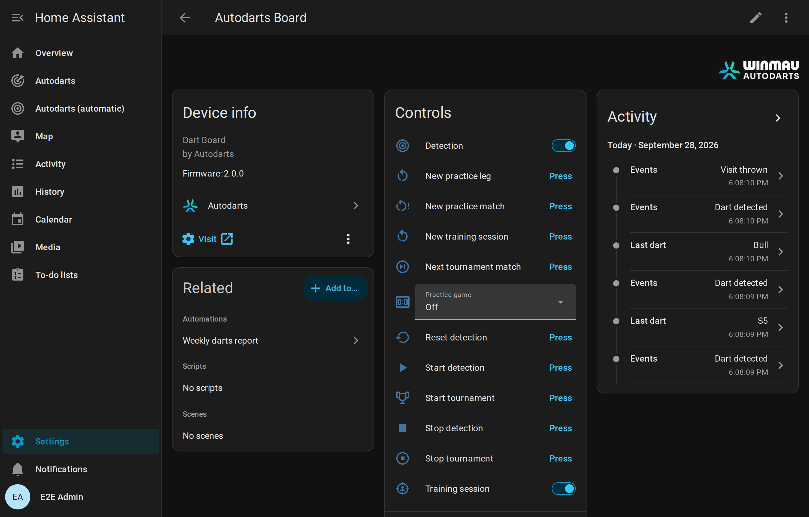

<div align="center">


# Autodarts for Home Assistant

**Your Autodarts board, live in Home Assistant: local, realtime and ready for automations.**

[](https://hacs.xyz)
[](https://www.home-assistant.io/)
[](https://github.com/Dennis-Otto/ha-autodarts/actions/workflows/tests.yml)
[](https://github.com/Dennis-Otto/ha-autodarts/actions/workflows/e2e.yml)
[](https://github.com/Dennis-Otto/ha-autodarts/actions/workflows/secret-scan.yml)
[](https://github.com/Dennis-Otto/ha-autodarts/actions/workflows/codeql.yml)
[](https://github.com/Dennis-Otto/ha-autodarts/actions/workflows/sbom.yml)
[](https://scorecard.dev/viewer/?uri=github.com/Dennis-Otto/ha-autodarts)
[](https://www.bestpractices.dev/projects/14935)

[**Documentation**](docs/README.md) · [**Deutsche Anleitung**](docs/de/README.md) · [Dashboard cards](#dashboard-cards) · [Blueprints](#automations-and-blueprints) · [Troubleshooting](docs/troubleshooting.md)


</div>

## Highlights

- **Local and realtime.** Talks directly to the Autodarts Board Manager in your network. Darts appear within a fraction of a second, and no cloud account or client ID is needed.
- **Found automatically.** Board Manager 2 announces itself on the network, so Home Assistant offers the board with one click. You can also search for your boards or enter an address.
- **Both Board Manager generations.** Works with the classic Board Manager 1 and the headless Board Manager 2. It detects the generation and switches over by itself when you update the board.
- **Six dashboard cards** are included and load automatically:
  - a live dartboard with blinking hit beds and dart positions;
  - a training card with a hit heatmap, personal bests and visit history;
  - a board status card for detection, connections and cameras;
  - a scoreboard for a tablet or TV at the board, readable from the oche, with an optional caller that announces the game;
  - a players card with profiles, head-to-head records and recent matches;
  - a doubles card with the hit rate of every double on the board;
  - plus an automatic dashboard that arranges everything for every board in one click.
- **Training analytics:**
  - training sessions that start with the first dart or on purpose, end after a pause and keep your last 20 sessions;
  - 3-dart average, visits, highest visit, 100+/140+/180 and triple rate;
  - hits per bed, stored locally and kept across restarts.
  - personal bests with an event when you beat one, a training streak in days and a daily goal in darts;
  - player profiles with statistics and personal bests per name, a match history and head-to-head records;
  - a doubles analysis with the hit rate of every double and checkout routes over your strongest doubles.
- **Practice games and matches.** Play X01 (101 to 1001, with double in and a bull-off if you like), Cricket or the party games Shanghai, Halve-It and Killer on the local board, alone or as a match of up to four players with legs and sets. The remaining score counts down, busts are recognised, and the live card shows the checkout route, the bed to aim at and a scoreboard, in Cricket a chalkboard with marks, points and marks per round. Four training games train the basics: Around the Clock, doubles training, checkout training and Bob's 27. First-9 average, checkout rate, doubles rate and legs per day show your progress.
- **Automations that feel like a stage.** Board events for every dart, correction, takeout, completed visit and training session, plus ten ready-made blueprints: 180 celebrations, a dart caller, takeout lights, automatic detection, alerts, daily reports, a training session routine, a practice caller, a highlight photo and a light show.
- **Full control.**
  - Start, stop and reset detection; calibrate the board or single cameras; restart Board Manager.
  - Board settings, camera standby and Board Manager updates.
  - Health sensors for every camera.
- **Built to last.**
  - Meets every rule of the [Home Assistant integration quality scale](https://developers.home-assistant.io/docs/core/integration-quality-scale/) up to Platinum ([self-assessment](custom_components/autodarts/quality_scale.yaml)), including strict typing.
  - Reconnects automatically and flags a wrong board address in Repairs.
  - Redacts all secrets in diagnostics.
  - Translated into English and German.
  - More than 350 automated tests, including a Docker end-to-end test against both Board Manager generations and a real browser test of every card.

## Screenshots

<table>
  <tr>
    <td width="50%">
      <picture>
        <source media="(prefers-color-scheme: light)" srcset="docs/images/en/training-card-light.png">
        
      </picture>
      <p align="center"><b>Training card</b>: heatmap, statistics and recent visits</p>
    </td>
    <td width="50%">
      <picture>
        <source media="(prefers-color-scheme: light)" srcset="docs/images/en/status-card-light.png">
        
      </picture>
      <p align="center"><b>Board status card</b>: detection, connections, cameras</p>
    </td>
  </tr>
  <tr>
    <td width="50%">
      <picture>
        <source media="(prefers-color-scheme: light)" srcset="docs/images/en/card-light.png">
        
      </picture>
      <p align="center"><b>Live card</b>: the current visit on a real board</p>
    </td>
    <td width="50%">
      
      <p align="center"><b>Device page</b>: controls, sensors and diagnostics</p>
    </td>
  </tr>
  <tr>
    <td width="50%">
      
      <p align="center"><b>Scoreboard</b>: a 501 match on the screen at the board</p>
    </td>
    <td width="50%">
      
      <p align="center"><b>Cricket</b>: marks, points and the next number</p>
    </td>
  </tr>
  <tr>
    <td width="50%">
      
      <p align="center"><b>Practice game</b>: the checkout route follows every dart</p>
    </td>
    <td width="50%">
      
      <p align="center"><b>Training game</b>: Around the Clock</p>
    </td>
  </tr>
</table>

## Quick start

1. **Install with HACS.**

   [](https://my.home-assistant.io/redirect/hacs_repository/?owner=Dennis-Otto&repository=ha-autodarts&category=integration)

   Or add `https://github.com/Dennis-Otto/ha-autodarts` in HACS as a custom repository of the type **Integration**, then install **Autodarts** and restart Home Assistant.

2. **Add your board.** If your board runs Board Manager 2, Home Assistant usually shows it under **Settings → Devices & services → Discovered** already. Otherwise:

   [](https://my.home-assistant.io/redirect/config_flow_start/?domain=autodarts)

   Choose **Search for boards on this network** or **Enter board address** and confirm. You need no account, password or client ID.

3. **Add the cards.** Edit a dashboard, choose **Add card** and search for *Autodarts*; all six cards pick your board automatically. Or create a complete dashboard in one step: **Settings → Dashboards → Add dashboard → Autodarts**.

The [installation guide](docs/installation.md) covers requirements, manual installation, cloud linking, updates and removal.

## What you get

| Area | Entities and features | Board Manager 1 | Board Manager 2 |
| --- | --- | :---: | :---: |
| Live visit | Detection status, last dart, darts in visit, visit score with dart positions | ✓ | ✓ |
| Board events | Dart detected and corrected, takeout started and finished, visit thrown and completed, status changed, session started and ended, bust, leg won, match won, turn changed, bull-off won, training game finished, checkout attempt, personal best, daily goal reached | ✓ | ✓ |
| Training | Training sessions with automatic start and end and the last 20 sessions; darts, points, 3-dart average, visits, highest visit, 100+/140+/180, triples, doubles, bulls, misses, hits per bed | ✓ | ✓ |
| Practice game | X01 from 101 to 1001 with double in and bull-off, Cricket, Shanghai, Halve-It and Killer for 1–4 players, double out, legs and sets, player names, remaining score, busts, checkout routes and the last 10 legs; training games Around the Clock, doubles, checkout training and Bob's 27 | ✓ | ✓ |
| Actions | `autodarts.start_game`: start X01 or a training game with players, names and format in one call, also by voice | ✓ | ✓ |
| Controls | Detection switch; start, stop and reset buttons; calibration (board and per camera); restart; camera streams | ✓ | ✓ |
| Settings | Calibrate on start, automatic recalibration, distortion correction, camera standby | ✓ | ✓ |
| Health | Board Manager connection, realtime connection, cameras active, calibration, camera problems (overall and per camera), frame rates | ✓ | ✓ |
| Motion | Hand detected, image stable, darts partially or fully removed | ✓ | ✓ |
| Board cloud link | Switch and buttons for the board's own cloud connection | ✓ | – |
| System | Autodarts cloud connection, CPU and memory, operating system, processor and detection software of the board PC, Board Manager update | – | ✓ |
| Cameras | One camera entity per board camera (disabled by default): snapshots, and the live stream with Board Manager 2 | ✓ | ✓ |
| Cloud match data *(optional)* | Board status, game mode, match state, round, visit score, darts thrown | Needs an Autodarts client ID | Needs an Autodarts client ID |

The [entity reference](docs/entities.md) lists every entity with its states, attributes and defaults.

## Dashboard cards

The integration serves its cards itself, so no dashboard resource is needed. Each card has a visual editor, follows your theme and language and works on phones.

| Card | Type | Highlights |
| --- | --- | --- |
| **Autodarts** | `custom:autodarts-card` | The current visit on a dartboard drawn to Board Manager geometry. Hit beds blink, darts appear at their detected position and the board glows in the detection status colour. Also shows training statistics, connection chips and controls. |
| **Autodarts training** | `custom:autodarts-training-card` | 3-dart average, a heatmap of your hits (per bed or per number), statistics tiles, your most hit beds and a chart of recent visits, plus a *New session* button. |
| **Autodarts scoreboard** | `custom:autodarts-scoreboard-card` | A large scoreboard for a tablet or TV: every player's score with the checkout route, the Cricket chalkboard, the target of a training game, the winner and the current visit. |
| **Autodarts players** | `custom:autodarts-players-card` | Every named player's statistics and personal bests, head-to-head records and the recent matches. |
| **Autodarts doubles** | `custom:autodarts-doubles-card` | The hit rate of every double on the board, for everybody or one player, with the favourite double. |
| **Autodarts board status** | `custom:autodarts-status-card` | Detection switch, Board Manager version and updates, connections, board PC load, a health tile for every camera and maintenance controls. |

```yaml
type: custom:autodarts-training-card
mode: numbers        # heatmap per number instead of per bed
history_size: 30     # visits in the chart
```

Or let the integration build a complete dashboard with live, scoreboard, training and board views for every board: **Settings → Dashboards → Add dashboard → Autodarts**, or in YAML simply `strategy: {type: custom:autodarts}`.

All options, with screenshots, are in the [card guide](docs/cards.md).

## Automations and blueprints

Import a blueprint with one click, choose your board and you're done:

| Blueprint | Import |
| --- | --- |
| **Celebrate a visit score.** Your actions for every 180, every ton, or any score you choose, the moment the third dart lands. | [](https://my.home-assistant.io/redirect/blueprint_import/?blueprint_url=https%3A%2F%2Fgithub.com%2FDennis-Otto%2Fha-autodarts%2Fblob%2Fmain%2Fblueprints%2Fautomation%2Fautodarts%2Fvisit_score.yaml) |
| **Dart caller.** Every visit is announced on your speakers, with a special call for 180. Every dart can be called too. | [](https://my.home-assistant.io/redirect/blueprint_import/?blueprint_url=https%3A%2F%2Fgithub.com%2FDennis-Otto%2Fha-autodarts%2Fblob%2Fmain%2Fblueprints%2Fautomation%2Fautodarts%2Fdart_caller.yaml) |
| **Takeout actions.** Light up the board while you pull your darts. | [](https://my.home-assistant.io/redirect/blueprint_import/?blueprint_url=https%3A%2F%2Fgithub.com%2FDennis-Otto%2Fha-autodarts%2Fblob%2Fmain%2Fblueprints%2Fautomation%2Fautodarts%2Ftakeout.yaml) |
| **Start and stop detection automatically**, based on presence in the darts room. | [](https://my.home-assistant.io/redirect/blueprint_import/?blueprint_url=https%3A%2F%2Fgithub.com%2FDennis-Otto%2Fha-autodarts%2Fblob%2Fmain%2Fblueprints%2Fautomation%2Fautodarts%2Fauto_detection.yaml) |
| **Board problem alert** when the board goes offline or a camera fails, with an optional all-clear. | [](https://my.home-assistant.io/redirect/blueprint_import/?blueprint_url=https%3A%2F%2Fgithub.com%2FDennis-Otto%2Fha-autodarts%2Fblob%2Fmain%2Fblueprints%2Fautomation%2Fautodarts%2Fboard_alert.yaml) |
| **Training report.** Your daily summary with the 3-dart average. | [](https://my.home-assistant.io/redirect/blueprint_import/?blueprint_url=https%3A%2F%2Fgithub.com%2FDennis-Otto%2Fha-autodarts%2Fblob%2Fmain%2Fblueprints%2Fautomation%2Fautodarts%2Ftraining_report.yaml) |
| **Training session routine.** Light, detection and calibration follow your training sessions. | [](https://my.home-assistant.io/redirect/blueprint_import/?blueprint_url=https%3A%2F%2Fgithub.com%2FDennis-Otto%2Fha-autodarts%2Fblob%2Fmain%2Fblueprints%2Fautomation%2Fautodarts%2Ftraining_session.yaml) |
| **Practice caller.** Who needs what, busts and game shots of the practice game on your speakers. | [](https://my.home-assistant.io/redirect/blueprint_import/?blueprint_url=https%3A%2F%2Fgithub.com%2FDennis-Otto%2Fha-autodarts%2Fblob%2Fmain%2Fblueprints%2Fautomation%2Fautodarts%2Fpractice_caller.yaml) |
| **Highlight photo.** A picture of the board on your phone after a 180 or a checkout. | [](https://my.home-assistant.io/redirect/blueprint_import/?blueprint_url=https%3A%2F%2Fgithub.com%2FDennis-Otto%2Fha-autodarts%2Fblob%2Fmain%2Fblueprints%2Fautomation%2Fautodarts%2Fhighlight_photo.yaml) |
| **Light show.** Your WLED presets or room lights for a 180, a high finish, a bust, a won leg or match, a personal best and more, and back to your normal light afterwards. | [](https://my.home-assistant.io/redirect/blueprint_import/?blueprint_url=https%3A%2F%2Fgithub.com%2FDennis-Otto%2Fha-autodarts%2Fblob%2Fmain%2Fblueprints%2Fautomation%2Fautodarts%2Flight_show.yaml) |

Prefer writing your own? The [automation guide](docs/automations.md) explains the board events and has ready-to-use examples.

## How it works

<picture>
  <source media="(prefers-color-scheme: dark)" srcset="docs/images/en/architecture-dark.png">
  
</picture>

- The integration listens to the Board Manager's realtime events and reconciles them with an HTTP read every 10 to 30 seconds. Without realtime events, it reads every 2 seconds instead. Short interruptions keep the values and the visit in progress.
- Actions are sent once, and failures are reported instead of retried.
- The training session is computed from what the board detects and stored in Home Assistant.

Details: [how it works](docs/how-it-works.md).

## Privacy and security

- **Local first.** Local mode sends nothing to the internet. *Search for boards* asks the public Autodarts discovery service which boards are registered from your internet connection; nothing else leaves your network.
- **No passwords.** The optional cloud link uses the Autodarts device login; Home Assistant never sees your password.
- **Secrets stay on the board.** Board API keys, TLS keys and camera device paths are never stored or shown, not even in diagnostics.
- **Security design:** the [security page](docs/security.md) documents trust boundaries, threats and countermeasures.
- **Security reports:** please report vulnerabilities privately as described in [SECURITY.md](SECURITY.md).

## Known limitations

- **Cloud match data is on hold.** It needs an OAuth client ID that Autodarts issues for this integration, and none is bundled yet. Everything local works without it.
- **No game logic in training.** Training statistics count the darts the board detects. They do not know players, legs, busts or checkouts.
- **Board Manager updates are not installed from Home Assistant.** The update entity reports new Board Manager 2 versions; you install them on the board PC.
- **Live camera view with Board Manager 2 only.** With Board Manager 1, the camera entities show snapshots.
- **Test coverage.** Every control is tested against a protocol-accurate Board Manager simulator in CI. Reads are also verified against real Board Manager 1.0.7 and 2.0.0 installations.

## Documentation

| Guide | Contents |
| --- | --- |
| [Installation](docs/installation.md) | Requirements, HACS and manual installation, setup, cloud link, updates, removal |
| [Entities](docs/entities.md) | Every entity, event, state and attribute |
| [Dashboard cards](docs/cards.md) | All six cards and their options |
| [Automations](docs/automations.md) | Board events, blueprints and examples |
| [How it works](docs/how-it-works.md) | Data flow, update intervals, training rules, privacy |
| [Troubleshooting](docs/troubleshooting.md) | Common problems, repairs, diagnostics and logs |
| [Security design](docs/security.md) | What is protected, trust boundaries, threats and countermeasures |
| [Roadmap](docs/roadmap.md) | Released versions and what comes next |
| [Development](docs/development.md) | Tests, Docker E2E, demo instance, screenshots, releases |
| [Deutsche Dokumentation](docs/de/README.md) | Die komplette Anleitung auf Deutsch |

## Contributing and support

Contributions are welcome. [CONTRIBUTING.md](CONTRIBUTING.md) explains the checks, and [SUPPORT.md](SUPPORT.md) explains where to ask questions and report bugs. Participation follows the [code of conduct](CODE_OF_CONDUCT.md) and the project's [governance](GOVERNANCE.md).

## Credits and license

This integration started as a fork of [Trkal/HACSAutodarts](https://github.com/Trkal/HACSAutodarts), a cloud-based prototype from April 2026. Since September 2026 it has been rewritten and is maintained independently by [@Dennis-Otto](https://github.com/Dennis-Otto): local realtime control for both Board Manager generations, training analytics, dashboard cards, blueprints, tests and documentation. Both use the `autodarts` domain; the [installation guide](docs/installation.md#update-from-the-original-integration) explains how to switch. Thanks to Trkal for the original work and to the Autodarts team for their open local API.

Licensed under the [MIT license](LICENSE). Autodarts and Winmau names and brand artwork belong to their respective owners. The bundled brand assets identify the supported product and are not covered by the MIT license. This is an unofficial community integration and is not affiliated with Autodarts.
