# Dashboard cards

[← Documentation](README.md) · [Deutsch](de/karten.md)

The integration includes seven cards. Home Assistant loads them automatically, so no dashboard resource and no separate HACS download are needed. Each card:

- has a visual editor and follows your theme (light or dark) and language (English or German);
- adapts to its width, from a phone to a wall tablet;
- finds your board by itself. With several boards, choose one in the editor.

To add one, edit a dashboard, select **Add card** and search for **Autodarts**. The card picker names the cards in your language and links each one to its section below.

## Live card

`custom:autodarts-card` shows the current visit, dart by dart, on a board drawn with the geometry of the Autodarts Board Manager.

<picture>
  <source media="(prefers-color-scheme: light)" srcset="images/en/card-light.png">
  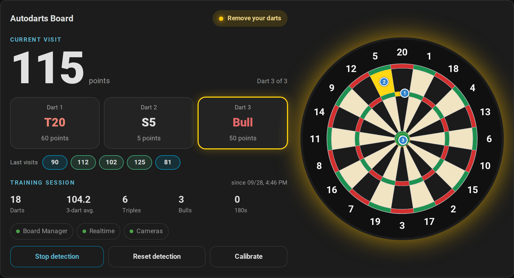
</picture>

- **Visit:** score, the three dart slots and a progress indicator. The latest dart is outlined.
- **Last visits:** the scores of your last five visits, colored like the training card's chart. Hover one for its darts.
- **Practice game:** while a [practice game](entities.md#practice-game) runs, the remaining score, the checkout route and busts appear above the dart slots, and the board outlines the bed to aim at next. "No checkout possible" appears only for a score that could be finished in one visit: up to 170 with double out, up to 180 without. In a match, a list shows every player with the remaining score, legs, sets and average, and highlights the player at the board; [start scores](entities.md#teams-and-start-scores) of their own appear beside the names, and a team match lists the two teams. A won match shows its result in large type, for example 2 : 1, and the [match summary](#match-summary) instead of the list. In the [party games](entities.md#party-games), the panel shows the round or hole, the target and every player's points or, in Killer, their number and lives, and who is out. The bull of Around the Clock and Halve-It, where the outer bull counts too, reads *Bull (25/50)*, and both bull beds are outlined. During a bull-off it lists the bed and the distance of every dart and who leads, and it says when a tie throws again. In the [Cricket games](entities.md#cricket), a chalkboard shows the marks of every player or team on the numbers of the game, the points and the marks per round, dims the numbers everybody has closed and outlines the next open number on the board. Screen readers read the marks as words. In a [training game](entities.md#training-games), the panel shows the target, the progress, darts and hit rate (Bob's 27: points and round; checkout training and 121 checkout: the route and the checkout rate; Catch 40, the JDC Challenge and the singles training: the round or part and the points), and the board outlines the beds of the target. The live card and the [scoreboard](#scoreboard-card) share how they show a game, so both always tell the same.
- **Board:**
  - Hit beds blink in the highlight color.
  - Numbered markers show where each dart landed.
  - The board glows in the detection status color of your theme: green (success) when ready, amber during a takeout, orange (warning) when stopped, purple while calibrating, red (error) when offline or when a camera has a problem.
- **Training statistics:** darts, 3-dart average, triples, bulls and 180s of the session.
- **Connections:** Board Manager, realtime and cameras. Tap a chip for details.
- **Controls:** start or stop detection, reset detection and calibrate. Resetting and calibrating need a second tap to confirm. Boards without a detection switch get the start or stop button that fits the board status.

Tap the board, or press Enter or Space on it, to open the visit details. Numbers, dates and times follow your [profile settings](https://www.home-assistant.io/docs/organizing/users/#user-profile): number format, 12- or 24-hour clock and the time zone of the server or the browser.

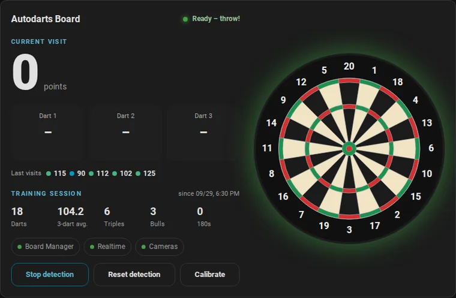

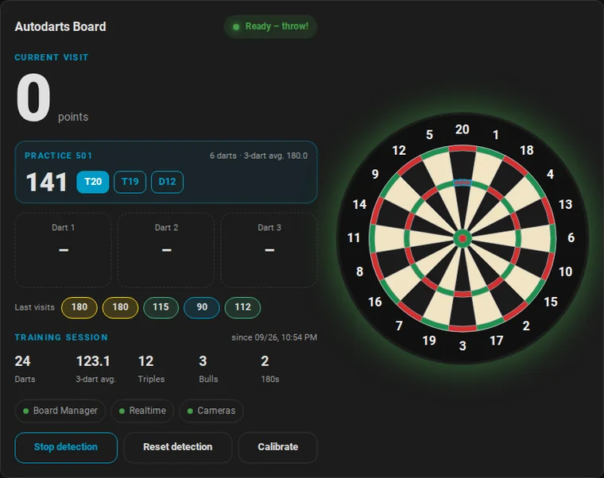

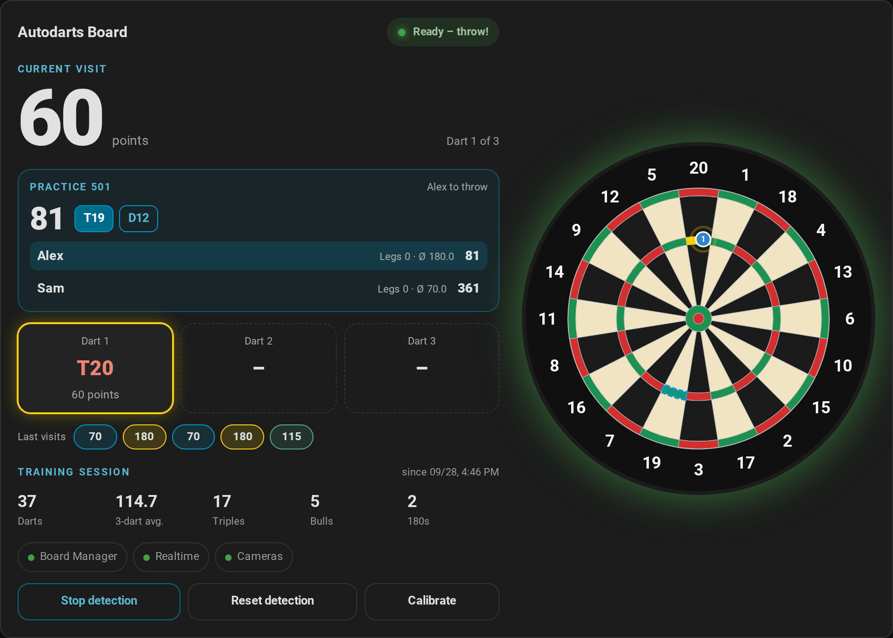

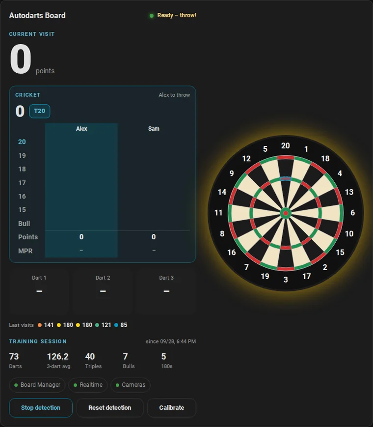

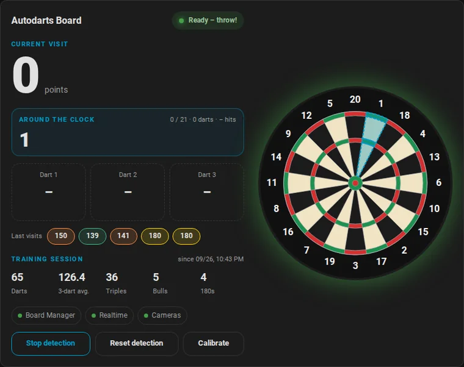

### Options

| Option | Values | Default | Description |
| --- | --- | --- | --- |
| `device_id` | device | first board | The board to show |
| `title` | text | board name | Card title |
| `layout` | `auto`, `horizontal`, `vertical`, `board` | `auto` | Board on the right, board below, or board only. `auto` switches to vertical on narrow cards |
| `board_style` | `classic`, `autodarts` | `classic` | Classic board with wires, or the flat Autodarts look |
| `highlight` | `visit`, `last`, `none` | `visit` | Highlight all darts of the visit, only the last one, or none |
| `blink` | boolean | `true` | Blink the hit beds |
| `show_markers` | boolean | `true` | Show dart positions |
| `show_numbers` | boolean | `true` | Show the numbers around the board |
| `show_stats` | boolean | `true` | Show the training statistics |
| `show_recent` | boolean | `true` | Show the last visits |
| `show_practice` | boolean | `true` | Show the practice game and the bed to aim at |
| `show_summary` | boolean | `true` | Show the [match summary](#match-summary) when an X01 or Cricket match ends |
| `summary_seconds` | 0–600 | `0` | How long the summary stays, in seconds; `0` keeps it until the next game starts |
| `show_connection` | boolean | `true` | Show the connection chips |
| `show_controls` | boolean | `true` | Show the controls |
| `accent_color` | [color](#colors) | theme primary color | Labels and main button |
| `highlight_color` | [color](#colors) | `#ffd60a` (gold) | Hit beds and the latest dart |

<table>
  <tr>
    <td>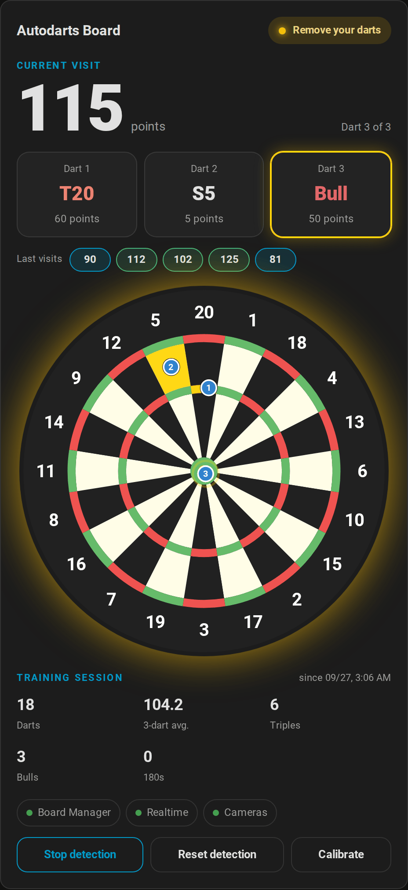</td>
    <td>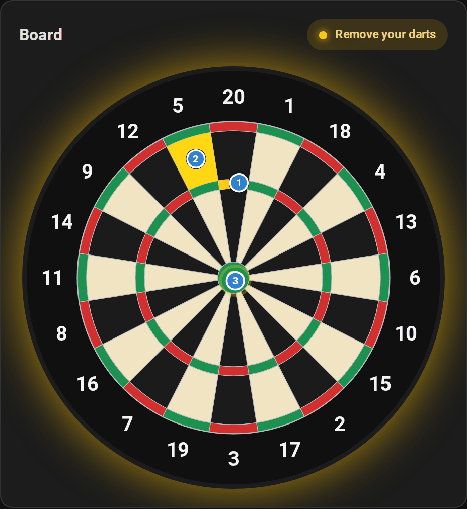</td>
  </tr>
  <tr>
    <td align="center"><code>layout: vertical</code>, <code>board_style: autodarts</code></td>
    <td align="center"><code>layout: board</code></td>
  </tr>
</table>

```yaml
type: custom:autodarts-card
layout: vertical
board_style: autodarts
highlight: last
highlight_color: "#00e5ff"
```

## Training card

`custom:autodarts-training-card` turns the local [training session](entities.md#training-session) into a dashboard you'll want to look at after every session.

<picture>
  <source media="(prefers-color-scheme: light)" srcset="images/en/training-card-light.png">
  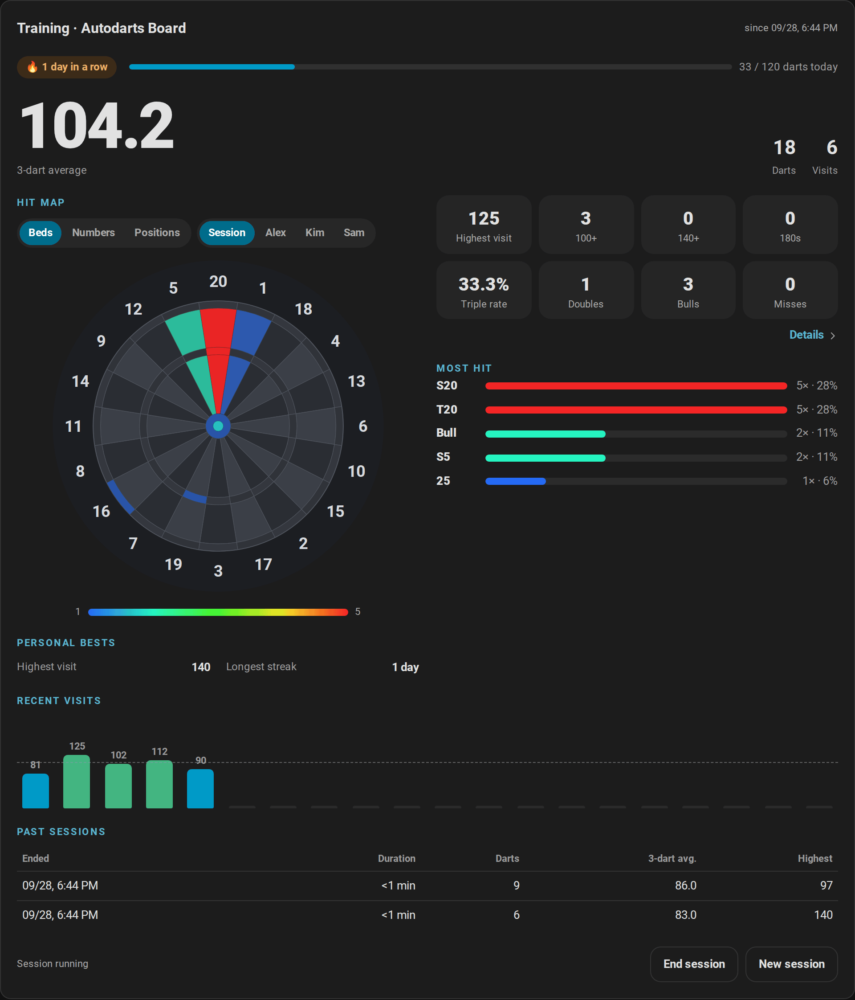
</picture>

- **3-dart average**, the number of darts and visits, and when the session started.
- **Streak and daily goal:** the [training streak](entities.md#personal-bests-streak-and-daily-goal) in days and today's darts, with a bar towards the daily goal that turns green when you reach it.
- **Heatmap:**
  - Every bed is colored by how often you hit it, from blue (rarely) to red (most often).
  - Hover a bed for its count and share.
  - In `numbers` mode, the heatmap sums each number's singles, doubles and triples instead.
  - In `positions` mode, it shows where the darts landed, from the positions the board reports: a smoothed density from blue (few darts) to red (many), with the newest 300 darts as dots. Below the board, the [grouping](how-it-works.md#grouping) at up to three beds aimed at, for example *T20: grouping 38 mm · 80 % within 61 mm · 6 mm left of center*, with *4 mm tighter* when the newer darts group closer.
  - The switches above the board choose the mode and whose darts it shows: the session, or a named player with all their hits and the positions of their last 1000 darts. The most hit beds follow the choice. [How positions are kept](how-it-works.md#dart-positions).
- **Statistics:** highest visit, 100+, 140+ and 180 visits, triple rate, doubles, bulls and misses. 180s light up in gold. Tap the tiles, or press Enter or Space on them, for the details of the session's darts.
- **Most hit beds:** the top five, with count and share of all darts.
- **Personal bests:** every [personal best](entities.md#personal-bests-streak-and-daily-goal) that has a value: highest visit and checkout, the fewest darts for every start score, the best Cricket marks per round, the best session average, Around the Clock, the doubles training, Bob's 27 and the longest training streak. The section appears with the first record.
- **Recent visits:** a bar chart of your last visits with the session average as a dashed line.
  - Bars are colored gray below 60, accent color from 60, green for 100+, orange for 140+ and gold for 180.
  - The visits come from the recorder, so the chart survives page reloads.
- **Past sessions:** end time, duration, darts, 3-dart average and highest visit of your last five finished sessions.
- **Session controls:**
  - *Start session* and *End session* switch the [training session](entities.md#training-session) on and off. Ending needs a second tap to confirm.
  - *New session* ends the running session and starts the next one, also after a second tap.
  - The line next to the buttons tells whether a session is running or when the last one ended.

### Options

| Option | Values | Default | Description |
| --- | --- | --- | --- |
| `device_id` | device | first board | The board to show |
| `title` | text | *Training · board name* | Card title |
| `mode` | `beds`, `numbers`, `positions` | `beds` | Heatmap per bed, per number or of the dart positions |
| `player` | text | the session | A player name: the heatmap starts with that player's darts. The editor lists the named players and takes any other name |
| `board_style` | `muted`, `classic`, `autodarts` | `muted` | The muted board lets the heatmap stand out |
| `history_size` | 5–60 | `20` | Visits in the chart; labels are shown up to 30 |
| `show_heatmap` | boolean | `true` | Show the heatmap |
| `show_heatmap_controls` | boolean | `true` | Show the switches of the mode and of whose darts the heatmap shows |
| `show_stats` | boolean | `true` | Show the statistics tiles |
| `show_bests` | boolean | `true` | Show the personal bests |
| `show_top` | boolean | `true` | Show the most hit beds |
| `show_history` | boolean | `true` | Show the recent visits |
| `show_sessions` | boolean | `true` | Show the past sessions |
| `show_reset` | boolean | `true` | Show the session controls |
| `accent_color` | [color](#colors) | theme primary color | Labels and 60+ visits |

```yaml
type: custom:autodarts-training-card
mode: numbers
history_size: 40
show_reset: false
```

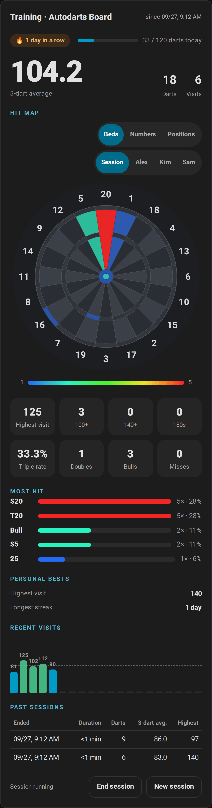

<table>
  <tr>
    <td>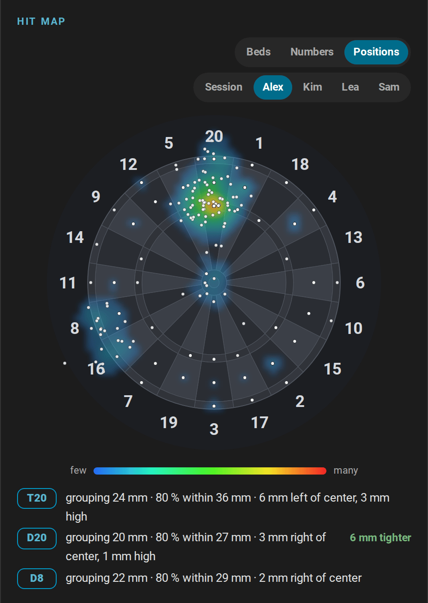</td>
    <td>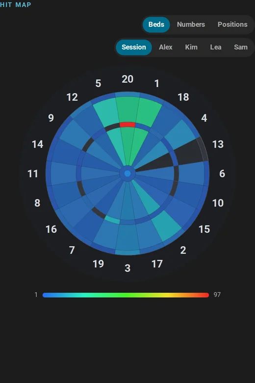</td>
  </tr>
  <tr>
    <td align="center"><code>mode: positions</code>, <code>player: Alex</code></td>
    <td align="center">The switches above the board</td>
  </tr>
</table>

## Board status card

`custom:autodarts-status-card` shows the health of the board and gathers the maintenance actions in one place.

<picture>
  <source media="(prefers-color-scheme: light)" srcset="images/en/status-card-light.png">
  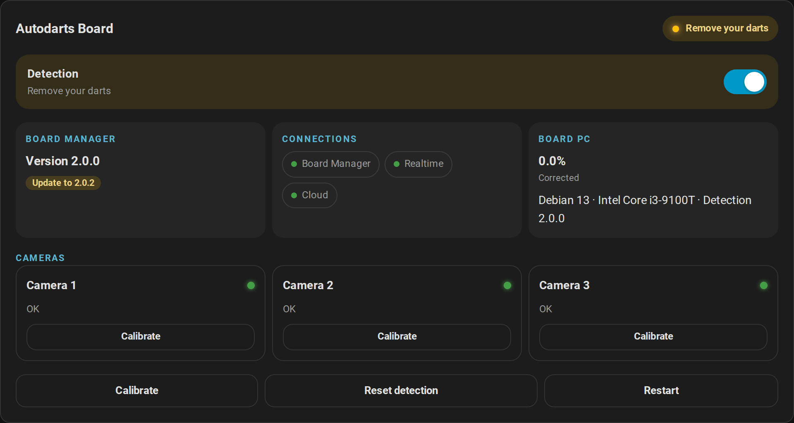
</picture>

- **Detection:** a switch with the current status, tinted in the status color. Boards without a detection switch start and stop detection with its buttons; the switch then follows the board status.
- **Board Manager:** the installed version and, with Board Manager 2, a badge for an available update. Tap the badge for its details.
- **Connections:** Board Manager, realtime and the cloud connection of the board.
- **Board PC** (Board Manager 2): CPU and memory load, the detection frame rate and the share of darts the board corrected, each if you enabled its sensor. Tap a value for its history. The tile stays hidden while it has nothing to show.
- **Cameras:** a tile for every camera with its status and frame rate (if the frame-rate sensor is enabled) and its own calibration. A camera with a problem turns red. The keyboard focus stays on a calibration button while it asks for confirmation.
- **Maintenance:** calibrate, reset detection and restart Board Manager. Each needs a second tap to confirm.

### Options

| Option | Values | Default | Description |
| --- | --- | --- | --- |
| `device_id` | device | first board | The board to show |
| `title` | text | board name | Card title |
| `show_connection` | boolean | `true` | Show the connections |
| `show_system` | boolean | `true` | Show the board PC load |
| `show_cameras` | boolean | `true` | Show the cameras |
| `show_controls` | boolean | `true` | Show the maintenance buttons |
| `accent_color` | [color](#colors) | theme primary color | Labels and the detection switch |

```yaml
type: custom:autodarts-status-card
show_system: false
```

## Scoreboard card

`custom:autodarts-scoreboard-card` is made for a tablet or TV next to the board: large enough to read from the oche, and it always shows what is being played.

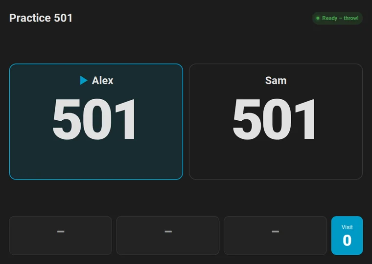

- **X01:** a tile for every player with the remaining score, legs, sets and average. The player at the board is outlined and gets the checkout route, a bust or the game shot. Players with a [start score](entities.md#teams-and-start-scores) of their own show it beside the name.
- **Teams:** in a team match, two team tiles such as *Alex & Kim* against *Sam & Lea*, with the shared score, the average of each partner and the partner at the board in bold. The banner names the winning team.
- **Cricket:** a large chalkboard with the marks of every player, the points and the marks per round; the next open number is shown in its top-left corner, above the numbers. Tactics fills it from 20 down to 10 in smaller type, Cut-Throat Cricket reminds that the fewest points win, and a team match has a column per team.
- **Party games:** the round and the target, every player's points, or in Killer their number and lives in red hearts. Golf and Baseball add a scorecard of every hole or inning with the total; after a tie, the extra rounds show as a play-off and the players out of it are dimmed.
- **Bull-off:** the bed of every player's dart and its distance from the center, if the board measured it. Once two darts are in, the one that leads is marked. A tie shows the banner *Tie – throw again*.
- **Training games:** the target in large type, with the progress, darts and hit rate (Bob's 27: points and round; checkout training and 121 checkout: the score, the route, the checkout rate and the best score reached; Catch 40: the number, the visit and the points; the JDC Challenge: the part and the points; singles training: the round and the points).
- **Between games:** the title (the board name unless you set `title`) and the score of the current visit together with darts, 3-dart average, highest visit and 180s of the training session, the training streak and today's darts towards the daily goal.
- **Winner:** a banner names the winner of the match with the result, for example *Alex wins the match 3 : 2!*, until the next dart. The result counts legs, or sets in a match of sets; a match of one leg has none.
- **Match summary:** when an X01 or Cricket match ends, the [match summary](#match-summary) takes the place of the players.
- **Tournaments:** the round of the match, and between the matches the table or the bracket; see [tournaments](#tournaments).
- **Pictures:** players [linked to a person](entities.md#link-a-player-to-a-person-autodartslink_player) show the person's picture next to their name.
- **Visit:** the three darts of the current visit and its score along the bottom.
- **Caller:** with `caller: true`, the screen at the board calls the game itself in English or German, following the language of Home Assistant (other languages hear English). It calls only what counts:
  - X01: the points a visit scored, "No score" for a bust or a visit before the opening double, "you require 81" whenever the remaining score can be finished (up to 170 with double out, 180 without), the game shot of a leg and the match, and a fanfare for a 180 that counted.
  - Cricket games: the marks of a visit, such as "5 marks". Shanghai and Halve-It: the points on the target; Count-Up: the points of the visit; Baseball: the runs, such as "3 runs". Killer, Golf, where the last dart counts, and the training games get no score calls.
  - Checkout training, 121 checkout and Catch 40: what the next attempt or visit requires, such as "You require 121".
  - Darts thrown after a bust or a game shot are not called.

  It uses the speech output of the browser, so nothing needs to be set up in Home Assistant. Browsers play sound only after a tap: tap *Caller* on the scoreboard once to switch it on, and again to mute it. The button keeps its name; its pressed state and the speaker symbol show whether the caller is on.

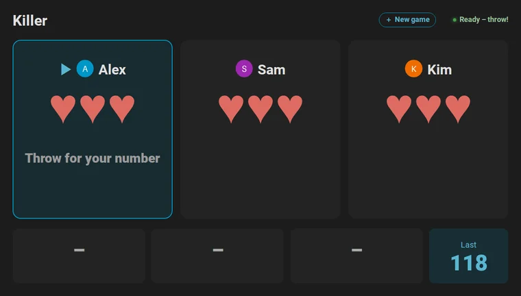

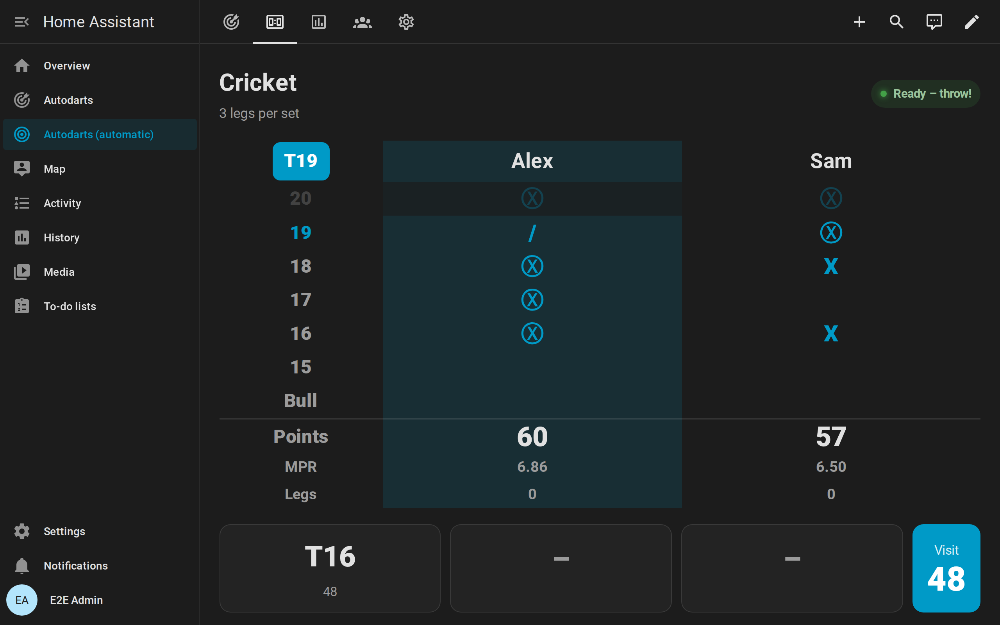

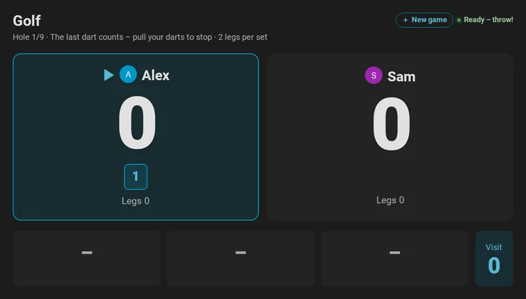

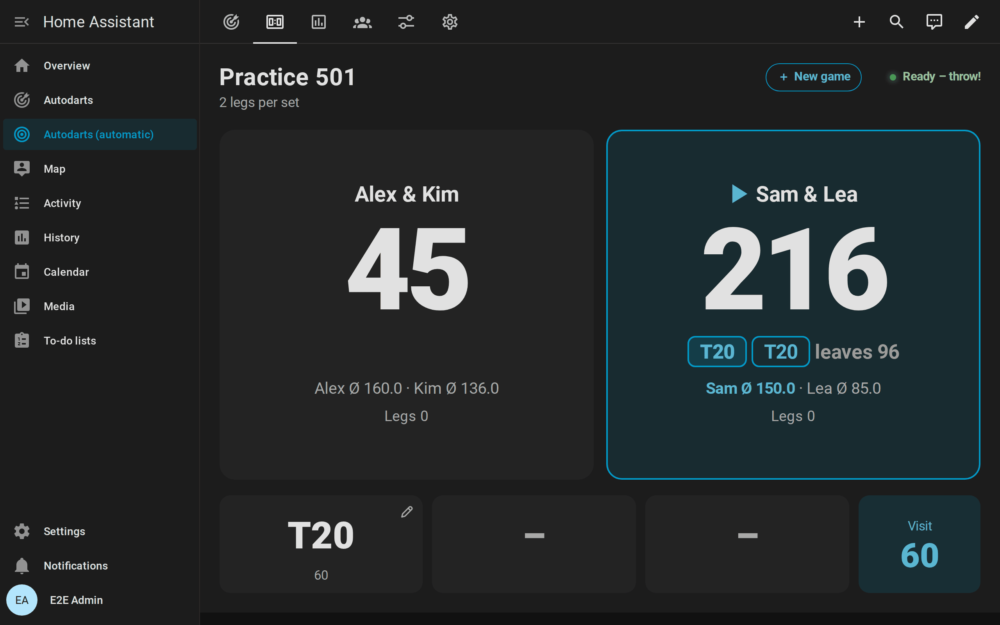

The [automatic dashboard](#automatic-dashboard) has a *Scoreboard* view that shows the card across the whole screen. Open it on the tablet, and use the browser's full-screen mode or the Home Assistant app in kiosk mode. On a phone, the full-height scoreboard leaves room for the browser's address bar.

### New game screen

Choose the next game at the board, without a phone: tap **New game** below the score between games, or at the top right at any time. A few seconds after a match or a training game ends, or after its [match summary](#match-summary), the screen also opens by itself, with the last choice ready for a rematch; a dart thrown instead closes it again.

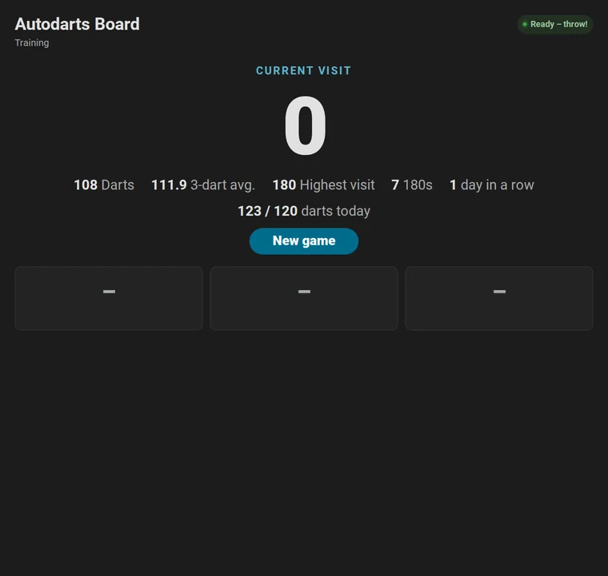

- **Game:** every game of *Practice game*, grouped into X01, Cricket, party games and training games. `lobby_games` limits the choice.
- **Players:** up to four, in throwing order. Tap a name to add the player, ▲ and ▼ to move them, ✕ to remove them. The names come from the player profiles and the player name fields; players [linked to a person](entities.md#link-a-player-to-a-person-autodartslink_player) who is at home come first, with their picture and ⌂. Type a new name, or add a guest without one. With nobody chosen, one player without a name throws. Killer needs two players; training games take the first player only. In X01, − and + beside a player set a [start score](entities.md#teams-and-start-scores) of their own in steps of 100, from 101 to 1001.
- **Format:** legs per set and sets to win, for a match of several players.
- **Options:** double out and double in for X01, and the bull-off for a match, with bull-off by distance where the board offers it. With four players of X01 or a Cricket game, *Teams* plays 1 and 3 against 2 and 4.
- **Start:** starts the game with [`autodarts.start_game`](entities.md#start-a-practice-game-autodartsstart_game), and the scoreboard shows it at once. During a game, *End game* stops it after a second tap.

The screen never opens in the preview of the card editor.

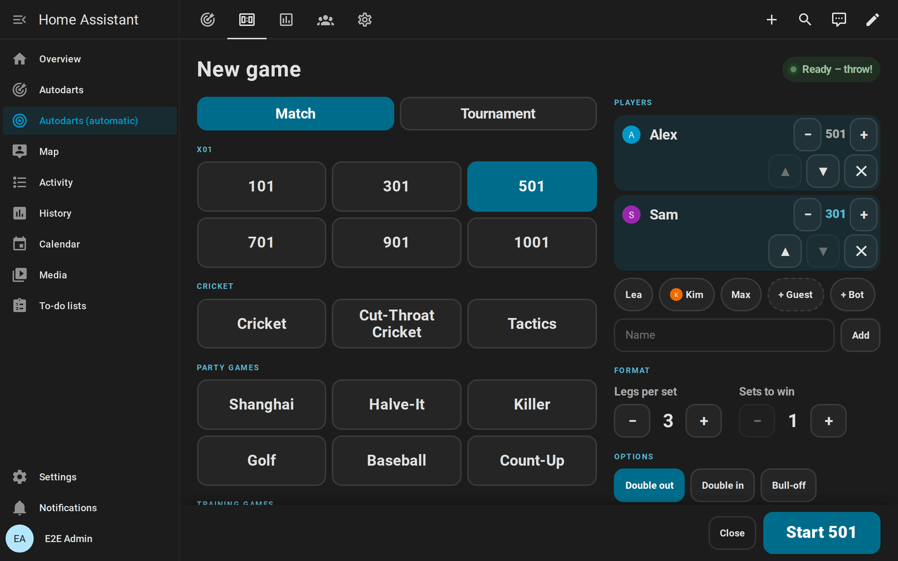

### Tournaments

During a [tournament](entities.md#tournaments), the scoreboard follows it:

- **During a match:** the title line names the round and the match, for example *Tournament · Semi-final · Match 5 of 7*.
- **Between the matches:** the [summary](#match-summary) of a match stays for *Tournament summary* (8 seconds), then, during *Tournament pause*, the table of a round robin or the bracket of a knockout shows, with the next match, its round and a countdown to its start. *Start now* starts it at once. During a tournament, the new game screen does not open by itself.
- **Table:** the position, matches played, won and lost, legs won and lost, the leg difference, the 3-dart average (Cricket: MPR) and the points. The players of the next match are marked, the winner of the tournament gets 🏆.
- **Bracket:** a column for every round, with the match for third place below the final; byes, open places and results; the next match is outlined. A player who goes on slides into the next round; on devices set to reduce motion, the places fill without moving.
- **Winner:** after the last match, a banner names the winner of the tournament, and the table or the bracket stays until a new match begins.
- **Caller:** with the caller on and `call_results`, it announces every match as it starts, "Next match: Alex against Sam", and the winner of the tournament.
- **New game screen:** *Tournament* switches the screen to a tournament of up to eight named players: X01, with start scores for a handicap, or a Cricket game, round robin or knockout, legs and sets, the rules, the match for third place and a random draw. *Start tournament* starts it with [`autodarts.start_tournament`](entities.md#start-a-tournament-autodartsstart_tournament). During a tournament, *Stop tournament* ends it and its game after a second tap.
- **Idle mode:** the panel `tournament` shows the table or the bracket of the tournament being played or just finished.

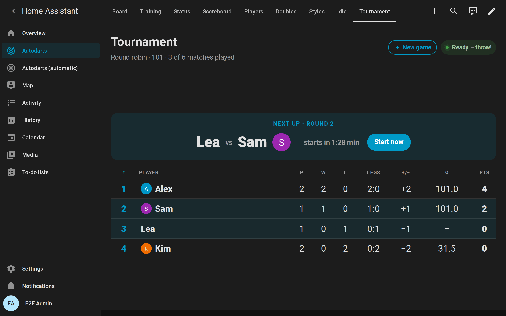

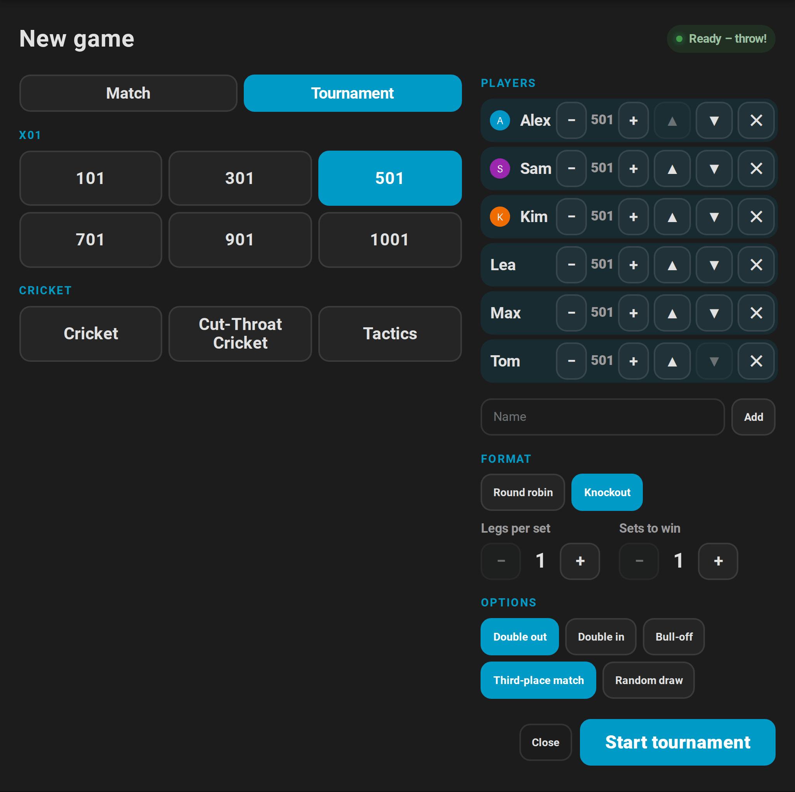

### Idle mode

When no game runs, or a match or training game is decided, and nobody throws or taps for `idle_after` seconds (3 minutes), the scoreboard shows these panels in turn, one every `idle_interval` seconds:

| Panel | Shows |
| --- | --- |
| `tournament` | The table or the bracket of the tournament being played or just finished |
| `leaderboard` | The five best players by 3-dart average, then by legs won, with their pictures |
| `records` | The personal bests of the board and the longest training streak |
| `today` | Today's darts towards the daily goal, the 3-dart average, highest visit and 180s of the session, and the streak |
| `last_match` | The last match of several players: the game, when it ended, and everybody's legs, or sets in a match of sets, and average |
| `clock` | The time and the date |

Panels with nothing to show are skipped. A dart, a new game or a tap anywhere ends idle mode. On devices set to reduce motion, the panels change without fading.

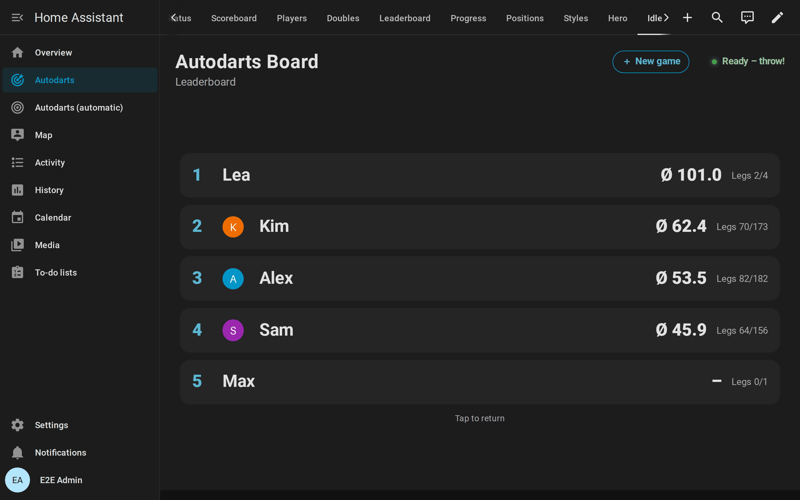

### Options

| Option | Values | Default | Description |
| --- | --- | --- | --- |
| `device_id` | device | first board | The board to show |
| `title` | text | board name | Title between games; during a game the title names the game |
| `full_height` | boolean | `false` | Fill the height of the screen, for a view in panel mode |
| `show_visit` | boolean | `true` | Show the darts of the current visit |
| `show_status` | boolean | `true` | Show the board status |
| `caller` | boolean | `false` | Switch the caller on: the screen announces visits, what a player requires, busts and game shots |
| `call_scores` | boolean | `true` | Call the score of every visit (Cricket: its marks) |
| `call_checkouts` | boolean | `true` | Call what the next player requires when a checkout is possible |
| `call_results` | boolean | `true` | Call busts and game shots |
| `call_sounds` | boolean | `true` | Play a fanfare for a 180 |
| `lobby` | boolean | `true` | Offer the [new game screen](#new-game-screen) |
| `lobby_games` | list of games | every game | The games the new game screen offers, for example `["501", cricket, killer]` |
| `idle` | boolean | `true` | Switch [idle mode](#idle-mode) on |
| `idle_after` | seconds, 10–3600 | `180` | Time without darts and taps before idle mode starts |
| `idle_interval` | seconds, 3–120 | `10` | Time each panel shows |
| `idle_panels` | list of panels | every panel | The panels of idle mode, in this order: `tournament`, `leaderboard`, `records`, `today`, `last_match`, `clock` |
| `show_summary` | boolean | `true` | Show the [match summary](#match-summary) when an X01 or Cricket match ends |
| `summary_seconds` | 0–600 | `0` | How long the summary stays, in seconds; `0` keeps it until the next game starts |
| `accent_color` | [color](#colors) | theme primary color | The player at the board, routes and the visit score |

In the editor, the four `call_…` options wait in the collapsed section *Caller options*; the new game screen and idle mode have collapsed sections of their own.

```yaml
type: custom:autodarts-scoreboard-card
full_height: true
caller: true
lobby_games: ["301", "501", cricket, killer]
idle_after: 300
idle_panels: [leaderboard, today, clock]
summary_seconds: 60
```

### Match summary

When an X01 or Cricket match of several players ends, the scoreboard and the live card sum it up: a column for every player, the winner's highlighted, with the result in the first row.

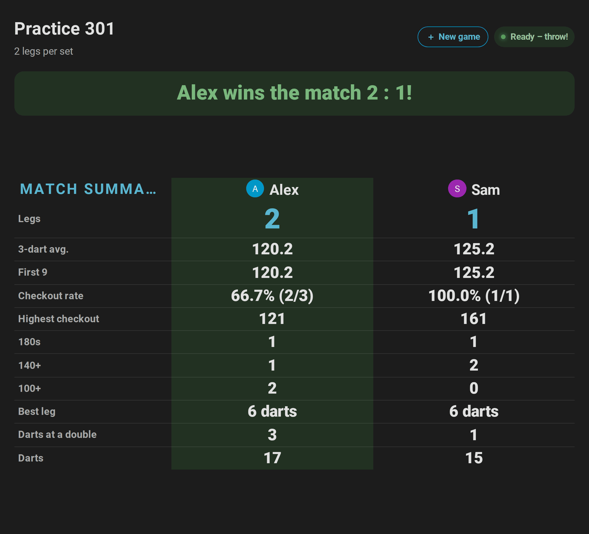

- **X01:** legs (and sets), 3-dart average, first-9 average, checkout rate with the legs checked out and the darts at a double, highest checkout, 180s, 140+ and 100+ visits, best leg in darts, darts at a double and all darts. Without double out, the checkout rate and the darts at a double are left out.
- **Cricket:** legs (and sets), marks per round, marks, best leg in darts and all darts.
- **How long:** until the first dart of the next game, or `summary_seconds` after the card first showed it. Then the players and the result come back, and on the scoreboard the [new game screen](#new-game-screen) opens a few seconds later. While the summary shows, the new game screen opens only with a tap, and [idle mode](#idle-mode) can take over after its idle time. `show_summary: false` switches the summary off. Between the matches of a [tournament](#tournaments), the table or the bracket follows after *Tournament summary*.

Party games keep their scores on screen. The numbers come from the `summary` attribute of the [practice remaining score](entities.md#practice-game); [how they are counted](how-it-works.md#match-summary).

## Doubles card

`custom:autodarts-doubles-card` shows the [doubles analysis](entities.md#doubles-analysis): the double ring of the board colored from red (rarely hit) to green (about every second dart), and every double thrown at, the best first, with hits, darts and hit rate. The favorite double is filled. With `player`, it shows the doubles of one named player instead of everybody's; a name without a profile gets a hint to check its spelling.

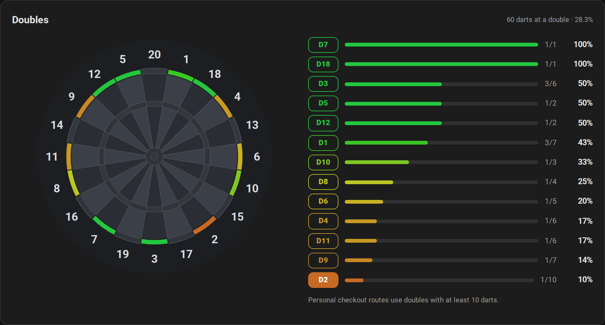

### Options

| Option | Values | Default | Description |
| --- | --- | --- | --- |
| `device_id` | device | first board | The board to show |
| `title` | text | *Doubles* | Card title |
| `player` | text | everybody | A player name, for that player's doubles. The editor lists the named players and takes any other name |
| `accent_color` | [color](#colors) | theme primary color | Labels |

## Players card

`custom:autodarts-players-card` shows the [player profiles](entities.md#player-profiles): a tile for every named player with legs and matches won, 3-dart average, first 9, checkout rate, marks per round and the best marks per round of a Cricket leg, highest visit and checkout and the fewest darts per start score. Players [linked to a person](entities.md#link-a-player-to-a-person-autodartslink_player) show the person's picture. Below, the head-to-head records with a balance bar and the recent matches with their result and the winner in bold: the legs every player won, or the sets in a match of sets, such as *Cricket · Sets*. On request, an *Export* button downloads everything as a file.

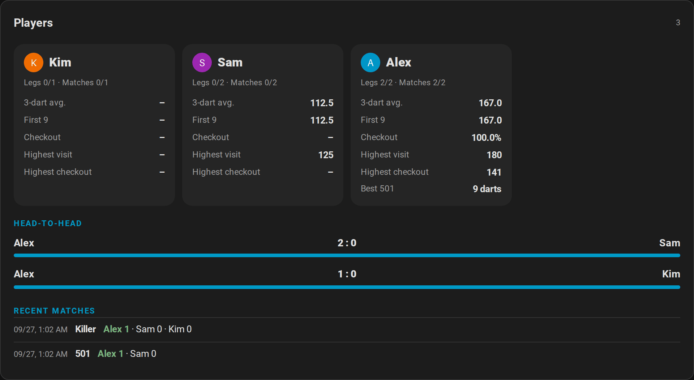

- **Badges:** every player's [achievements](entities.md#achievements). An earned badge shows its tier in bronze, silver, gold or platinum, the next goal and how far the player has come; a locked badge is greyed out, with its progress where it can be counted.
- **Trends:** for every player who practiced in the weeks shown, a tile per figure: 3-dart average, first 9, checkout rate, doubles rate and darts over the weeks, a line of the weekly values, and an arrow that compares the newer half of the weeks with the older half (↗ better, ↘ worse, → about the same). Weeks without practice interrupt the line.
- **Grouping:** where each player's darts land around the beds they aimed at most, in millimeters, with the change of the newer darts. [How the grouping is measured](how-it-works.md#grouping).

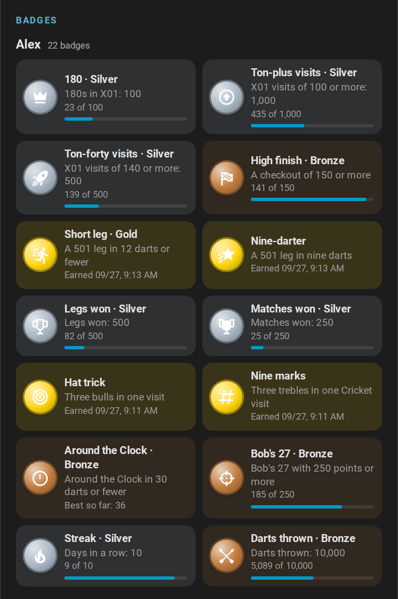

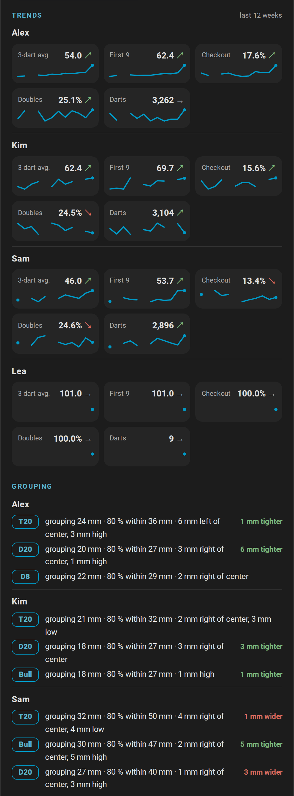

### Options

| Option | Values | Default | Description |
| --- | --- | --- | --- |
| `device_id` | device | first board | The board to show |
| `title` | text | *Players* | Card title |
| `show_head_to_head` | boolean | `true` | Show the head-to-head records |
| `show_matches` | boolean | `true` | Show the recent matches |
| `show_badges` | boolean | `true` | Show the badges |
| `show_locked` | boolean | `true` | Show locked badges too; without them, players without a badge are left out |
| `show_trends` | boolean | `true` | Show the trends |
| `trend_weeks` | 4–12 | `12` | Weeks in the trends |
| `show_spread` | boolean | `true` | Show the groupings |
| `export` | boolean | `false` | Show an *Export* button. It exports the sessions, matches and profiles with [`autodarts.export`](entities.md#export-training-data-autodartsexport) to `www/autodarts` and downloads the file through Home Assistant with your login. Exports contain player names, and files in `www` need no login. |
| `export_format` | `csv`, `json` | `csv` | Format of the export; CSV comes as a ZIP file with one table each |
| `accent_color` | [color](#colors) | theme primary color | Labels, the balance bars, progress and trend lines |

## Leaderboard card

`custom:autodarts-leaderboard-card` ranks the records of all named players. The leader of each record gets the crown, the next places follow.

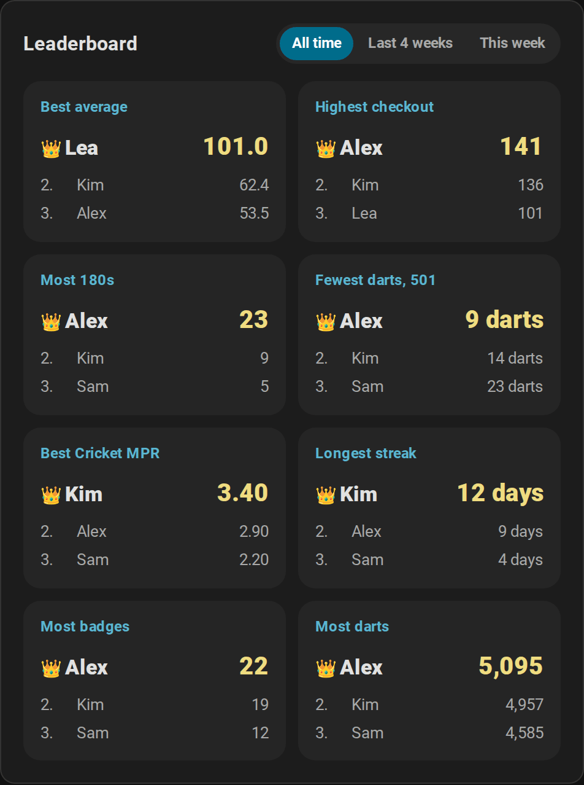

| Record | All time | Last 4 weeks, this week |
| --- | --- | --- |
| Best average | The player's 3-dart average in X01 | The average of the X01 legs that ended in the period |
| Highest checkout | The highest checkout with double out | The same, in the period |
| Most 180s | X01 visits that scored 180 | The same, in the period |
| Fewest darts, 501 | The fewest darts of a won 501 leg with double out | The same, in the period |
| Best Cricket MPR | The best marks per round of a won Cricket leg | The same, in the period |
| Longest streak | The longest run of days with darts | – |
| Most badges | Achievement tiers unlocked | Tiers unlocked in the period |
| Most darts | Darts thrown in practice and training games | The same, in the period |

A period covers whole weeks from Monday: *This week* the current week, *Last 4 weeks* the current week and the three before. Players share a place when their values are equal. The switch at the top changes the period until the card's configuration changes.

### Options

| Option | Values | Default | Description |
| --- | --- | --- | --- |
| `device_id` | device | first board | The board to show |
| `title` | text | *Leaderboard* | Card title |
| `period` | `all`, `month`, `week` | `all` | All time, the last four weeks or this week |
| `show_period` | boolean | `true` | Show the period switch |
| `limit` | 1–5 | `3` | Places shown per record |
| `accent_color` | [color](#colors) | theme primary color | Labels and the period switch |

```yaml
type: custom:autodarts-leaderboard-card
period: month
limit: 5
```

## Automatic dashboard

Instead of arranging the cards yourself, let the integration build a whole dashboard:

1. Go to **Settings → Dashboards → Add dashboard**.
2. Choose **Autodarts**.

For every board, the dashboard gets up to five views, which update themselves when you add a board or enable entities:

| View | Contents |
| --- | --- |
| **Live** | The live card across the full width, the practice game controls with teams and the Golf and Count-Up options, the player names, their start scores and the [tournament](entities.md#tournaments) with its settings and buttons |
| **Scoreboard** | The [scoreboard card](#scoreboard-card) across the whole screen, for a tablet or TV at the board |
| **Training** | The training card with the personal bests, the [doubles card](#doubles-card), the daily goal with darts today, the streak and the last personal best, darts per day for the last 30 days (from long-term statistics, which Home Assistant compiles hourly), the 3-dart average of the last 7 days, practice legs per day, the first 9 average, checkout rate and doubles rate of the practice game, and the training settings: starting sessions automatically and ending them after a pause |
| **Players** | The [players card](#players-card) and the [leaderboard](#leaderboard-card), once the first named player has a profile |
| **Board** | The board status card, the board settings, the Board Manager update and the share of darts the board corrected |

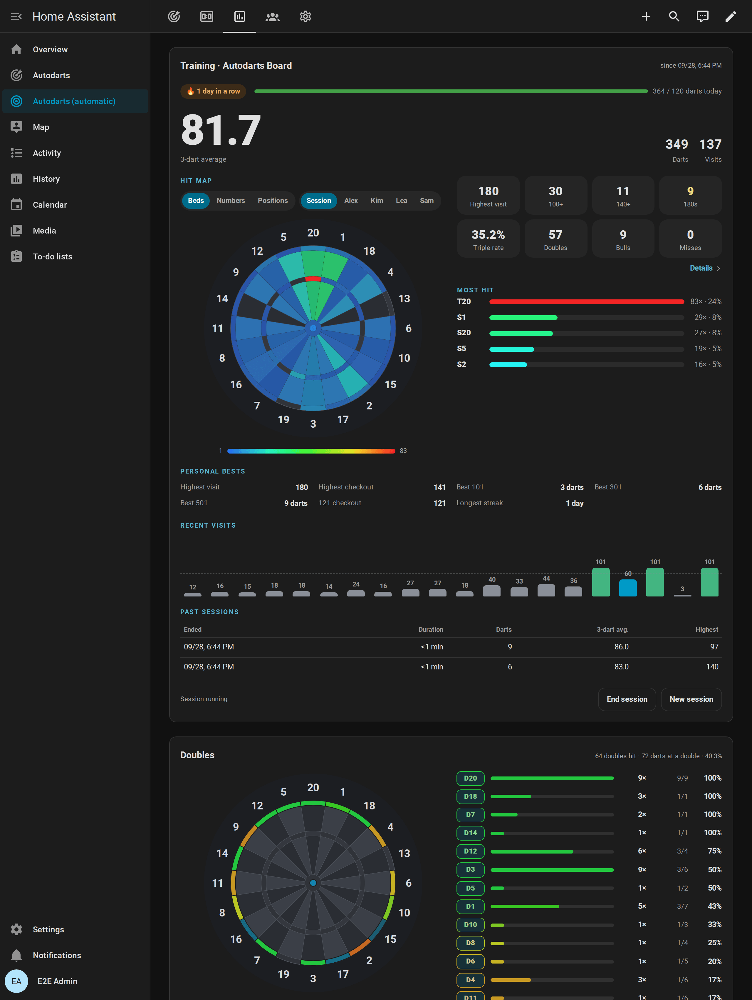

In YAML, the whole dashboard is one line; `device_id` and `title` are optional:

```yaml
strategy:
  type: custom:autodarts
  device_id: 0123456789abcdef   # only this board
  title: Darts
```

To choose the board or the title later, open the dashboard's menu (⋮) → **Edit dashboard**. Home Assistant shows the dashboard's own editor:

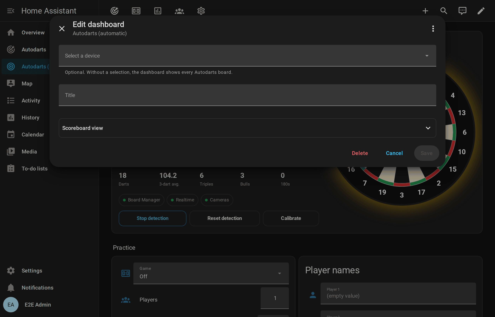

If the chosen board is removed from Home Assistant, the dashboard says so instead of showing empty views; choose another board or clear the choice to show every board. To customize the views themselves, choose **Take control** in the menu (⋮) of that editor. Home Assistant then turns the generated views into a normal dashboard that you can edit.

## Card editor

All options can be set in the visual editor. It is a form of Home Assistant, so it looks and works like the editors of the built-in cards:

- The device picker offers only Autodarts boards.
- Switches show their default until you change them; lists name their default below the field.
- The caller options, the new game screen and idle mode of the scoreboard wait in collapsed sections; the doubles card offers the named players.
- An option the form cannot show, such as a mistyped `layout`, sends the editor to the code view with a message that names it.

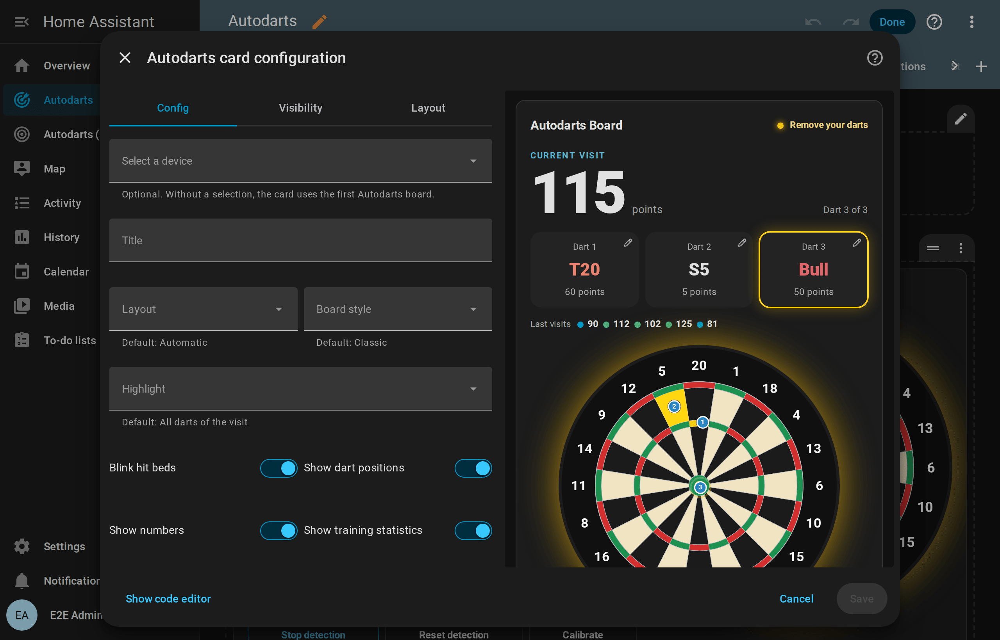

### Colors

`accent_color` and `highlight_color` use Home Assistant's color picker. Choose a theme color such as *Primary*, *Accent* or *Red*, which follows your theme, or type any CSS color, for example `#00e5ff`, `rgb(0 229 255)` or `var(--accent-color)`. An empty field, or a value that is not a color, uses the default.

## Tips

- **Wall tablet:** the live card with `layout: vertical` fills a portrait screen. The board scales with the card. For a landscape screen at the board, use the [scoreboard](#scoreboard-card).
- **Combine:** put the live card and the training card next to each other in a sections view with two columns.
- **Several boards:** add one card per board and choose the board in each card's editor.
- **Cached old version:** after an update, the card URL changes automatically. If a browser still shows an old card, reload the page. In the companion app, use *Settings → Companion app → Debugging → Reset frontend cache*.
