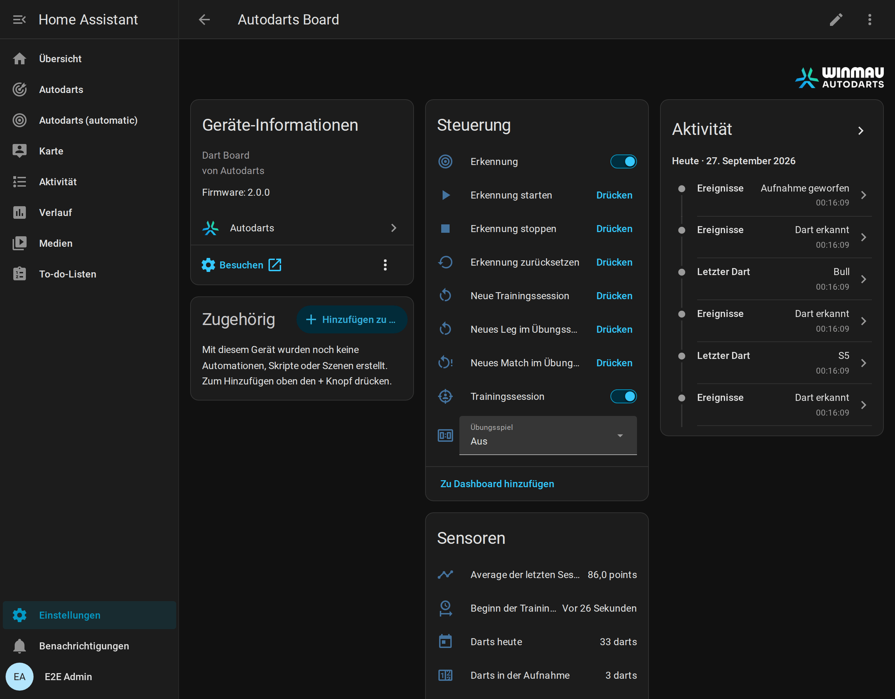
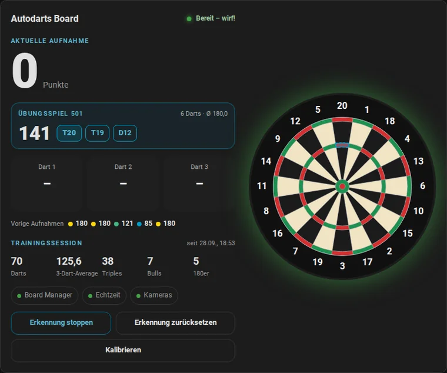
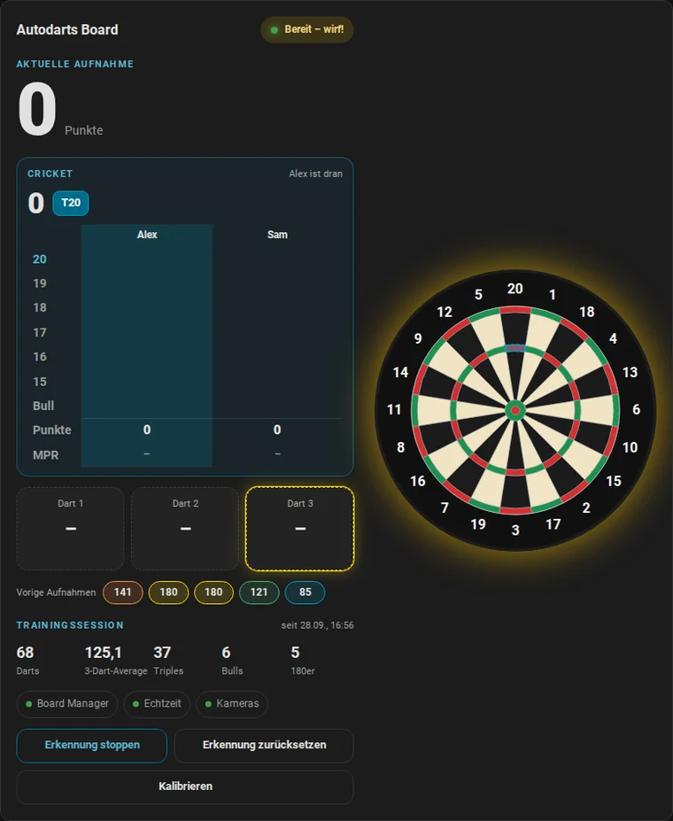
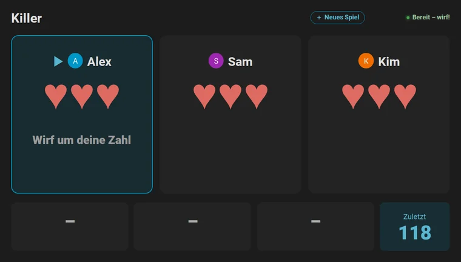
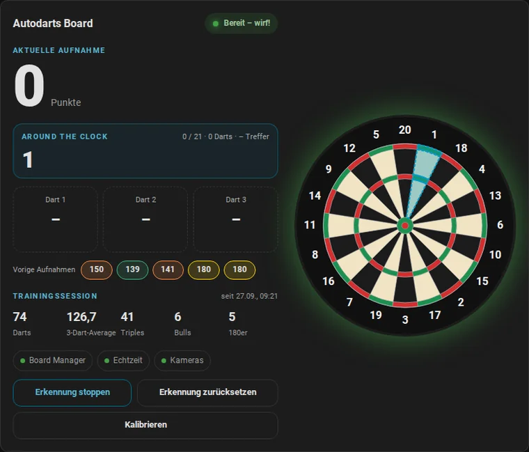

# Entitäten und Ereignisse

[← Übersicht](README.md) · [English](../entities.md)

Jedes Board ist ein Gerät mit den folgenden Entitäten. Es heißt so wie das Board in Autodarts, wenn die Board-Suche oder die Cloud es gefunden hat, sonst *Autodarts Board*. Die Namen der Entitäten folgen der Sprache von Home Assistant und wiederholen den Gerätenamen nicht. Die Entitäts-IDs leiten sich beim Anlegen einer Entität aus beiden ab, zum Beispiel `sensor.autodarts_board_training_3_dart_average`, und bleiben erhalten, wenn eine spätere Version eine Entität umbenennt.

**Legende:**

| Spalte oder Markierung | Bedeutung |
| --- | --- |
| **BM** | Die Board-Manager-Generation, die die Entität liefert: 1, 2 oder beide |
| *Deaktiviert* | Wird deaktiviert angelegt; bei Bedarf aktivierst du sie in den Entitätseinstellungen |
| *Diagnose*, *Konfiguration* | Die Entitätskategorie; solche Entitäten stehen auf der Geräteseite in eigenen Bereichen |



## Aktuelle Aufnahme

| Entität | Typ | Beschreibung |
| --- | --- | --- |
| Erkennungsstatus | Sensor (Aufzählung) | `offline`, `starting`, `stopping`, `stopped`, `throw` (bereit), `takeout`, `takeout_in_progress`, `calibrating`, `error`. Unbekannte Zustände künftiger Board-Manager-Versionen erscheinen als *unbekannt*. |
| Letzter Dart | Sensor | Feld des letzten Darts, zum Beispiel `T20`, `D16`, `S5`, `25`, `Bull`. |
| Punkte letzter Dart | Sensor, Punkte | Punkte des letzten Darts. |
| Darts in der Aufnahme | Sensor, Darts | Darts, die gerade im Board erkannt sind (0–3). |
| Erkannte Aufnahmepunkte | Sensor, Punkte | Summe der erkannten Darts. Das Attribut `throws` listet jeden Dart mit `segment`, `number`, `multiplier`, `score`, `bed` und der normierten Position `x`/`y`. Das Attribut `recent_visits` listet die letzten zehn abgeschlossenen Aufnahmen, die neueste zuerst, mit `time`, `score`, `darts` und `segments`. Der Recorder speichert beide Attribute nicht. |
| Letztes Ereignis | Sensor | Der letzte Ereignistext des Board Managers, etwa `Throw detected` oder `Takeout started`. |

Die Aufnahmepunkte sind die reine Summe der Darts, ohne Spielregeln wie Überwerfen.

## Board-Ereignisse

Die Entität **Ereignisse** (etwa `event.autodarts_board_events`, bei einem mit einer früheren Version eingerichteten Board `event.autodarts_board_board_events`) löst native Home-Assistant-Ereignisse aus. Das Attribut `event_type` sagt, was passiert ist; weitere Attribute enthalten die Details. Jedes Ereignis hat zusätzlich `source`: `websocket` für Echtzeit, `poll` beim Abgleich per HTTP und `training` für Session-Ereignisse. Die Entität bleibt verfügbar, während das Board fehlt; Ereignisse von Home Assistant selbst wie `session_ended` oder `personal_best` kommen also immer an.

| `event_type` | Wann | Attribute |
| --- | --- | --- |
| `dart_detected` | Ein neuer Dart landet | `dart_index` (1–3), `segment` (etwa `T20`, `S5`, `Bull`, `25` oder `M` für einen Fehlwurf), `score`, `game` |
| `dart_corrected` | Das Board korrigiert einen erkannten Dart | `dart_index`, `segment`, `score`, `game` |
| `takeout_started` | Du beginnst, die Darts zu ziehen | keine |
| `takeout_finished` | Das Board ist wieder frei | keine |
| `visit_thrown` | Der dritte Dart einer Aufnahme landet, solange die Darts noch im Board stecken; einmal pro Aufnahme | `score`, `darts` (3), `segments` (etwa `["T20", "T20", "S20"]`), `game` |
| `visit_completed` | Eine Aufnahme endet: bei der Entnahme, wenn nach einer verpassten Entnahme neue Darts folgen, oder wenn die Erkennung stoppt | `score`, `darts`, `segments`, `game`, `thrown` (`true`, wenn `visit_thrown` die Aufnahme schon gemeldet hat) |
| `status_changed` | Der Erkennungsstatus ändert sich | `status` |
| `session_started` | Eine Trainingssession beginnt: mit dem Schalter *Trainingssession*, der Taste *Neue Trainingssession* oder mit dem ersten Dart, wenn *Sessions automatisch starten* an ist | `started` und `reason` (`manual`, `new_session` oder `first_dart`) |
| `session_ended` | Eine Trainingssession endet: mit dem Schalter, der Taste oder nach der Pause aus *Session-Timeout* | `reason` (`manual`, `new_session` oder `idle`), `started`, `ended`, `duration_minutes`, `darts`, `points`, `average`, `visits`, `highest_visit` und die übrigen Trainingssummen |
| `bust` | Ein Dart im [Übungsspiel](#übungsspiel) geht unter null, lässt mit Double-Out 1 übrig oder erreicht 0 ohne Double | `game`, `player`, `name`, `players`, `remaining` (der Rest zu Beginn der Aufnahme, der bleibt) |
| `leg_won` | Ein Dart beendet das Übungsleg | `game`, `player`, `name`, `players`, `darts` und `average` des Legs, `checkout` (der ausgecheckte Rest), `double_out` und `double_in` (die Regeln des Legs), `legs` des Gewinners im Satz einschließlich dieses Legs und `sets` danach, `match` (`true`, wenn das Leg das Match entscheidet); bei [Cricket](#cricket) `points` und `mpr` statt `average`, `checkout` und der Regeln |
| `match_won` | Ein Dart entscheidet ein Übungsmatch mehrerer Spieler | `game`, `player`, `name`, `players`, `legs` (des Gewinners im entscheidenden Satz) und `sets`, `scores` mit `player`, `name`, `legs` und `sets` aller Spieler, etwa 3 : 2, und der `average` des Matches; bei Cricket `mpr` |
| `turn_changed` | Im Übungsspiel wurden die Darts gezogen und die nächste Aufnahme ist dran: im Match der nächste Spieler, allein derselbe | `game`, `player`, `name`, `players`, `remaining`, `checkout` (der Weg für drei Darts oder keiner); bei Cricket `points`, bei [Partyspielen](#partyspiele) `points` und `target` des nächsten Spielers; beim Ausbullen `bull_off` |
| `drill_finished` | Ein [Trainingsspiel](#trainingsspiele) endet: Around the Clock oder Doppeltraining sind durch, oder Bob's 27 ist vorbei | `drill`, `darts`, `hits`, `hit_rate` (Prozent); Bob's 27 ergänzt `score` und `completed` |
| `checkout_attempt` | Ein Versuch im Checkout-Training endet | `drill`, `target`, `success`, `darts`, `attempts`, `successes`, `rate` (Prozent) |
| `bull_off_won` | Das [Ausbullen](#übungsspiel) entscheidet, wer das Match beginnt | `game`, `player`, `name`, `players`, `hit` (das Feld des Siegerdarts: `BULL`, `25` oder etwa `S20`), `distance` (Millimeter von der Mitte, oder keiner ohne Position vom Board) |
| `personal_best` | Ein Wert übertrifft deine [Bestleistung](#bestleistungen-serie-und-tagesziel) | `record`, `value`, `previous`, `name` (der Spieler, falls bekannt) |
| `daily_goal_reached` | Die Darts von heute erreichen das [Tagesziel](#bestleistungen-serie-und-tagesziel), einmal pro Tag | `goal`, `darts`, `streak` |

`game` ist das [Übungsspiel](#übungsspiel), das beim Landen des Darts läuft, etwa `501`, `cricket` oder `shanghai`, und leer ohne Übungsspiel und bei [Trainingsspielen](#trainingsspiele). Eine Aufnahme aus drei Darts wird zweimal gemeldet: mit `visit_thrown`, sobald ihr dritter Dart landet, für 180-Feiern und Caller, und mit `visit_completed`, wenn sie endet, mit den Punkten nach allen Korrekturen. Um auf jede Aufnahme genau einmal und so früh wie möglich zu reagieren, nutze `visit_thrown` und `visit_completed` mit `thrown` gleich `false`; die [Blueprints](automationen.md#blueprints) machen es so.

Nach einem Neustart oder Verbindungsabbruch werden Ereignisse nie wiederholt. Beispiele stehen unter [Automationen](automationen.md).

## Trainingssession

Die Integration zählt deine Darts in Trainingssessions, in Home Assistant und unabhängig von Autodarts-Spielen. Sessions überstehen Neustarts.

- **Starten und beenden:** Der Schalter *Trainingssession* startet eine Session bei null und beendet sie. *Neue Trainingssession* beendet die laufende Session und startet die nächste.
- **Automatisch:** Ist *Sessions automatisch starten* an, startet der erste Dart eine Session, wenn keine läuft. *Session-Timeout* beendet eine Session so viele Minuten nach ihrem letzten Dart; `0` lässt sie weiterlaufen.
- **Ohne Session** werden Darts und Aufnahmen weiter als [Board-Ereignisse](#board-ereignisse) gemeldet, etwa für eine 180-Feier im Online-Spiel, aber nicht gezählt.
- **Historie:** Eine beendete Session behält ihre Summen, bis die nächste beginnt. *Average der letzten Session* hält den 3-Dart-Average jeder beendeten Session mit Darts fest; sein Verlauf zeigt deine Entwicklung.

Mit den Standardwerten, automatischer Start an und keine Pausengrenze, zählt jeder Dart wie in Version 1.0.

| Entität | Typ | Beschreibung |
| --- | --- | --- |
| Training Darts | Sensor, Summe | Darts der Session. Das Attribut `hits` zählt die Treffer pro Feld, etwa `{"T20": 12, "S20": 30, "BULL": 2, "MISS": 3}`; das Trefferbild nutzt es. Der Recorder speichert `hits` nicht. |
| Training Punkte | Sensor, Summe | Summe aller Punkte. |
| Training 3-Dart-Average | Sensor | Punkte pro drei Darts, der übliche Darts-Schnitt. Vor dem ersten Dart *unbekannt*. |
| Training Aufnahmen | Sensor, Summe | Aufnahmen mit mindestens einem gezählten Dart. |
| Training höchste Aufnahme | Sensor | Höchste Aufnahme der Session. |
| Training 100+ Aufnahmen | Sensor, Summe | Aufnahmen mit 100–139 Punkten. |
| Training 140+ Aufnahmen | Sensor, Summe | Aufnahmen mit 140–179 Punkten. |
| Training 180er | Sensor, Summe | Aufnahmen mit drei Triple 20. |
| Training Triple | Sensor, Summe | Darts in einem Triple-Feld. |
| Training Doubles | Sensor, Summe | Darts in einem Double-Feld (ohne Bull). |
| Training Bull-Treffer | Sensor, Summe | Darts im Bull oder Single Bull. |
| Training Fehlwürfe | Sensor, Summe | Darts außerhalb der Wertungsfelder. |
| Beginn der Trainingssession | Sensor, Zeitstempel | Wann die Session begonnen hat. |
| Trainingssession | Schalter | An, solange eine Session läuft. Einschalten startet eine Session bei null, Ausschalten beendet sie. |
| Neue Trainingssession | Taste | Beendet die laufende Session und startet die nächste; das Board selbst bleibt unberührt. |
| Sessions automatisch starten | Schalter, *Konfiguration* | Der erste Dart startet eine Session, wenn keine läuft. Standardmäßig an. |
| Session-Timeout | Zahl, *Konfiguration* | Minuten ohne Darts, 0–240, nach denen eine Session von selbst endet. `0`, der Standard, lässt sie weiterlaufen. |
| Average der letzten Session | Sensor, Punkte | 3-Dart-Average der letzten beendeten Session. Attribute: `started`, `ended`, `duration_minutes`, die Summen und `sessions` mit den letzten 20 Sessions, die der Recorder nicht speichert. |

Die Summen nutzen die Zustandsklasse *total increasing*. Statistiken und Verlaufsdiagramme von Home Assistant behandeln einen Neustart der Session daher korrekt. [So wird gezählt](funktionsweise.md#trainingssession).

## Bestleistungen, Serie und Tagesziel

Home Assistant merkt sich deine besten Werte, die Tage, an denen du trainiert hast, und deine Darts pro Tag. Jeder erkannte Dart zählt für den Tag, mit oder ohne Session. Der erste Wert eines Rekords setzt ihn still; wer ihn übertrifft, löst `personal_best` aus, gleiche Werte zählen nicht.

| Rekord | Bester Wert | Aus |
| --- | --- | --- |
| `highest_visit` | höchster | einer Aufnahme mit bis zu drei Darts |
| `highest_checkout` | höchster | einem gewonnenen X01-Leg mit Double-Out |
| `fewest_darts_101` bis `fewest_darts_1001` | wenigste | einem gewonnenen X01-Leg mit Double-Out von 101, 301, 501, 701, 901 oder 1001 |
| `best_cricket_mpr` | höchster | den Treffern pro Runde eines gewonnenen Cricket-Legs |
| `around_the_clock`, `doubles` | wenigste | Darts eines beendeten Trainingsspiels |
| `bobs_27` | höchster | den Punkten eines geschafften Bob's 27 |
| `best_session_average` | höchster | einer beendeten Trainingssession mit mindestens 30 Darts |

| Entität | Typ | Beschreibung |
| --- | --- | --- |
| Letzte Bestleistung | Sensor, Zeitstempel | Wann die letzte Bestleistung fiel; vor der ersten *unbekannt*. Attribute: `record`, `value`, `previous` und `name` dieser Bestleistung sowie der beste Wert jedes Rekords unter seinem Schlüssel, etwa `highest_checkout`. |
| Darts heute | Sensor, Darts, Summe | Heute erkannte Darts; beginnt um Mitternacht bei 0. Attribute: `goal`, `goal_reached`, `progress` (Prozent des Ziels). |
| Trainingsserie | Sensor, Dauer in Tagen | Tage in Folge mit mindestens einem Dart. Sie bleibt, bis ein ganzer Tag ohne Darts vergeht. Attribute: `best_streak`, `trained_today`, `last_day`. |
| Tagesziel | Zahl, Darts, *Konfiguration* | Darts, die du jeden Tag werfen willst, 0–2000; `0`, der Standard, setzt kein Ziel. Erreichen die Darts von heute das Ziel, löst `daily_goal_reached` einmal aus. |

## Übungsspiel

Spiele X01, [Cricket](#cricket) oder ein [Partyspiel](#partyspiele) am lokalen Board ohne Autodarts-Spiel. Home Assistant zählt herunter, erkennt Überwerfen und zeigt den Checkout-Weg. Das Spiel braucht keine Cloud und übersteht Neustarts.



- **Starten:** Wähle 101, 301, 501, 701, 901 oder 1001 in *Übungsspiel*. Darts, die schon im Board stecken, zählen nicht. *Neues Leg im Übungsspiel* beginnt das Leg wieder beim vollen Rest.
- **Double-In:** Mit *Übungsspiel Double-In* beginnt die Zählung eines Spielers mit dem ersten Double oder Bullseye des Legs; Darts davor zählen nichts, und ein Überwerfen nimmt die Öffnung zurück. Die Karte fordert ein Double und umrandet den Doppelring.
- **Ausbullen:** Mit *Übungsspiel Ausbullen* und zwei oder mehr Spielern beginnt ein Match mit einem Dart pro Spieler aufs Bull. Wie in den offiziellen Regeln schlägt das Bullseye das Single-Bull und dieses jedes andere Feld; zwei Darts im selben Bull-Feld werfen noch einmal, in umgekehrter Reihenfolge. Außerhalb des Bulls, und mit *Übungsspiel Ausbullen nach Abstand* auch darin, gewinnt der Dart, der der Mitte am nächsten ist, gemessen an den Dart-Positionen, die das Board meldet; ein Dart ohne Position schlägt nie einen gemessenen. [Die Regeln fürs Ausbullen](funktionsweise.md#ausbullen).
- **Aufnahmen:** Eine Aufnahme endet, wenn du die Darts ziehst. Nach dem Überwerfen bleibt der Rest vom Beginn der Aufnahme. Darts nach dem Überwerfen oder nach dem Checkout zählen nicht.
- **Checkout:** der Weg für die restlichen Darts der Aufnahme, etwa `T20 T20 BULL` für 170. [So wird der Weg gewählt](funktionsweise.md#übungsspiel).
- **Matches:** Stelle *Übungsspiel Spielerzahl* auf 2, 3 oder 4. Nach einer Aufnahme wirft der nächste Spieler; auch beim Überwerfen ist der Nächste dran. Wer zuerst *Übungsspiel Legs pro Satz* Legs gewinnt, holt den Satz, und wer zuerst *Übungsspiel Sätze zum Sieg* Sätze holt, gewinnt das Match. Der Anwurf wechselt innerhalb eines Satzes jedes Leg, und jeder Satz beginnt mit dem nächsten Spieler. Das Ergebnis mit den Legs des entscheidenden Satzes bleibt in der Karte stehen, bis der nächste Dart ein neues Match beginnt. Mit einem Spieler werden Legs und Sätze nicht gezählt. [Die Regeln für Matches](funktionsweise.md#matches-legs-und-sätze).
- **Sessions:** Übungsspiel und [Trainingssessions](#trainingssession) sind unabhängig. Ein Dart zählt in beiden.
- **Weitere Spiele:** *Übungsspiel* bietet auch drei [Partyspiele](#partyspiele) und vier [Trainingsspiele](#trainingsspiele).

| Entität | Typ | Beschreibung |
| --- | --- | --- |
| Übungsspiel | Auswahl | `off` (*Aus*), `101`, `301`, `501`, `701`, `901`, `1001`, `cricket`, ein Partyspiel (`shanghai`, `halve_it`, `killer`) oder ein Trainingsspiel: `around_the_clock`, `doubles` (*Doppeltraining*), `checkout` (*Checkout-Training*), `bobs_27`. Die Wahl startet ein neues Match oder Spiel. |
| Übungsspiel Restpunkte | Sensor | Restpunkte des Spielers am Board; ohne Spiel *unbekannt*. Attribute: `game`, `double_out`, `player` und `name` des Spielers am Board, `checkout`, `bust`, `won`, `visit` (die Felder der aktuellen Aufnahme), `darts` und `average` des Legs, `players`, `legs_to_win`, `sets_to_win`, `winner` (der Matchgewinner bis zum nächsten Dart), `scores` mit `player`, `name`, `remaining`, `legs` (im laufenden Satz oder im entscheidenden Satz eines beendeten Matches), `sets`, `match_legs` (Legs des ganzen Matches) und dem Match-`average` jedes Spielers, `bull_off` beim Ausbullen (der `player` am Board, `rethrow`, `by_distance` und `throws` mit `player`, `name`, `hit` und `distance`) sowie `legs` mit den letzten 10 Legs (`game`, `player`, `name`, `darts`, `average`, `checkout`, `ended`). Der Recorder speichert weder `visit`, `scores` noch `legs`. |
| Übungsspiel Checkout-Weg | Sensor | Der Checkout-Weg, etwa `T20 25 D18`; *unbekannt*, wenn es keinen gibt. |
| Übungsspiel Ziel | Sensor | Das Ziel des [Trainingsspiels](#trainingsspiele), etwa `7`, `D16`, `BULL` oder der Checkout-Rest `81`, oder bei [Cricket](#cricket) die nächste offene Zahl, etwa `T19`; ohne Ziel *unbekannt*. Attribute: `drill`, `finished`, `visit`, `progress` und `targets`, `darts`, `hits`, `hit_rate`, das beste Ergebnis als `best` und `results` mit den letzten 10 Ergebnissen, die der Recorder nicht speichert. Bob's 27 ergänzt `score`; das Checkout-Training ergänzt `remaining`, `checkout`, `bust`, `won`, `attempt_visit`, `attempt_visits`, `attempts`, `successes` und `rate`. |
| Neues Leg im Übungsspiel | Taste | Beginnt das Leg wieder beim vollen Rest; Legs und Sätze bleiben. |
| Neues Match im Übungsspiel | Taste | Beginnt das Match wieder bei null Legs und Sätzen. |
| Übungsspiel First-9-Average | Sensor, Punkte | 3-Dart-Average der ersten neun Darts jedes Legs, über die letzten 10 Legs aller Spieler am Board. |
| Übungsspiel Checkout-Quote | Sensor, % | Gewonnene Legs pro Dart auf ein Double, über die letzten 10 Legs. Ein Dart zählt als Dart aufs Double, wenn ein Double den Rest checken könnte: 2 bis 40 bei geraden Zahlen oder 50. Nur mit Double-Out. |
| Übungsspiel Doppelquote | Sensor, % | Dieselben Darts aufs Double zusammen mit den letzten 10 Ergebnissen aus Doppeltraining und Bob's 27. |
| Übungsspiel gespielte Legs | Sensor, Summe | Beendete Legs in X01, Cricket und den Partyspielen; die Langzeitstatistik zeigt die Legs pro Tag. |
| Übungsspiel Spielerzahl | Zahl, *Konfiguration* | 1–4 Spieler. Eine Änderung startet ein neues Match. |
| Übungsspiel Legs pro Satz | Zahl, *Konfiguration* | 1–11 Legs gewinnen einen Satz. Eine Änderung startet ein neues Match. |
| Übungsspiel Sätze zum Sieg | Zahl, *Konfiguration* | 1–7 Sätze gewinnen das Match. Eine Änderung startet ein neues Match. |
| Übungsspiel Spieler *N* | Text, *Konfiguration* | Name von Spieler 1–4, höchstens 20 Zeichen, für Anzeigetafel und Ereignisse. Ohne Namen zeigt die Karte *Spieler N*. |
| Übungsspiel Double-Out | Schalter, *Konfiguration* | Checkout auf einem Double oder dem Bullseye. Standardmäßig an. |
| Übungsspiel Double-In | Schalter, *Konfiguration* | Die Zählung beginnt mit einem Double oder dem Bullseye. Standardmäßig aus; eine Änderung startet ein neues Match. |
| Übungsspiel Ausbullen | Schalter, *Konfiguration* | Ausbullen entscheidet, wer ein Match mehrerer Spieler beginnt. Standardmäßig aus; eine Änderung startet ein neues Match. |
| Übungsspiel Ausbullen nach Abstand | Schalter, *Konfiguration* | Zwei Darts im selben Bull-Feld entscheidet der Abstand, den das Board gemessen hat, statt eines neuen Wurfs. Standardmäßig aus, wie es die offiziellen Regeln wollen; gilt sofort. |

## Cricket

Wähle `cricket` in *Übungsspiel*, allein oder als Match mit bis zu vier Spielern, Legs und Sätzen wie bei X01.



- **Treffer:** Nur 20 bis 15 und das Bull zählen. Ein Single ist ein Treffer, ein Double zwei, ein Triple drei; das Single-Bull ist ein Treffer, das Bullseye zwei. Drei Treffer schließen eine Zahl.
- **Punkte:** Treffer auf einer geschlossenen Zahl bringen ihren Wert (25 beim Bull), solange ein anderer Spieler sie noch offen hat.
- **Sieg:** Schließe alle Zahlen und hab mindestens so viele Punkte wie alle anderen. Allein gewinnt das Schließen aller Zahlen das Leg.
- **Ziel:** *Übungsspiel Ziel* zeigt die nächste offene Zahl von 20 abwärts bis zum Bull, etwa `T19` oder `BULL`, und die Karte umrandet sie auf der Scheibe.
- **Treffer pro Runde (MPR):** gezählte Treffer pro drei Darts, die übliche Cricket-Statistik. Treffer auf einer Zahl, die niemand mehr braucht, zählen nicht.

Die Karte zeigt eine Kreidetafel mit den Treffern aller Spieler (`/`, `X`, `Ⓧ`), den Punkten und der MPR. *Übungsspiel Restpunkte* bleibt bei Cricket *unbekannt*; seine Attribute tragen das Spiel: `game` ist `cricket`, dazu `points`, `mpr`, `target`, `numbers` (20 bis 15 und 25) und `scores` mit `marks`, `points`, `legs`, `sets` und `mpr` jedes Spielers. Cricket-Legs zählen nicht für die X01-Statistik.

## Spielerprofile

Jeder Spieler eines Übungsspiels mit Namen bekommt ein Profil mit Gesamtwerten. Ein Name ist derselbe Spieler, gleich ob groß oder klein geschrieben; Spieler ohne Namen zählen für niemanden. Jedes Leg von X01, Cricket und den Partyspielen zählt; X01-Legs ergänzen Averages und Checkout-Quote, Cricket-Legs die Treffer pro Runde.

| Entität | Typ | Beschreibung |
| --- | --- | --- |
| Spielerprofile | Sensor, Spieler | Die Zahl der Profile. Attribut `players` mit, für jeden Spieler: `name`, `legs_played`, `legs_won`, `matches_played`, `matches_won`, `average`, `first_9_average`, `checkout_rate`, `mpr`, `highest_visit`, `highest_checkout`, `best_mpr`, `fewest_darts` (Startwert → wenigste Darts für ein gewonnenes Leg) und `last_played`. `highest_visit` ist die höchste X01-Aufnahme des Spielers; `highest_checkout` und `fewest_darts` kommen nur aus Legs mit Double-Out. Der Recorder speichert die Liste nicht. |
| Letztes Match | Sensor, Zeitstempel | Wann das letzte Match mehrerer Spieler endete. Attribute: `game` und `winner` dieses Matches, `matches` mit den letzten 20 Matches (`ended`, `game`, `legs_to_win`, `sets_to_win`, `winner` und `name`, `legs` und `sets` am Ende, `match_legs` sowie `average`, `mpr` oder `points` jedes Spielers) und `head_to_head` mit den Siegen jedes Paars benannter Spieler. Der Recorder speichert keine der Listen. |

Die [Spielerkarte](karten.md#spielerkarte) zeigt alles davon. Um ein Profil zu entfernen, etwa nach einem Tippfehler im Namen, nutze [`autodarts.delete_player`](#spielerprofil-löschen-autodartsdelete_player).

## Doppelanalyse

Home Assistant zählt jeden Dart, der auf ein Double geworfen wurde, und ob er traf: im X01, wenn ein Double den Rest checken könnte (2 bis 40 bei geraden Zahlen oder 50 fürs Bullseye), im Doppeltraining auf das aktuelle Double und bei Bob's 27 auf das Double der Runde. Die Zahlen gibt es für alle zusammen und in den [Spielerprofilen](#spielerprofile) für jeden benannten Spieler.

| Entität | Typ | Beschreibung |
| --- | --- | --- |
| Lieblingsdouble | Sensor | Das Double mit der besten Quote unter denen mit mindestens 10 Darts, etwa `D16`; vorher *unbekannt*. Attribute: `attempts`, `hits`, `rate` (Prozent) und `doubles` mit `double`, `attempts`, `hits` und `rate` jedes geworfenen Doubles. Der Recorder speichert die Liste nicht. |
| Übungsspiel persönliche Checkout-Wege | Schalter, *Konfiguration* | Checkout-Wege bevorzugen die stärksten Doubles des Spielers am Board (sein Profil, sonst die Darts aller): Ein Weg mit gleich vielen Darts zu einem Double mit besserer Quote gewinnt, ohne Double als Stellwurf; es zählen nur Doubles mit mindestens 10 Darts. Standardmäßig aus. |

Die [Doubles-Karte](karten.md#doubles-karte) zeichnet die Quote jedes Doubles auf die Scheibe.

## Partyspiele



Drei Kneipenklassiker für einen bis vier Spieler, gewählt in *Übungsspiel*. Sie folgen den Darts wie X01, verbuchen eine Aufnahme beim Ziehen der Darts und gewinnen Legs und Sätze wie jedes Match. Live-Karte und [Anzeigetafel](karten.md#anzeigetafel) zeigen Runde, Ziel, Punkte oder Leben aller Spieler und umranden die Felder, auf die es ankommt.

| Spiel | Regeln |
| --- | --- |
| **Shanghai** (`shanghai`) | Sieben Runden auf die Zahlen 1 bis 7. Jeder Dart in einem Feld der Zahl der Runde zählt seinen Wert, ein Fehlwurf daneben nicht. Single, Double und Triple dieser Zahl in einer Aufnahme (ein *Shanghai*) gewinnen das Leg sofort; sonst gewinnen die meisten Punkte nach sieben Runden. |
| **Halve-It** (`halve_it`) | Alle beginnen mit 40 Punkten. Die Runden zielen auf 15, 16, ein beliebiges Double (das Bullseye eingeschlossen), 17, 18, ein beliebiges Triple, 19, 20 und das Bull (`25`: das Single-Bull bringt 25, das Bullseye 50); Treffer zählen ihre Punkte. Eine Aufnahme ohne Treffer auf das Ziel halbiert die Punkte, abgerundet. Die meisten Punkte nach neun Runden gewinnen. |
| **Killer** (`killer`) | Zwei bis vier Spieler. Jeder wirft zuerst einen Dart für eine eigene Zahl (ein beliebiges Feld einer Zahl, die noch niemand hat; nach einem Fehlwurf, dem Bull oder einer vergebenen Zahl noch einmal). Danach zählen nur Doubles: Wer das Double der eigenen Zahl trifft, ist für den Rest des Legs Killer. Killer nehmen mit jedem Treffer auf das Double eines anderen ein Leben und verlieren selbst eines, wenn sie ihr eigenes treffen. Alle haben 3 Leben; wer keines mehr hat, ist raus, und der Rest seiner Aufnahme bewirkt nichts. Wer als Letzter noch eines hat, gewinnt. |

Bei Shanghai und Halve-It entscheidet bei Punktgleichheit die Zahl der Treffer; ist auch die gleich, wird das Leg neu gespielt. Shanghai und Killer gewinnt ein einzelner Dart; spätere Darts der Aufnahme zählen nicht. [Alle Regeln](funktionsweise.md#regeln). *Übungsspiel Restpunkte* bleibt *unbekannt*; seine Attribute tragen `game`, `round`, `rounds`, `target` (`D` und `T` stehen für ein beliebiges Double und Triple), `phase` (bei Killer `choose` oder `play`), `points` und `scores` mit `points`, `legs`, `sets` und bei Killer `number`, `lives` und `killer` jedes Spielers. *Übungsspiel Ziel* zeigt das Ziel, bei Killer das eigene Double, bis du Killer bist. Partyspiele zählen nicht für die X01-Statistik.

## Trainingsspiele

Vier klassische Übungen, gewählt in *Übungsspiel*. Jede folgt den Darts der aktuellen Aufnahme und verbucht die Aufnahme, wenn du die Darts ziehst. Darts, die beim Start schon im Board stecken, zählen nicht. Ein beendetes Spiel bleibt in der Karte stehen, bis der nächste Dart es neu startet; *Neues Leg im Übungsspiel* startet es sofort neu. Jedes Spiel behält seine letzten 10 Ergebnisse.



| Spiel | Ziel |
| --- | --- |
| **Around the Clock** (`around_the_clock`) | Triff der Reihe nach 1, 2, … 20 und dann das Bull, mit jedem Feld der Zahl. Das Bull-Ziel heißt `25`: Single-Bull und Bullseye zählen beide. Weniger Darts sind besser. |
| **Doppeltraining** (`doubles`) | Dasselbe nur mit den Doubles: D1 bis D20, dann das Bullseye (`BULL`). |
| **Checkout-Training** (`checkout`) | Ein zufälliger Rest von 2 bis 170, der mit drei Darts checkbar ist, auf einem Double in höchstens drei Aufnahmen ausgecheckt. Überwerfen beendet den Versuch; der Weg steht nur, solange der Versuch läuft. Die Checkout-Quote zählt erfolgreiche Versuche. |
| **Bob's 27** (`bobs_27`) | Start mit 27 Punkten, je eine Aufnahme auf jedes Double von D1 bis D20 und dann aufs Bullseye. Jeder Treffer bringt den Wert des Doubles; eine Aufnahme ohne Treffer zieht ihn ab. Das Spiel ist verloren, sobald die Punkte null oder weniger erreichen, und geschafft nach dem Bullseye. |

Trainingsspiele sind für einen Spieler; *Übungsspiel Spielerzahl* gilt für X01, Cricket und die Partyspiele.

## Steuerung

| Entität | Typ | Beschreibung |
| --- | --- | --- |
| Erkennung | Schalter | Startet oder stoppt die Dart-Erkennung. |
| Erkennung starten, Erkennung stoppen | Tasten | Dieselben Aktionen als Tasten, für Skripte und Dashboards. |
| Erkennung zurücksetzen | Taste | Verwirft die im Board erkannten Darts. |
| Automatische Kalibrierung starten | Taste, *Konfiguration* | Kalibriert alle Kameras. |
| Kamera *N* kalibrieren | Taste, *Konfiguration* | Kalibriert eine Kamera. |
| Board Manager neu starten | Taste, *Konfiguration* | Startet den Board-Manager-Dienst neu. |
| Kamerastreams starten, Kamerastreams stoppen | Tasten, *Konfiguration*, *Deaktiviert* | Steuert die Kamerastreams des Board Managers. |
| Cloud-Verbindung | Schalter, **BM 1** | Stellt die eigene Verbindung des Boards zu Autodarts her oder trennt sie. |
| Cloud-Verbindung herstellen, Cloud-Verbindung trennen | Tasten, **BM 1**, *Deaktiviert* | Dasselbe als Tasten. |

Jede Aktion wird **genau einmal** gesendet. Lehnt das Board sie ab oder antwortet es nicht, meldet Home Assistant einen Fehler, statt es erneut zu versuchen. So wird keine Aktion doppelt ausgeführt.

## Board-Einstellungen

| Entität | Typ | Beschreibung |
| --- | --- | --- |
| Beim Start kalibrieren | Schalter, *Konfiguration* | Kalibriert beim Start der Erkennung. |
| Automatisch nachkalibrieren | Schalter, *Konfiguration* | Der Board Manager kalibriert bei Bedarf selbst nach. |
| Automatische Verzerrungskorrektur | Schalter, *Konfiguration* | Korrigiert die Linsenverzerrung bei der Kalibrierung. |
| Kamera-Standby | Auswahl, *Konfiguration* | Versetzt die Kameras nach 5, 10, 15, 30 oder 60 Minuten ohne Nutzung in den Standby. |

Änderungen werden in die Board-Manager-Konfiguration geschrieben; gesendet wird nur die geänderte Einstellung.

## Zustand und Verbindungen

| Entität | Typ | Beschreibung |
| --- | --- | --- |
| Lokale Verbindung | Binärsensor, *Diagnose* | Home Assistant erreicht den Board Manager. Ein oder zwei verpasste Lesevorgänge, also wenige Sekunden, lassen ihn an. |
| Echtzeitverbindung | Binärsensor, *Diagnose* | Die Verbindung für Echtzeitereignisse steht. Bis darüber Ereignisse ankommen, liest die Integration alle 2 Sekunden. |
| Autodarts-Cloud-Verbindung | Binärsensor, **BM 2**, *Diagnose* | Die Verbindung des Boards zu Autodarts. |
| Kameras aktiv | Binärsensor | Die Kameras laufen. |
| Kalibrierung läuft | Binärsensor | Eine Kalibrierung läuft. |
| Kamerastörung | Binärsensor, *Diagnose* | An, wenn eine Kamera bei laufender Erkennung 15 Sekunden lang keine Bilder liefert. Normales Stoppen, Kalibrieren und Standby zählen nicht. |
| Kamera *N* Störung | Binärsensor, *Diagnose* | Dasselbe für eine einzelne Kamera. |
| Erkennungsbildrate | Sensor, fps, *Diagnose*, *Deaktiviert* | Bilder pro Sekunde der Erkennung. |
| Korrekturquote der Erkennung | Sensor, %, *Diagnose* | Anteil der letzten 100 erkannten Darts, die das Board nachträglich korrigiert hat. Ab 20 % bei mindestens 50 Darts schlägt eine [Reparatur](fehlerbehebung.md#reparaturen) das Nachkalibrieren vor. Attribute: `darts`, `corrected`. |
| Kamera *N* Bildrate | Sensor, fps, *Diagnose*, *Deaktiviert* | Bilder pro Sekunde einer Kamera. |
| CPU-Auslastung | Sensor, %, **BM 2**, *Diagnose* | CPU-Last des Board-PCs. |
| Speichernutzung | Sensor, **BM 2**, *Diagnose*, *Deaktiviert* | Speichernutzung laut Board Manager 2. |
| Betriebssystem | Sensor, **BM 2**, *Diagnose* | Distribution und Version des Board-PCs, etwa *Debian 13*. Attribute: `kernel`, `architecture`. |
| Prozessor | Sensor, **BM 2**, *Diagnose* | Prozessormodell des Board-PCs. Attribut: `cores`. |
| Version der Erkennungssoftware | Sensor, **BM 2**, *Diagnose* | Version der Autodarts-Erkennungssoftware. Attribut: `opencv_version`. |
| Software | Update, **BM 2** | Installierte und neueste Board-Manager-Version. Updates installierst du auf dem Board-PC. |

Die Entitäten einer einzelnen Kamera tragen das Attribut `camera` mit der Kameranummer. Die [Board-Status-Karte](karten.md#board-status) nutzt es.

## Bewegung

| Entität | Typ | Beschreibung |
| --- | --- | --- |
| Hand erkannt | Binärsensor, *Diagnose* | Eine Hand ist vor dem Board. |
| Bild stabil | Binärsensor, *Diagnose*, *Deaktiviert* | Das Kamerabild ist ruhig. |
| Darts teilweise entfernt | Binärsensor, *Diagnose* | Einige Darts sind entfernt. |
| Darts vollständig entfernt | Binärsensor, *Diagnose*, *Deaktiviert* | Alle Darts sind entfernt. |

Während die Erkennung gestoppt ist, startet, stoppt oder kalibriert, sind diese Sensoren *aus*. Sie ändern sich mit fast jedem Dart und jeder Entnahme, und jede Änderung wird aufgezeichnet. Die Live-Karte zeigt eine Hand am Board und eine Entnahme mit dem ersten und dritten Sensor, deshalb sind diese beiden aktiv; die anderen beiden werden deaktiviert angelegt. Bei einem mit einer früheren Version eingerichteten Board bleiben alle vier aktiv; nicht benötigte deaktivierst du in den Entitätseinstellungen.

## Kameras

| Entität | Typ | Beschreibung |
| --- | --- | --- |
| Kamera *N* | Kamera, *Deaktiviert* | Eine Board-Kamera, etwa für eine Bildkarte oder den Kameradialog. Mit **BM 2** leitet die Liveansicht den Kamerastream des Boards über Home Assistant weiter; läuft der Stream nicht, und mit BM 1, zeigt sie Standbilder. Um eine Kamera zu zeigen, startet oder stoppt die Integration weder die Erkennung noch die Streams. |

## Cloud-Spieldaten (optional)

Diese Entitäten gibt es nur mit [verknüpftem Autodarts-Konto](installation.md#autodarts-cloud-verknüpfen-optional). Sie werden während eines Matches alle 5 Sekunden gelesen, sonst einmal pro Minute.

| Entität | Typ | Beschreibung |
| --- | --- | --- |
| Cloud-Status | Sensor (Aufzählung), *Diagnose* | `connected` oder `disconnected` in der Autodarts-Cloud. |
| Spielmodus | Sensor | Variante des laufenden Spiels, etwa `X01` oder `Cricket`. |
| Match-Status | Sensor (Aufzählung) | `no_match`, `active` oder `finished`. |
| Runde | Sensor | Aktuelle Runde. |
| Punkte der Aufnahme | Sensor, Punkte | Punkte der aktuellen Aufnahme im Spiel. |
| Geworfene Darts | Sensor, Darts | Im Spiel geworfene Darts. |

Ohne lokales Board kommen auch *Letztes Ereignis*, *Letzter Dart* und *Darts in der Aufnahme* aus der Cloud.

## Aktionen

### Übungsspiel starten: `autodarts.start_game`

Richtet ein Spiel mit einem Aufruf ein und startet es, für Automationen, Skripte, Dashboard-Tasten und Sprachsteuerung. Werte, die du weglässt, bleiben, wie sie sind.

| Feld | Werte | Beschreibung |
| --- | --- | --- |
| `game` | `101`, `301`, `501`, `701`, `901`, `1001`, `cricket`, `shanghai`, `halve_it`, `killer`, `around_the_clock`, `doubles`, `checkout`, `bobs_27` | Das Spiel; Pflichtfeld |
| `players` | 1–4 Namen | Spieler in Wurfreihenfolge; die Zahl der Namen legt die Spielerzahl fest |
| `legs` | 1–11 | Legs, die einen Satz gewinnen |
| `sets` | 1–7 | Sätze, die das Match gewinnen |
| `double_out` | `true`, `false` | X01-Legs auf einem Double oder dem Bullseye beenden |
| `double_in` | `true`, `false` | X01-Legs mit einem Double oder dem Bullseye beginnen |
| `bull_off` | `true`, `false` | Ausbullen entscheidet, wer ein Match mehrerer Spieler beginnt |
| `bull_off_distance` | `true`, `false` | Zwei Darts im selben Bull-Feld entscheidet der gemessene Abstand statt eines neuen Wurfs |
| `config_entry_id` | Autodarts-Eintrag | Nur bei mehreren Boards nötig |

```yaml
action: autodarts.start_game
data:
  game: "501"
  players: [Dennis, Lea]
  legs: 3
```

Die Aktion bricht mit einer klaren Meldung ab, wenn kein Board geladen ist, wenn mehrere Boards eingerichtet sind und keines gewählt ist, wenn der gewählte Eintrag unbekannt ist, zu einer anderen Integration gehört oder nicht geladen ist, wenn ein Name zweimal unter den Spielern steht oder wenn Killer weniger als zwei Spieler hätte. Werte außerhalb der Grenzen oben werden abgelehnt, bevor sich etwas ändert.

### Spielerprofil löschen: `autodarts.delete_player`

Vergisst Statistik, Bestleistungen und direkte Vergleiche eines Spielers. Der Name verschwindet auch aus den [Bestleistungen](#bestleistungen-serie-und-tagesziel) des Boards, deren Werte bleiben, und aus den Spielernamen des Übungsspiels, damit das nächste Leg das Profil nicht wieder anlegt. Der Match-Verlauf behält den Namen.

| Feld | Werte | Beschreibung |
| --- | --- | --- |
| `name` | Text | Der Spielername, in beliebiger Groß- und Kleinschreibung; Pflichtfeld |
| `config_entry_id` | Autodarts-Eintrag | Nur bei mehreren Boards nötig |

Die Aktion bricht mit einer klaren Meldung ab, wenn es kein Profil mit diesem Namen gibt.

## Verfügbarkeit

- Lokale Entitäten werden *nicht verfügbar*, wenn der Board Manager nicht antwortet, und erholen sich selbst.
- Trainingsentitäten bleiben verfügbar, weil die Session in Home Assistant gespeichert ist.
- Antwortet unter der eingerichteten Adresse ein **anderes Board**, bleiben die Entitäten nicht verfügbar, und Home Assistant zeigt einen Reparaturhinweis.
- Beim Umstieg von Board Manager 1 auf 2 lädt sich die Integration selbst neu und ergänzt oder entfernt die generationsspezifischen Entitäten.
