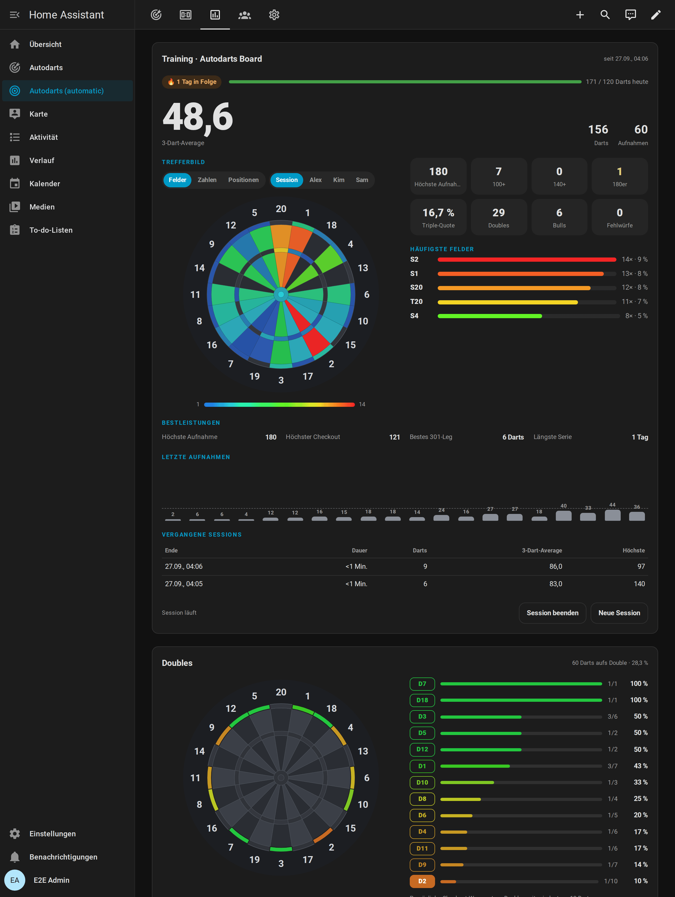
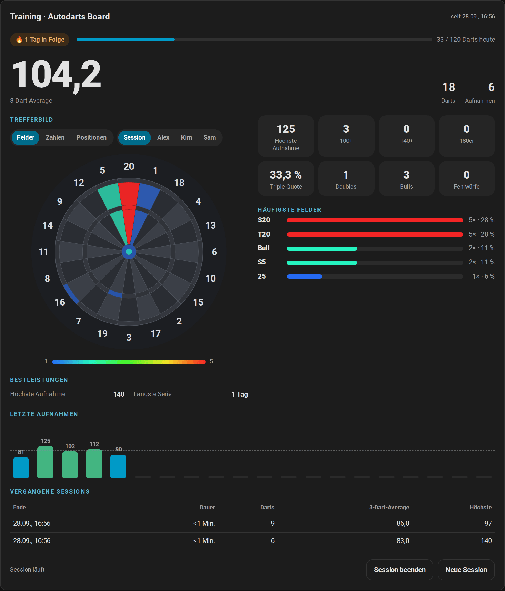
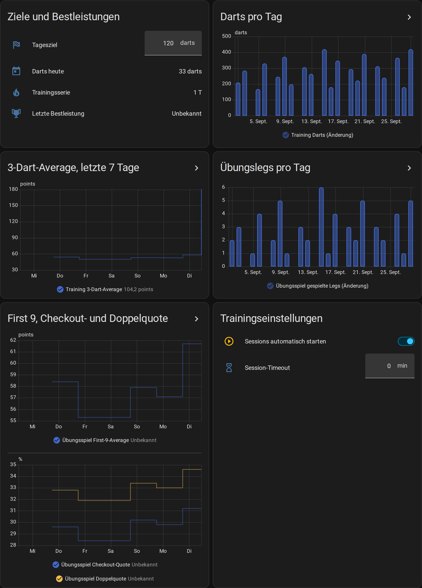
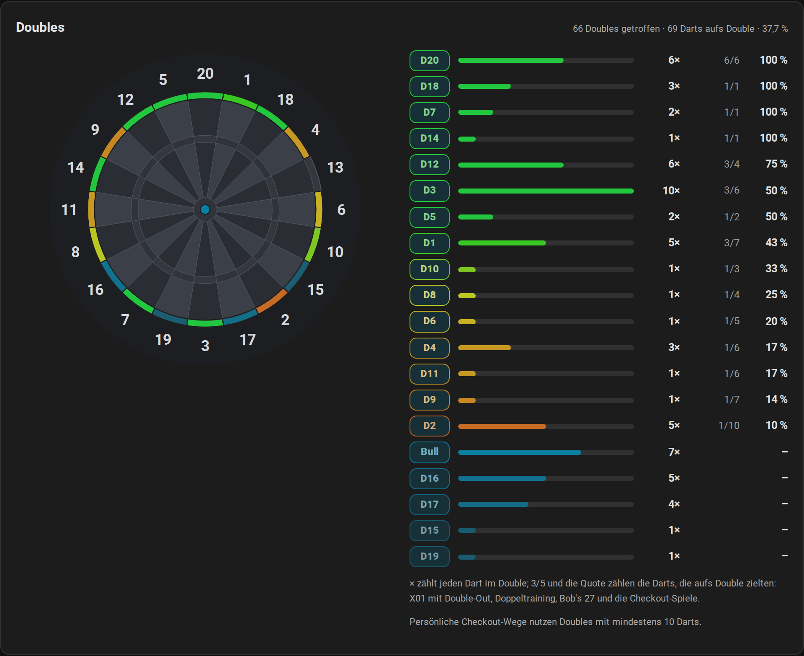
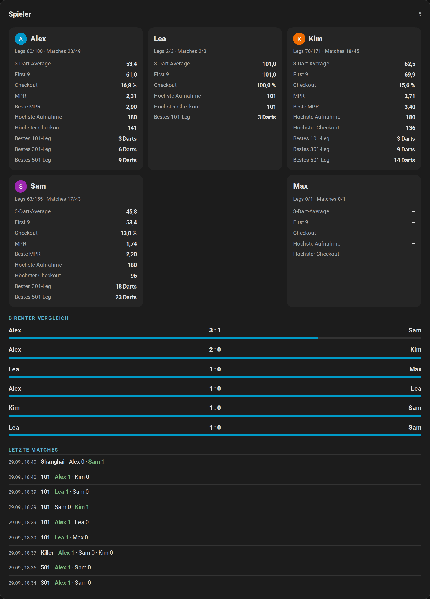
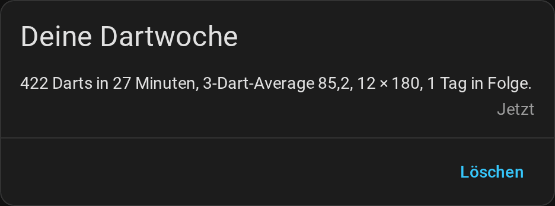
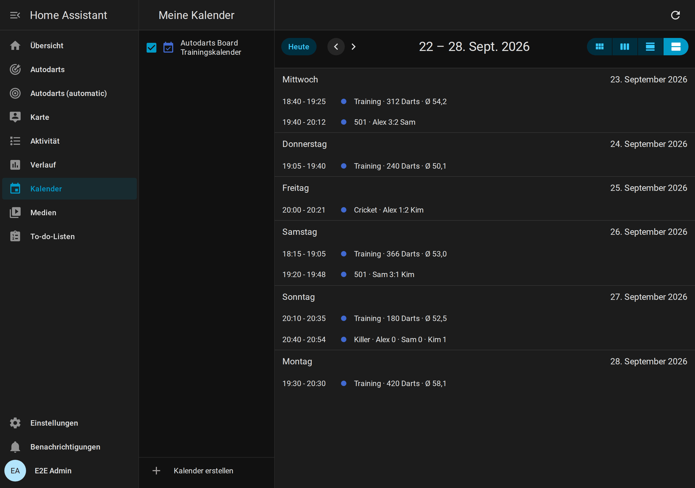

# Statistik und Spieler

[← Dokumentation](README.md) · [English](../statistics.md)

Jeder Dart, den das Board erkennt, wird in Home Assistant zu einer Zahl: dein 3-Dart-Average, wohin deine Darts fliegen, deine Bestleistungen, deine Doubles und für jeden Spieler mit Namen ein Profil mit direkten Vergleichen. Alles bleibt bei dir zu Hause, übersteht Neustarts und füllt die Langzeitstatistik von Home Assistant, sodass du deine Entwicklung über Wochen und Monate siehst.



**Auf dieser Seite:** [Wo du was findest](#wo-du-was-findest) · [Trainingssessions](#trainingssessions) · [Bestleistungen, Serie und Tagesziel](#bestleistungen-serie-und-tagesziel) · [Trefferbild](#trefferbild) · [Fortschritt über die Zeit](#fortschritt-über-die-zeit) · [Doppelanalyse](#doppelanalyse) · [Spielerprofile](#spielerprofile) · [Spieler und Personen](#spieler-und-personen) · [Wochenbericht](#wochenbericht) · [Trainingskalender](#trainingskalender) · [Export](#export) · [Deine Daten](#deine-daten)

## Wo du was findest

| Wo | Was es zeigt |
| --- | --- |
| [Trainingskarte](karten.md#trainingskarte) | Die laufende Session: 3-Dart-Average, Trefferbild, Statistik, Bestleistungen, letzte Aufnahmen und vergangene Sessions |
| [Spielerkarte](karten.md#spielerkarte) | Statistik und Bestleistungen jedes Spielers mit Namen, direkte Vergleiche, letzte Matches und der Export |
| [Doubles-Karte](karten.md#doubles-karte) | Die Quote jedes Doubles, für alle oder einen Spieler |
| Ansicht *Training* des [automatischen Dashboards](karten.md#automatisches-dashboard) | Trainingskarte, Doubles-Karte und Grafiken der Darts pro Tag, des 3-Dart-Averages, der Legs pro Tag und der Quoten des Übungsspiels |
| [Ruhemodus](anzeigetafel.md#zwischen-den-spielen-ruhemodus) der Anzeigetafel | Die Bestenliste, die Bestleistungen des Boards, die Darts von heute und das letzte Match |
| Kalender von Home Assistant | Jede Session und jedes Match des letzten Jahres im [Trainingskalender](#trainingskalender) |
| Dein Handy | Der [Wochenbericht](#wochenbericht) |
| [Sensoren](entitaeten.md) | Jeder Wert, für eigene Karten, Grafiken und Automationen |

## Trainingssessions

<picture>
  <source media="(prefers-color-scheme: light)" srcset="../images/de/training-card-light.png">
  
</picture>

Eine Trainingssession zählt die Darts, die du wirfst, egal was du spielst: ein Online-Match, ein Übungsspiel oder nur ein paar Aufnahmen auf die 20.

- **Beginn:** Mit *Sessions automatisch starten* (Standard) startet der erste Dart eine Session. Du kannst eine auch bewusst starten, mit *Session starten* auf der Trainingskarte oder dem Schalter *Trainingssession*.
- **Ende:** *Session beenden* auf der Karte oder automatisch nach der Pause, die in *Session-Timeout* eingestellt ist. `0`, der Standard, lässt eine Session laufen, bis du sie beendest. *Neue Session* beendet die laufende Session und startet die nächste.
- **Was zählt:** Darts, Punkte, 3-Dart-Average, Aufnahmen, die höchste Aufnahme, 100+-, 140+- und 180er-Aufnahmen, Triples, Doubles, Bulls, Fehlwürfe und die Treffer jedes Feldes. Korrekturen des Boards ändern die Summen mit; Darts, die beim Start von Home Assistant im Board stecken, zählen nicht.
- **Verlauf:** Die letzten 20 Sessions bleiben mit ihren Summen erhalten; die Trainingskarte zeigt die letzten fünf. *Average der letzten Session* hält den 3-Dart-Average jeder beendeten Session, sein Verlauf ist also deine Entwicklung von Session zu Session.
- **Automationen:** `session_started` und `session_ended` starten die [Routine für Trainingssessions](automationen.md#training-session-routine), und der [Trainingsbericht](automationen.md#training-report) schickt deinen Tag.

[Alle Trainingsentitäten](entitaeten.md#trainingssession) · [So wird gezählt](funktionsweise.md#trainingssession)

## Bestleistungen, Serie und Tagesziel

Home Assistant behält den besten Wert jeder Bestleistung und meldet `personal_best`, wenn du eine übertriffst, etwa für die [Lichtshow](automationen.md#light-show):

| Bestleistung | Aus |
| --- | --- |
| Höchste Aufnahme | Jeder Aufnahme mit bis zu drei Darts |
| Höchster Checkout, wenigste Darts für 101 bis 1001 | Gewonnenen X01-Legs mit Double-Out, allein gespielt |
| Beste Marks pro Runde im Cricket | Gewonnenen Cricket-Legs, allein gespielt |
| Bester Session-Average | Beendeten Sessions mit mindestens 30 Darts |
| Around the Clock, Doppeltraining | Den wenigsten Darts eines beendeten Spiels |
| Bob's 27, 121-Checkout, Catch 40, JDC Challenge, Singles-Training | Der höchsten Punktzahl |
| Längste Serie | Tagen in Folge mit mindestens einem Dart |

- **Trainingsserie:** die Tage in Folge mit mindestens einem Dart. Der heutige Tag unterbricht sie nicht; ein ganzer Tag ohne Darts schon.
- **Tagesziel:** Stelle *Tagesziel* auf die Darts, die du jeden Tag werfen willst. Die Trainingskarte zeigt einen Balken bis dorthin, und `daily_goal_reached` meldet einmal am Tag, wenn du es erreichst.
- Der erste Wert jeder Bestleistung setzt sie still; gleiche Werte zählen nicht als neue Bestleistung.

[Die Bestleistungen im Detail](entitaeten.md#bestleistungen-serie-und-tagesziel) · [Welche Legs für welche Bestleistung zählen](funktionsweise.md#bestleistungen-und-statistik)

## Trefferbild

Das Trefferbild der Trainingskarte färbt jedes Feld danach, wie oft du es getroffen hast, von Blau (selten) bis Rot (am häufigsten). Fahre mit der Maus über ein Feld für Anzahl und Anteil. Mit `mode: numbers` fasst es stattdessen Single, Double und Triple jeder Zahl zusammen und zeigt auf einen Blick, ob du zur 5 oder zur 1 abdriftest. Die häufigsten Felder listen die ersten fünf mit ihrem Anteil an allen Darts.

```yaml
type: custom:autodarts-training-card
mode: numbers
```

## Fortschritt über die Zeit

Home Assistant führt eine Langzeitstatistik der Summen und Averages, Stunde für Stunde und so lange du die Integration nutzt. Die Ansicht *Training* des automatischen Dashboards zeichnet sie:



- **Darts pro Tag** und **Übungslegs pro Tag** der letzten 30 Tage;
- der **3-Dart-Average** der letzten sieben Tage;
- **First-9-Average, Checkout- und Doppelquote** der letzten 10 X01-Legs.

Eigene Grafiken baust du mit der Statistik-Grafik-Karte von Home Assistant. Der 3-Dart-Average deiner Sessions, Woche für Woche, über drei Monate:

```yaml
type: statistics-graph
title: 3-Dart-Average pro Woche
entities:
  - sensor.autodarts_board_average_der_letzten_session
stat_types: [mean]
period: week
days_to_show: 90
chart_type: line
```

Die Entitäts-IDs hängen vom Namen deines Boards und der Sprache bei der Einrichtung ab; deine findest du auf der Geräteseite. Home Assistant berechnet die Langzeitstatistik einmal pro Stunde, ein neuer Tag erscheint also nach der nächsten vollen Stunde in den Grafiken.

## Doppelanalyse



Home Assistant zählt jeden Dart aufs Double und ob er getroffen hat: bei X01, sobald ein Double den Rest checken könnte, im Doppeltraining, bei Bob's 27 und im Double-Teil der JDC Challenge. Die [Doubles-Karte](karten.md#doubles-karte) zeichnet die Quote jedes Doubles auf die Scheibe, für alle oder mit `player` für einen Spieler mit Namen. *Lieblingsdouble* nennt dein bestes Double mit mindestens 10 Darts.

Mit *Übungsspiel persönliche Checkout-Wege* bevorzugt der Checkout-Weg die stärksten Doubles des Spielers am Board: Ein Weg mit gleich vielen Darts zu einem Double mit besserer Quote gewinnt, solange er kein Double zum Stellen braucht. [So wird der Weg gewählt](funktionsweise.md#übungsspiel).

## Spielerprofile



Jeder Spieler mit Namen bekommt im Übungsspiel ein Profil mit Werten über seine ganze Zeit: gespielte und gewonnene Legs und Matches, 3-Dart-Average, First-9-Average, Checkout-Quote, Marks pro Runde, die höchste Aufnahme und der höchste Checkout, die besten Marks pro Runde und die wenigsten Darts für jede Startpunktzahl. Die [Spielerkarte](karten.md#spielerkarte) zeigt sie mit den direkten Vergleichen jedes Gegnerpaars und den letzten Matches.

- **Namen:** Ein Name ist derselbe Spieler, egal in welcher Groß- und Kleinschreibung; Spieler ohne Namen zählen für niemanden. Gib deinen Stammspielern Namen, in der [Spielauswahl](anzeigetafel.md#das-nächste-spiel-wählen) oder in *Übungsspiel Spieler N*.
- **Was zählt:** jedes Leg von X01, den Cricket-Spielen und den Partyspielen. X01-Legs bringen die Averages und die Checkout-Quote, Cricket-Legs die Marks pro Runde. In einem [Team-Match](spiele.md#teams) gewinnen beide Partner Leg und Match.
- **Match-Verlauf:** die letzten 20 Matches mehrerer Spieler, mit Legs, Sätzen und Average jedes Spielers.
- **Ein Tippfehler im Namen?** Entferne das Profil mit [`autodarts.delete_player`](entitaeten.md#spielerprofil-löschen-autodartsdelete_player). Der Match-Verlauf behält den Namen.

## Spieler und Personen

Verknüpfe einen Spieler mit einer Person von Home Assistant, dann zeigen die [Anzeigetafel](anzeigetafel.md), die Spielerkarte und die Spielauswahl das Bild der Person. Die Spielauswahl listet die Spieler, die zu Hause sind, zuerst.

```yaml
action: autodarts.link_player
data:
  player: Alex
  person: person.alex
```

Eine Person ist ein Spieler: Verknüpfst du die Person mit einem anderen Spieler, wandert die Verknüpfung. [`autodarts.unlink_player`](entitaeten.md#spieler-verknüpfung-lösen-autodartsunlink_player) löst sie; die Statistik bleibt. Die Integration behält nur die Entitäts-ID der Person; Bild und Anwesenheit kommen aus Home Assistant.

## Wochenbericht



Endet die Woche, standardmäßig montags um Mitternacht, fasst `weekly_report` sie zusammen: Darts, Trainingszeit, Sessions, der 3-Dart-Average und seine Änderung zur Vorwoche, die beste Aufnahme, 180er, die Checkout-Quote, die Serie, die Tage mit erreichtem Tagesziel und die neuen Bestleistungen. Der [Blueprint Weekly report](automationen.md#deutscher-wochenbericht) schickt ihn auf dein Handy. *Tag des Wochenberichts* und *Uhrzeit des Wochenberichts* verschieben das Ende der Woche; der Sensor *Wochenbericht* zeigt die laufende Woche.

[Alle Werte des Berichts](entitaeten.md#wochenbericht) · [So wird die Woche gezählt](funktionsweise.md#wochenbericht)

## Trainingskalender



Der **Trainingskalender** zeigt deine beendeten Sessions und Übungsmatches der letzten 365 Tage im Kalender von Home Assistant, etwa *Training · 312 Darts · Ø 54.2* oder *501 · Alex 3:2 Sam*. Öffne **Kalender** in der Seitenleiste oder frage ihn in einer Automation mit `calendar.get_events` ab, etwa um [die Trainingssessions eines Monats zu zählen](automationen.md#trainingssessions-des-monats-zählen).

## Export

Nimm deine Daten mit in eine Tabellenkalkulation, eine Sicherung oder deine eigene Auswertung:

- **Auf der Spielerkarte:** Schalte `export` ein und tippe auf *Exportieren*. Der Browser lädt Sessions, Matches und Profile herunter, als ZIP mit CSV-Tabellen oder als JSON.
- **In einer Automation:** Die Aktion [`autodarts.export`](entitaeten.md#trainingsdaten-exportieren-autodartsexport) schreibt die Datei in deinen Konfigurationsordner und gibt zurück, wo sie liegt.

```yaml
action: autodarts.export
data:
  format: csv
  what: sessions
response_variable: export
```

Exporte enthalten Spielernamen. Dateien in `www` liefert Home Assistant unter `/local/` ohne Anmeldung an jeden aus, der Home Assistant erreicht und den Dateinamen kennt; lösche Exporte, die du nicht mehr brauchst, oder exportiere in einen Ordner außerhalb von `www`.

## Deine Daten

- **Nur lokal.** Sessions, Spiele, Bestleistungen, Profile, der Wochenbericht und der Kalender liegen im Ordner `.storage` von Home Assistant und verlassen dein Zuhause nie. [Was wo gespeichert wird](funktionsweise.md#gespeicherte-daten).
- **Diagnosedaten** schwärzen Spielernamen und Board-Details, du kannst sie also einem Fehlerbericht anhängen.
- **Neu anfangen:** *Neue Session* startet eine neue Trainingssession; [`autodarts.delete_player`](entitaeten.md#spielerprofil-löschen-autodartsdelete_player) vergisst einen Spieler. Löschst du das Board unter **Einstellungen → Geräte & Dienste**, werden alle seine gespeicherten Daten gelöscht.
