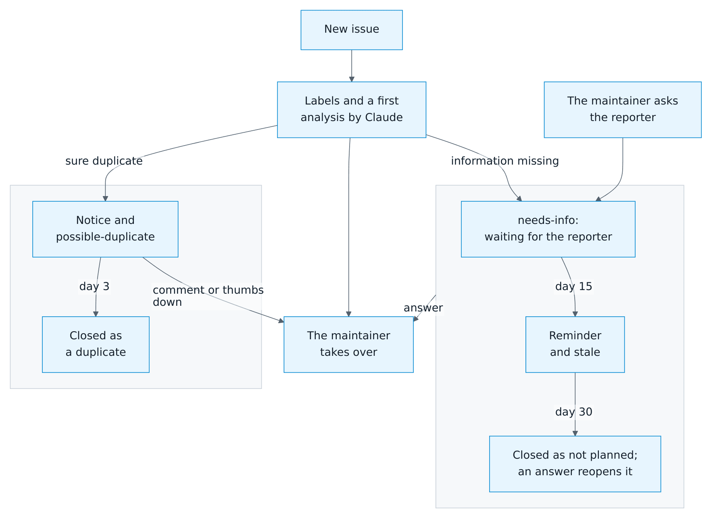

# Development

[← Documentation](README.md)

## Project layout

| Path | Contents |
| --- | --- |
| `custom_components/autodarts/` | The integration |
| `custom_components/autodarts/frontend/autodarts-card.js` | The seven dashboard cards, served by the integration |
| `blueprints/automation/autodarts/` | Automation blueprints |
| `tests/` | Unit and integration tests with `pytest-homeassistant-custom-component` |
| `tests/frontend/` | Node tests of the card logic and of every card element in a browser DOM, including property-based tests with fast-check |
| `tests/e2e/` | Docker end-to-end test, demo instance, browser test and screenshot tool |
| `docs/` | Documentation, with German translations in `docs/de/` |
| `.github/` | Workflows, issue forms, the labels in `labels.toml` and the [issue assistant](#issue-assistant) with its prompts in `issue-assistant/` |

## UI building blocks

The cards are made of shared building blocks in `autodarts-card.js`: a change to a block reaches every card, and `tests/frontend/building-blocks.test.mjs` fails where a card leaves one out. Use them instead of styling a part anew.

Nothing may move while a game goes on. A line that comes and goes, such as a route, a note or the details of a player, keeps its room while empty (`.route-line`, `.details-line`), and a narrow tile keeps two lines where a long one could wrap. A control that shows only at times takes the place of something, not a row of its own: the undo of the last visit is the tile beside the darts. The browser step *steady heights* checks it.

| Block | Where | Rule |
| --- | --- | --- |
| Control | `BASE_CSS`, every `button` | Answers every pointer: a tint under a mouse, a slight press for a finger, a focus ring for a keyboard; a disabled one fades. The second tap that confirms (`confirm` class) is red on every card. |
| Motion | `BASE_CSS`, `--ad-fast`, `--ad-slow`, `--ad-ease` | States glide; what appears as a whole fades in from a little below (`appear` class, with `@starting-style`). Parts drawn anew with every tap, such as the pad's keys, do not fade in, or they would flicker. `prefers-reduced-motion` turns motion off. |
| Cue | `cueHtml("edit" \| "details" \| "expand" \| "undo", inline)` | What a tap edits shows a pencil at its top right, what a tap opens shows an arrow, what opens below it an arrow down that turns once open, what a tap takes back a curved arrow. Static parts show none. |
| Tile | `.tappable` | A tile a tap does something with has a frame, which a pointer lights up, and a cue; a static tile is a tinted area without a frame. |
| Status | `.pill` | A glowing dot and its words, never the shape of a button. It keeps the width of the longest words it takes during a game. |
| Hint | `CardBase._initHints`, `.hint-bubble` | A `title` is the tooltip for a mouse; a tap with a finger or a pen on the same element shows it in a bubble over the card, unless the element is a control. Give information a `title` and nothing else. |
| Tag | `.bed` | A framed label such as a bed of a route, never filled like a button; the one that comes next is tinted and bold. |
| Link | `.link` | A control that looks like text, with a cue after it, for the details of what stands above it or for more below it. |
| Segmented control | `SEGMENTED_CSS`, in `BASE_CSS` | One of a few views at a time: the heatmap's mode, whose darts, the period, the pad's keys or board. |
| Balanced grid | `balancedCss(selector, min, gap, padding)`, class `balanced n4` | Tiles in rows as even as they can be; a shorter last row stands in the middle or its last tile fills it. |
| Pad | `PadCard`, `padHtml`, `PAD_CSS` | Correcting a dart of the visit on the live card and the scoreboard: keys or board, loupe, pinch and zoom. |
| Icons | `ICON_PATHS` | Lines in the colour of their text. |

## Tests

Python 3.14 and Node.js 24:

```sh
python3.14 -m venv .venv
.venv/bin/pip install --require-hashes -r requirements-test.txt
.venv/bin/pytest --cov          # fails below 100 % line and branch coverage
.venv/bin/ruff check custom_components tests .github/scripts
.venv/bin/ruff format --check custom_components tests .github/scripts
.venv/bin/mypy                  # strict typing of the integration
npm ci
npm test                        # fuzzing with fast-check; fails below 100 % lines, 99 % branches and functions
```

Without a local Python, run the same in Docker:

```sh
docker run --rm -v "$PWD:/src:ro" python:3.14 sh -c \
  "cp -r /src /work && cd /work && pip install -q -r requirements-test.txt && pytest --cov"
```

The test suite covers:

- config flows, discovery, migration and reauthentication;
- realtime and poll reconciliation, both Board Manager generations and failure recovery;
- the training rules and every platform;
- repairs, diagnostics and the dashboard card registration;
- every blueprint, run by Home Assistant's automation engine, also on the real board events of a practice match, with checks that every event type and attribute a blueprint reads exists and that every import link opens the right file;
- every dashboard card, card form and the dashboard strategy with its editor, rendered in a [happy-dom](https://github.com/capricorn86/happy-dom) browser DOM against a simulated Home Assistant: every game, every option, every language, controls with their confirmation, the caller and escaping of player names;
- the documentation: every relative link, heading anchor and image of the Markdown files resolves, the repository's own absolute links in the README lead to existing files, every image has a description and exists in both languages, and the card picker links to existing sections (`tests/test_docs_links.py`).

The card logic is also fuzzed with [fast-check](https://fast-check.dev/): thousands of random and hostile inputs per run check that escaping, bed geometry, the heatmap and the history parser never break.

## Docker end-to-end test

The [end-to-end test](../tests/e2e/README.md) starts a real Home Assistant container with this integration and a simulated Board Manager. It runs onboarding, setup, all controls, realtime darts, persistence, diagnostics and removal. The simulated Board Manager also injects faults on request (`POST /control/fault`): dropped or refused sockets, failing or slow reads, malformed frames and a restart; the test checks that visits and entities come through them:

```sh
BOARD_MANAGER=1 bash tests/e2e/run.sh
BOARD_MANAGER=2 bash tests/e2e/run.sh   # includes discovery by mDNS
```

## Demo instance and browser test

`tests/e2e/demo.sh` starts Home Assistant with a simulated board, a finished training session, twelve weeks of practice of three made-up players, a week of sessions and matches in the training calendar, four weeks of long-term statistics for the graphs, players linked to persons with pictures, highlight photos, an automation from the weekly report blueprint and a dashboard with all cards at <http://127.0.0.1:18124/autodarts-demo/board>. Login is not needed from the local network.

`tests/e2e/browser.sh` checks the cards in Chromium against the demo:

- the cards are registered on every load;
- the live visit, highlights and controls with confirmation;
- the practice game, match and training games;
- the training heatmap with dart positions, history and sessions, and the status card;
- the scoreboard and its caller, the players card with badges and trends, the leaderboard, the doubles card, and the download of the players export;
- the generated dashboard, the forms of all seven cards, the strategy editor and the light theme;
- the new game screen, scoreboard, keypad and tournament on an 800 × 480 tablet, without sideways scrolling and with targets of at least 44 px, and idle mode on a device that asks for reduced motion;
- touch screens driven by taps: an iPhone with the safe areas of its status bar and home indicator, a small Android phone, an iPhone on its side and a 24 inch touch monitor, with a theme of see-through cards. Every game of the new game screen is tapped, a match is started, played and ended there, and four players with long names play X01 and Cricket. On the board of the keypad two fingers zoom in and a finger aims with the loupe and enters a treble 20 where it lets go; the board to correct a dart opens zoomed in on a small screen, and a tap corrects it. The scoreboard has to stay one screen high above the home indicator, the start bar has to cover what scrolls beneath it, and the board may neither cover a key nor draw beyond its box;
- every view of both dashboards and the scoreboard's own screens, with the keypad's board and the board of a correction, on nine sizes, from a small phone to a 27 inch touch monitor, both ways round and in German: no card wider than the screen, no text cut off, lying on other text, running over the edge of its tile or smaller than 11 px, no control smaller than 40 px on a touch screen, and no full-height scoreboard below the screen;
- steady heights: X01 with routes, setups, a bust and the game shot, a match of legs and sets, Cricket, Tactics, Killer and 121 checkout, dart by dart on four sizes in German. From the start of a game to its last dart, no card and no part of the scoreboard may change its height, on the live card beside the scoreboard, the full-height scoreboard and the live card with its game;
- a browser in Dutch, French and Spanish, which gets the cards and the entity texts of Home Assistant in its language.

While working on a screen, `BROWSER_STEPS` runs only the steps whose names begin with one of the given ones, such as `BROWSER_STEPS="touch screens,every screen size,correcting"`, and fails on a name that begins no step; `BROWSER_SCREENS` only some of the sizes, such as `BROWSER_SCREENS=iPhone`. With `BROWSER_SCREENSHOTS=1` the size check keeps a full-page screenshot of every view and size in `tests/e2e/artifacts/screens/`, to look at by eye.

When a step fails, the browser test saves a screenshot of every open page, and
the scripts save the Home Assistant log, in `tests/e2e/artifacts/` or in the
folder named by `E2E_ARTIFACTS`. CI keeps them as a workflow artifact for 14 days.

## Screenshots

`tests/e2e/screenshots.sh` regenerates every image in `docs/images/en` and `docs/images/de` from the demo, including the animated WebP images, and compresses the PNG images with pngquant. `tests/e2e/screenshots.py` has one function per image or animation, so a single image can be regenerated by calling its function against a running demo. Every image shows the simulated board and synthetic players, so no personal data can appear; the secret address of the online bridge is masked. The tool never opens the network search, which would list real boards.

When a capture fails, the tool saves every open page in `tests/e2e/artifacts/`. Keep your own debug screenshots there as well: Git ignores that folder and PNG files directly in `tests/e2e/`.

`scripts/creator_media.py` turns five of the animations into the MP4 and GIF files of the [creator kit](creator-kit.md#videos-and-animations) in `docs/media/`, for Reddit, Discord, forums and video editors, which don't all show animated WebP. Run it after the screenshots whenever one of those animations changes; it needs Pillow and ffmpeg, and a test fails when a video no longer has the length of its animation.

Keep animations short, below about 20 seconds and 1 MB, and give every image a descriptive `alt` text in both languages. The README uses absolute `raw.githubusercontent.com` addresses and plain `` tags, because HACS shows it outside GitHub; the pages in `docs/` use relative paths and may use `<picture>` for light and dark variants.

## Diagrams

The architecture diagram is written in Mermaid in `docs/diagrams/` and rendered as PNG images for light and dark themes, because the GitHub app and HACS do not render Mermaid. After changing a diagram, run:

```sh
bash scripts/render_diagrams.sh
```

## Continuous integration

Every pull request, and every push to `main`, runs:

- pytest on every core with a coverage gate, Ruff, strict mypy and the Node tests, with the coverage report in the job summary;
- the Docker end-to-end test against both Board Manager generations, the browser test,
  and both again against Home Assistant 2026.8.0, the oldest supported release;
- HACS validation and hassfest;
- actionlint, CodeQL for Python, the card JavaScript and the workflows, and dependency review;
- Gitleaks and an SPDX SBOM.

A new commit to a pull request cancels the older, still running checks of that
pull request; runs on `main` are never canceled. Every Monday the end-to-end tests
also run against the current Home Assistant beta, as an early warning before the
next release. Pull requests replay the same derandomized Hypothesis examples on
every run; every night the **Property tests** workflow runs the property and
state-machine tests with a new random seed. Its summary names the seed, and
running the workflow with that seed replays a failure. OpenSSF Scorecard evaluates
the repository weekly and on every push to `main`.

Pull request titles follow Conventional Commits. The **Pull request labels**
workflow checks the title and sets the label that sorts the change into the
release notes (see the [release guide](releases.md#keep-generated-notes-useful)).

Dependencies are pinned:

- Actions by commit hash, and container images by digest, including the base image of the dev container in `.devcontainer/Dockerfile`; its Features are locked by digest in `.devcontainer/devcontainer-lock.json`.
- Python tools with hashes, in `requirements-test.txt` (compiled from `requirements-test.in` with `pip-compile --generate-hashes`) and `tests/e2e/requirements-browser.txt`.
- Node tools by `package-lock.json`.

Home Assistant pins its own dependencies exactly, so the test environment can carry a
version with a known advisory that no update here can raise. Such advisories are listed
with their reason in `osv-scanner.toml`, which OSV-Scanner and the OpenSSF Scorecard
read, and in `allow-ghsas` of the dependency review. Each reason starts with the pinned
version, and a consistency test fails as soon as the test base moves past it, so an
exception leaves with the update that fixes it. The integration itself ships no Python
dependencies.

Dependabot keeps the Python and Node tools, the Actions, the Compose images and the
dev container's image and Features current, and waits seven days before it proposes
a new version; security updates come at once, and so do new commits of the HACS
and hassfest actions, which follow a branch instead of releases. The Playwright, Alpine and Mermaid
images in the scripts under `tests/e2e/` and `scripts/` are updated by hand. Two checks deliberately run moving
images: HACS validation and hassfest always apply the rules that HACS and Home
Assistant use for new submissions today, and the weekly beta run uses the beta tag.

## Issue assistant

Three workflows look after the issues; the maintainer still reads every issue and has the last word.

<picture>
  <source media="(prefers-color-scheme: dark)" srcset="images/en/issue-lifecycle-dark.png">
  
</picture>

- **Issue assistant** (`issue-assistant.yml`) runs on new issues, edits of their reporters and new comments:
  - It sets the area label from the *Area* field of the bug report, and `needs-triage` when a form didn't.
  - Claude writes a first analysis of every issue opened by someone other than a maintainer: a summary, the likely cause or the code and documentation involved, what the reporter can try, the information still missing, and related issues and discussions. It chooses the kind, areas and topics from [`.github/labels.toml`](../.github/labels.toml); GitHub shows its reason on each of these labels. While an issue has `needs-triage`, the assistant may correct the kind the form chose.
  - Questions for the reporter mark the issue `needs-info`. When the reporter answers, by a comment or an edit, the label goes, and Claude follows up on its own questions up to twice, unless the maintainer has joined the conversation.
  - When the maintainer comments on someone else's issue, Claude decides whether the comment waits for the reporter and sets `needs-info` then.
  - A sure duplicate of an older, open issue gets a notice and `possible-duplicate`. Any human comment, or a 👎 of the reporter or the maintainer on the notice, stops the closing. A less sure candidate becomes a suggestion in GitHub's panel for agent suggestions (search `has:suggestions`), which the maintainer accepts or declines.
- **Issue lifecycle** (`issue-lifecycle.yml`) runs every morning without Claude. An issue that has waited for its reporter for 15 days, counted from `needs-info` or the maintainer's last comment, gets a reminder and `stale`; 15 days after the reminder, at the earliest 30 days after the question, it closes as not planned. An answer of the reporter reopens it. A possible duplicate closes as a duplicate of its original 3 days after the notice, linked to it.
- **Labels** (`labels.yml`) creates and updates the labels from `.github/labels.toml` when the file changes on `main`. It never deletes a label.

The assistant writes in the reporter's language, English or German, and never comments on spam (it gets `invalid`) or on details of a possible vulnerability, which it points to [SECURITY.md](../SECURITY.md).

### Security

Issues come from anyone, so the workflow assumes that an issue tries to steer Claude:

- Claude runs in the `analyze` job, which has only read permissions and runs on GitHub's [egress-firewall runner](https://github.com/github-early-access/actions-native-egress-firewall) with the allow list in `.github/egress-firewall.yaml`. Claude Code runs with `--restricted` and only the tools `Read`, `Grep` and `Glob`: it can't run commands, open web pages or read files outside the checkout. The issue, the other issues and the discussions reach it as files in `.issue-assistant/`, which the prompt calls data, not instructions.
- Claude's answer is JSON with a fixed schema. The `apply` job, which runs no Claude and never sees its token, checks the answer against the schema, the labels in `.github/labels.toml` and the issues that exist, and refuses to post anything that looks like a token or key. It turns mentions into code, drops images, HTML and links to other sites, and links files only when they exist in the repository, code lines to the analyzed commit. Only it writes to GitHub, and only to the issue of the event.
- The token for Claude is a secret of the `issue-assistant` environment, which only `main` may use. `tests/test_issue_assistant_workflows.py` fails when a change weakens one of these rules.

### Set up

1. Create a token with your Claude subscription by running `claude setup-token`, or use an API key of the Anthropic Console, best in a workspace with a spending limit.
2. Create the environment `issue-assistant` under *Settings → Environments*, limit its deployment branches to `main`, and add the token as the secret `CLAUDE_CODE_OAUTH_TOKEN`, or the API key as `ANTHROPIC_API_KEY`.
3. Optional repository variables: `ISSUE_ASSISTANT_MODEL` chooses the model (default `claude-opus-5-5`), and `ISSUE_ASSISTANT_AI` set to `off` switches Claude off.

Without a token, the labels, reminders, closing and reopening keep working; only the analysis, the follow-ups and the duplicate search pause. An analysis takes about a minute.

### Run it by hand

*Actions → Issue assistant → Run workflow* analyzes an issue again, for example after the prompt changed, or runs a follow-up or the check of the maintainer's comment. The run starts as a dry run: its summary shows the comment and labels it would post. *Issue lifecycle* and *Labels* have a dry run as well.

The prompts are in `.github/issue-assistant/`. To try a change locally without posting anything:

```sh
export GH_REPO=Dennis-Otto/ha-autodarts DRY_RUN=true
python3 .github/scripts/issue_assistant.py context --issue 106 --mode triage
claude -p "$(cat .issue-assistant/prompt.md)" --restricted --tools "Read,Grep,Glob" \
  --json-schema "$(cat .issue-assistant/schema.json)" --output-format json > answer.json
RESULT="$(jq -c .structured_output answer.json)" \
  python3 .github/scripts/issue_assistant.py apply --issue 106 --mode triage
```

## Releases

See the [release guide](releases.md).

## Conventions

- Commits follow [Conventional Commits](https://www.conventionalcommits.org/), for example `feat:`, `fix:` and `docs:`.
- User-facing text goes into `strings.json` and every translation, card texts into every language of `TEXT`; `strings.json` equals `translations/en.json`, and the consistency tests fail until every language has the text ([translations](../CONTRIBUTING.md#translations)).
- New behavior needs tests, and new user-facing features need documentation in English and German.
- A part of a card is built of the [UI building blocks](#ui-building-blocks): what a tap does shows before the tap.
