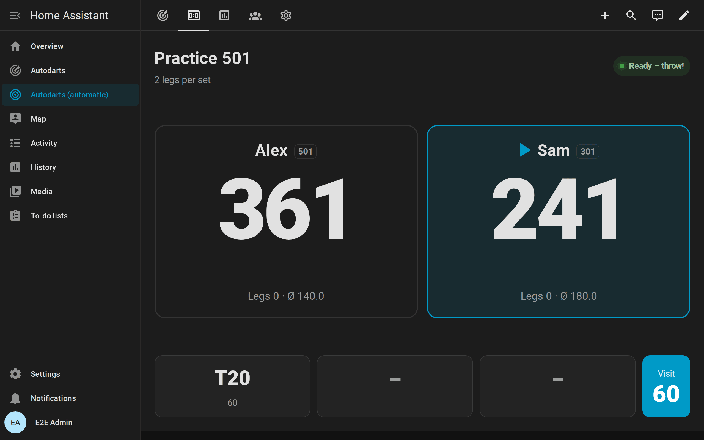
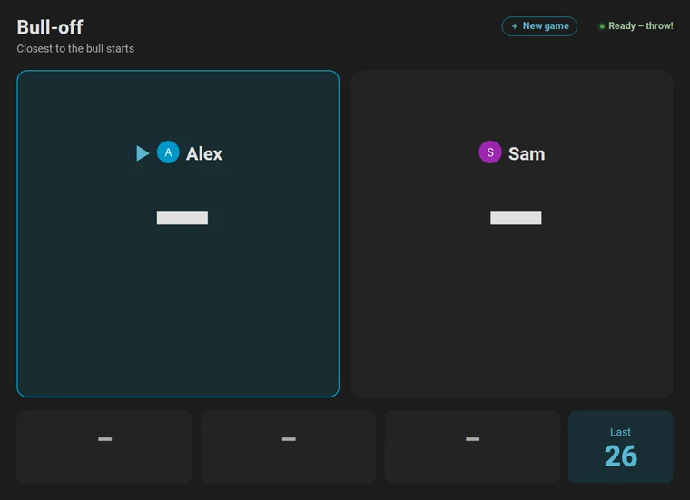
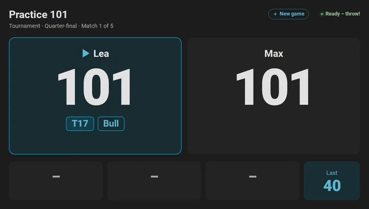
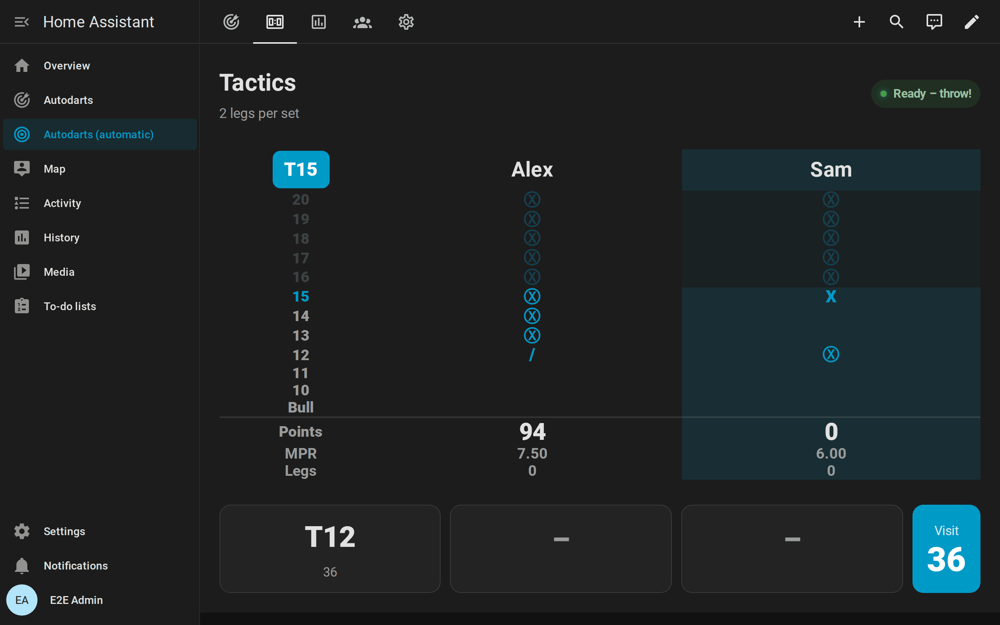
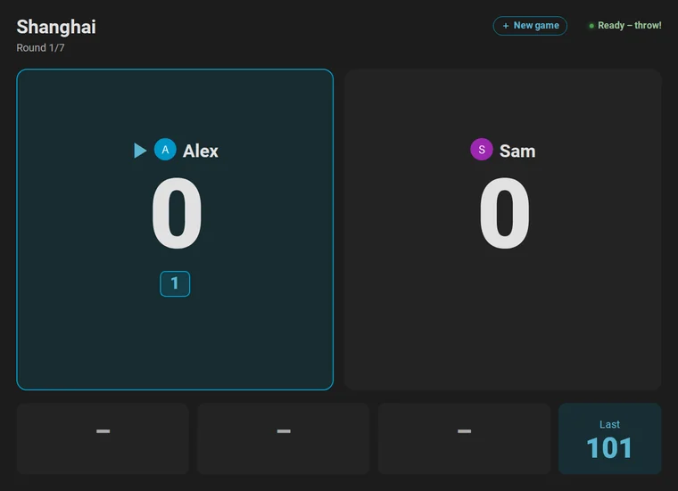
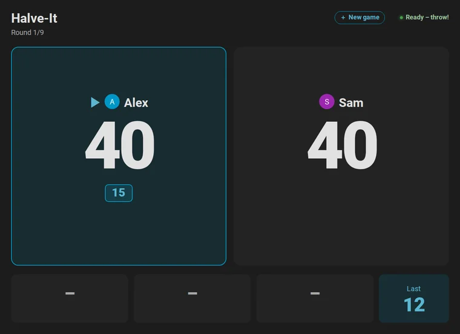
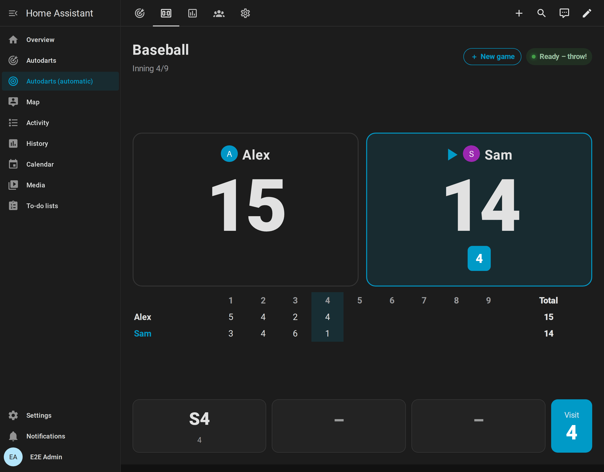
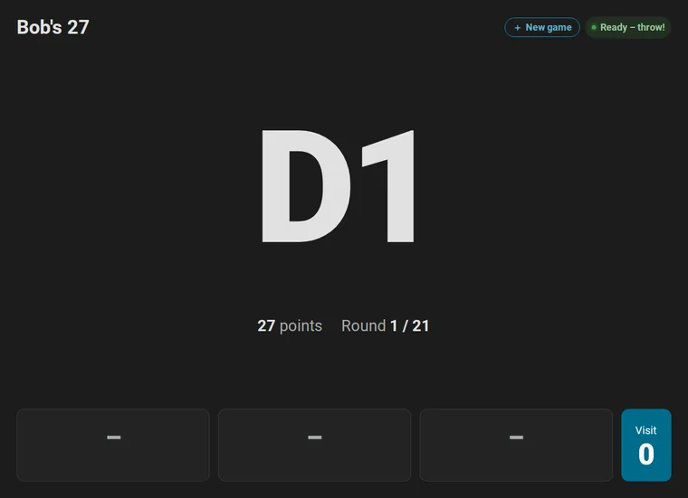
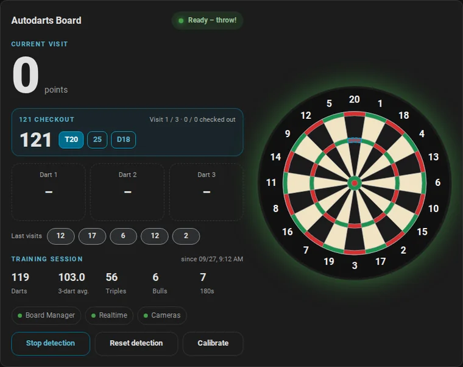
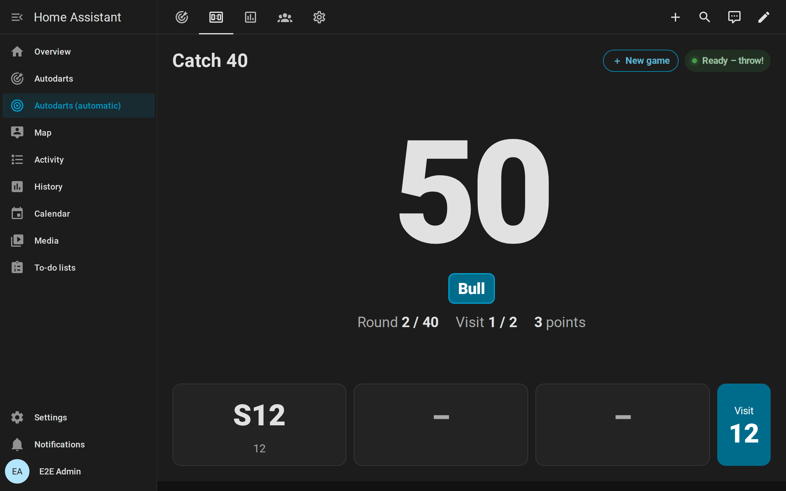

# Games and rules

[← Documentation](README.md) · [Deutsch](de/spiele.md)

Your Autodarts board plays games in Home Assistant itself: X01 from 101 to 1001, three Cricket games, six party games and eight training games, alone, as a match of up to four players or as a tournament of up to eight. Home Assistant counts every dart the board detects, recognizes busts, shows the checkout route and keeps the game through restarts. No Autodarts account, no cloud and no browser tab are needed.


**On this page:** [All games at a glance](#all-games-at-a-glance) · [Start a game](#start-a-game) · [At the board](#at-the-board) · [Matches, legs and sets](#matches-legs-and-sets) · [Match summary](#match-summary) · [Teams](#teams) · [Start scores (handicap)](#start-scores-handicap) · [Bull-off](#bull-off) · [Tournaments](#tournaments) · [X01](#x01) · [Cricket games](#cricket-games) · [Party games](#party-games) · [Training games](#training-games) · [Statistics](#statistics)

## All games at a glance

| Game | Players | Goal |
| --- | :---: | --- |
| [**X01**](#x01): 101, 301, 501, 701, 901, 1001 | 1–4, or two teams of two | Count down to exactly zero, by default on a double |
| [**Cricket**](#cricket) | 1–4, or two teams of two | Close 20 to 15 and the bull, and score on the numbers the others still have open |
| [**Cut-Throat Cricket**](#cut-throat-cricket) | 1–4, or two teams of two | Close everything with the fewest points: your points go to the others |
| [**Tactics**](#tactics) | 1–4, or two teams of two | Cricket on 20 to 10 and the bull |
| [**Shanghai**](#shanghai) | 1–4 | Score on the numbers 1 to 7; single, double and triple in one visit win at once |
| [**Halve-It**](#halve-it) | 1–4 | Hit the target of the round, or your points are halved |
| [**Killer**](#killer) | 2–4 | Win your number, become a killer and take the others' lives |
| [**Golf**](#golf) | 1–4 | Nine or 18 holes in the fewest strokes |
| [**Baseball**](#baseball) | 1–4 | Score the most runs in nine innings |
| [**Count-Up**](#count-up) | 1–4 | Score the most points in 1 to 20 rounds |
| [**Around the Clock**](#around-the-clock) | 1 | 1 to 20 and the bull in the fewest darts |
| [**Doubles training**](#doubles-training) | 1 | D1 to D20 and the bullseye in the fewest darts |
| [**Checkout training**](#checkout-training) | 1 | Random finishes from 2 to 170 within three visits |
| [**Bob's 27**](#bobs-27) | 1 | One visit at every double, without dropping to zero |
| [**121 checkout**](#121-checkout) | 1 | Check out 121 in nine darts, and climb |
| [**Catch 40**](#catch-40) | 1 | Check out 61 to 100, the faster the more points |
| [**JDC Challenge**](#jdc-challenge) | 1 | The 57-dart routine of the Junior Darts Corporation |
| [**Singles training**](#singles-training) | 1 | One visit at each number, points per mark |
| [**Tournament**](#tournaments) | 3–8 | A round robin or a knockout of X01 or Cricket matches, one at a time |

## Start a game

There are four ways to start a game. All of them end in the same place: the *Practice game* of your board, which the [live card](cards.md#live-card), the [scoreboard](scoreboard.md) and the [board events](entities.md#board-events) follow.

1. **On the screen at the board.** Tap **New game** on the [scoreboard](scoreboard.md#choose-the-next-game), choose the game, the players and the format, and tap **Start**. The screen also opens by itself a few seconds after a game ends, ready for a rematch. **Tournament** on the same screen starts a [tournament](#tournaments).
2. **On the dashboard.** The *Live* view of the [automatic dashboard](cards.md#automatic-dashboard) has the practice controls: *Practice game*, the number of players, their names and start scores, legs, sets and the rules. Choosing a game starts it.
3. **In an automation or script** with the action [`autodarts.start_game`](entities.md#start-a-practice-game-autodartsstart_game), which sets everything in one call:

   ```yaml
   action: autodarts.start_game
   data:
     game: "501"
     players: [Alex, Sam]
     legs: 3
   ```

4. **By voice** with Assist: "Start Cricket for Alex and Sam". The [automation guide](automations.md#start-a-game-by-voice) has the automation.

To end a game, choose *Off* in *Practice game*, or tap **End game** on the new game screen. *New practice leg* starts the leg again; *New practice match* starts the match from zero legs and sets.

## At the board

- **A visit ends when you pull the darts.** The practice game books it with the takeout. Darts that are already in the board when a game starts do not count.
- **Three darts per visit.** A fourth dart before the takeout does not count. Darts the board does not detect, such as bounce-outs, count as not thrown.
- **Corrections count.** When you correct a dart in Autodarts before the takeout, the game follows the correction.
- **The turn passes with the takeout,** also after a bust. The live card and the scoreboard outline the player at the board.
- **What the cards show:** the remaining score and the checkout route, the Cricket chalkboard, the round and the target of a party game or the target of a training game. The board outlines the bed to aim at. [Live card](cards.md#live-card), [scoreboard](scoreboard.md).
- **Events for your automations:** `bust`, `leg_won`, `match_won`, `turn_changed`, `bull_off_won`, `drill_finished`, `checkout_attempt`, `achievement_unlocked` and the tournament events arrive the moment they happen, for callers and [light shows](automations.md#light-show).
- **Training sessions keep counting.** The practice game and the [training session](statistics.md#training-sessions) are independent; a dart counts in both.

## Matches, legs and sets


- **Players:** set *Practice players* to 2, 3 or 4, or choose them on the new game screen. After every visit the next player throws; a bust passes the turn too.
- **Legs and sets:** the first player to win *Practice legs per set* legs wins the set; there is no tie-break and no need for two clear legs. The first player to win *Practice sets to win* sets wins the match. With one set to win, a match is simply the first to that many legs. With one player, legs just count up.
- **Throwing first:** as in PDC set play, the first throw passes to the next player every leg within a set, and every new set starts with the player after the one who started the previous set. With two players, player 1 starts sets 1, 3 and 5 and player 2 sets 2 and 4. The first leg of a match starts with player 1, or with the winner of the [bull-off](#bull-off).
- **Result:** the result stays on the cards until the next dart, which starts a new match. The winner keeps the legs of the deciding set, so a first-to-3 match ends 3–2 on the scoreboard. `match_won`, the match history and the [player profiles](statistics.md#player-profiles) keep every player's legs and sets; `match_legs` counts the legs of the whole match.
- **Averages:** each player's average and marks per round cover the whole match.

## Match summary


When an X01 or Cricket match of several players ends, the scoreboard and the live card sum it up: a column for every player, the winner's highlighted, with the result in the first row. The winner's banner names the result too, for example *Alex wins the match 3 : 2!*

- **X01:** legs and sets, 3-dart and first-9 average, the checkout rate with the legs checked out and the darts at a double, the highest checkout, 180s, 140+ and 100+ visits, the best leg in darts and all darts. Without double out, the checkout rate and the darts at a double are left out.
- **Cricket:** legs and sets, marks per round, marks, the best leg in darts and all darts.
- **Party games** keep their scores on the screen.
- **How long:** until the first dart of the next game, or for `summary_seconds` of the [card](cards.md#match-summary). `match_won` carries the numbers for your automations, for example to [send them to your phone](automations.md#send-the-summary-of-a-match). [How they are counted](how-it-works.md#match-summary).

## Teams


- **Two teams of two:** turn on *Practice teams* (on the new game screen: *Teams*) and play X01 or a Cricket game with four players. Players 1 and 3 play against players 2 and 4. The throwing order is the seat order, so the teams alternate: A1, B1, A2, B2. With fewer or more than four players, and in party and training games, everybody plays alone.
- **One score per team:** partners share the remaining score, the opening double with double in, and in the Cricket games the marks and points. A team plays from the start score of its first player.
- **Throwing first** passes to the next seat every leg, as in any match of four, so the teams take turns.
- **Winning:** both partners win the leg and the match. The scoreboard names the winning team, and `leg_won` and `match_won` add `team` and `team_name`, for example *Alex & Kim*.
- **Statistics per person:** the first nine, the checkout rate, the averages and the marks per round stay with the player who threw the darts. The player profiles count the leg and the match for both partners, and each of them beats both opponents in the head-to-head records; partners play no head-to-head. A team leg sets no fewest-darts and no marks-per-round personal best; a checkout still counts for the player who threw it.

## Start scores (handicap)



- For a fair match between players of different strength, every player can start X01 from a score of their own, from 2 to 1001: set *Practice start score player N*, use − and + beside the player on the new game screen, or pass `start_scores` to [`autodarts.start_game`](entities.md#start-a-practice-game-autodartsstart_game).
- `0` plays the game's start score. All other rules stay the same; the average counts from the player's own start, and `leg_won` names it in `start`.
- The scoreboard and the live card show every start score of its own beside the name.
- A leg counts for the fewest-darts personal best of the score it really started from: a leg from 301 for `fewest_darts_301`, a leg from 401 for none, because 401 is no X01 game.

## Bull-off



- With *Practice bull-off* (on the new game screen: *Bull-off*) and two or more players, a match starts with one dart per player at the bull, in seat order. Only the first dart of each visit counts. The scoreboard shows the bed of every dart and its distance from the center, marks the dart that leads, and says *Tie – throw again* when a tie throws again.
- As the WDF and PDC rules want, the bullseye beats the outer bull, which beats every other bed. Two or more darts in the same bull bed tie: those players throw again, the last of them first.
- Outside the bull, the dart closer to the center wins. The distance comes from the position the board reports, measured against the outer edge of the double ring (170 mm).
- With *Practice bull-off by distance*, the measured distance also decides between two darts in the same bull bed; darts equally close to 0.1 mm throw again.
- A dart without a position cannot be measured, so it never beats a measured dart: when the decision needs a distance the board did not report, those players throw again.
- The bull-off only decides who starts. With three or four players, the others follow in seat order. `bull_off_won` announces the winner, for example for the [practice caller](automations.md#practice-caller).

## Tournaments



A tournament for three to eight named players at one board, one match at a time: a **round robin**, in which everyone plays everyone once and a table ranks the players, or a **knockout**, in which the winners go on through a bracket until the final. Every match is an X01 match, with start scores for a handicap if you like, or a Cricket game, with the legs, sets and rules of the tournament. The results go into the [player profiles](statistics.md#player-profiles) and the head-to-head records like every match.

1. **Start:** tap **New game** on the scoreboard, then **Tournament**. Choose the players, round robin or knockout, the game, the legs and sets and the rules, and tap **Start tournament**. Or start it from an automation:

   ```yaml
   action: autodarts.start_tournament
   data:
     players: [Alex, Sam, Kim, Lea]
     format: round_robin
     game: "501"
     legs: 2
   ```

2. **Play:** the first match starts at once, and the title line of the scoreboard names the round and the match. When a match is decided and the darts are pulled, the scoreboard shows its summary, then the table or the bracket with the next match and a countdown. The next match starts by itself; **Start now** skips the wait.
3. **Winner:** after the last match, a banner names the winner, and the table or the bracket stays until a new match begins. `tournament_finished` can start the [light show](automations.md#light-show) or [announce the results](automations.md#announce-the-results-of-a-tournament).

<table>
  <tr>
    <td width="50%"></td>
    <td width="50%"></td>
  </tr>
</table>

The [entity reference](entities.md#tournaments) lists the tournament's settings, buttons and actions, and the [scoreboard guide](scoreboard.md#tournaments) what the screen shows.

### Tournament rules

- **Players:** three to eight players with a name each. A name is the same player regardless of upper and lower case, as in the [player profiles](entities.md#player-profiles).
- **Draw:** the order of the names, or a random order with *Tournament random draw* or a `seed`. The same seed always draws the same order; a random draw without a seed picks one and shows it in the `seed` attribute of *Tournament*.
- **Round robin:** everyone plays everyone once, in rounds by the circle method: three or four players play 3 rounds, five or six play 5, seven or eight play 7. With an odd number of players, one player sits out every round. Within a round, a player of the round's last match opens the next round only when no other match can, and the first throw goes to the player of a match who had it less often.
- **Points:** a won match is worth 2 points, as in the Premier League, a lost one none. A match cannot end in a draw.
- **Tie-breakers:** players level on points are ranked by
  1. the points they won in the matches among themselves,
  2. the leg difference: legs won minus legs lost over all their matches, every leg of a match with sets included,
  3. the 3-dart average over all their matches (Cricket: the marks per round),
  4. the order of the draw.

  So of two players level on points, the one who won their match goes first; of three players who beat each other in turn, the leg difference decides.
- **Knockout:** a bracket of 4 places for three or four players and of 8 places for five to eight. The first player of the draw is seed 1, the second seed 2, and so on, placed as in professional draws: seed 1 meets the last seed first, seeds 1 and 2 can meet in the final at the earliest, and seeds 1 to 4 not before the semi-finals. Places the players do not fill are byes for the top seeds, who go straight into the next round. The rounds are the quarter-finals, the semi-finals and the final.
- **Third place:** with *Tournament third-place match* and four players or more, the losers of the semi-finals play for third place, before the final. Without it, a knockout has no third place.
- **Order of play:** one match at a time, round by round. A knockout plays the matches of a round from the top of the bracket down, and the match for third place before the final.
- **Matches:** every match is a [match](#matches-legs-and-sets) of two players, with the legs per set, sets to win, double out, double in and bull-off of the tournament. In X01, a player with a start score of their own starts every leg of the tournament from it, a handicap; the other one from the game's. The first named player throws first, unless the bull-off decides.
- **Averages:** a player's average counts the points and darts of all their tournament matches; the darts of a bust visit count, its points do not.
- **Winner:** the winner of the final, or the player at the top of the table after the last match.

## X01


- **Counting down:** the score starts at 101, 301, 501, 701, 901 or 1001, and every dart subtracts its score.
- **Double out** (on by default): the last dart of a leg must hit a double or the bullseye. Without double out, any bed finishes.
- **Double in** (off by default): a player's score starts with the first double or bullseye of the leg; darts before it score nothing. The cards ask for a double and outline the double ring. A bust takes the opening double back.
- **Changing double out:** a leg keeps the rules it started with. Switching double out on or off during a leg, once a dart counted, applies from the next leg; before the first dart of a leg, between matches and in the other games it applies at once. So no leg becomes unwinnable: a player who stands on 1 in a leg without double out can still finish it with a single 1 when double out comes on.
- **Bust:** a dart that goes below zero, leaves 1 with double out, or reaches 0 without a double busts the visit. The score returns to the start of the visit. The dart that busts counts as thrown; later darts of the visit do not.
- **Game shot:** a dart that reaches exactly 0 wins the leg. `leg_won` is announced at once; the leg is booked when you pull the darts, so a correction before that still counts. Darts after the winning dart do not count.
- **Checkout route:** whenever a score can be finished, the cards show the route for the darts left in the visit, for example `T20 T20 BULL` for 170, and outline the next bed on the board. "No checkout possible" appears only for a score that one visit could finish: up to 170 with double out, up to 180 without. The route follows the professional checkout charts; with *Practice personal checkout routes*, it prefers your strongest doubles. [How the route is chosen](how-it-works.md#practice-game).
- **Average:** points scored per three darts of the leg. Darts of a bust visit count, their points do not.


## Cricket games


The live card and the scoreboard show a chalkboard with the marks of every player or team (`/`, `X`, `Ⓧ`), the points and the marks per round (MPR). Numbers everybody has closed are dimmed, and the board outlines the next open number, from 20 down to the bull. Screen readers read the marks as words.

### Cricket

- **Marks:** only 20 to 15 and the bull count. A single is one mark, a double two, a triple three; the outer bull is one mark, the bullseye two. Three marks close a number.
- **Points:** further marks on a closed number score its value (25 for the bull) as long as another player still has it open.
- **Win:** close every number with at least as many points as everybody else. The win is checked after every dart, so a closing dart wins at once when the points are enough, and later darts of the visit do not count. Alone, closing every number wins the leg.
- **Marks per round:** the marks that closed a number or scored, per three darts actually thrown. Marks on a number nobody needs any more do not count.


### Cut-Throat Cricket

- **Marks:** as in Cricket, on 20 to 15 and the bull.
- **Points go to the others:** further marks on a closed number give its value to every other player who still has it open; the player who threw them scores nothing.
- **Win:** close every number with no more points than anybody else: the fewest points win. Alone, closing every number wins. The scoreboard reminds everybody that the fewest points win.

### Tactics

- Cricket on the numbers 20 to 10 and the bull, twelve numbers in all. Marks, points and the win follow the rules of Cricket.



## Party games

Six pub classics for one to four players; Killer needs two. They book a visit when you pull the darts and win legs and sets like any match. The cards show the round, the target and every player's points or lives, and outline the beds to aim at. Party games do not count for the X01 statistics.

### Shanghai



- Seven rounds at the numbers 1 to 7; the traditional pub game plays 1 to 20 or nine rounds.
- Every dart in any bed of the round's number scores its value. A miss next to the number counts nothing.
- A single, a double and a triple of the number in one visit, a *Shanghai*, win the leg at once; later darts of the visit do not count.
- After seven rounds, the most points win. A tie in points goes to the player with more hits; with equal hits, the leg is played again and the next player starts it.

### Halve-It



- Everybody starts with 40 points. The nine rounds aim at 15, 16, any double, 17, 18, any triple, 19, 20 and the bull, shown as *Bull (25/50)*.
- Hits add their score. *Any double* includes the bullseye. In the bull round, the outer bull scores 25 and the bullseye 50.
- A visit without a hit on the target halves the points, rounded down, also when fewer than three darts were thrown.
- The most points after nine rounds win; ties are decided as in Shanghai.

### Killer


- Two to four players with 3 lives each.
- First, everybody throws one dart for a number of their own: any bed of 1 to 20 that nobody has yet. A miss, the bull or a number already taken means throwing again.
- Only doubles count after that. Hitting the double of your own number makes you a killer for the rest of the leg. Before that, the doubles of the others do nothing.
- A killer takes a life with every hit on another player's double and loses one with every hit on their own, also with a second own double in the visit that made them a killer.
- A player without lives is out: the rest of the visit does nothing, and the turn skips them from then on.
- The last player with a life left wins at once; later darts of the visit do not count.

### Golf


- Nine or 18 holes, set in *Practice Golf holes*; hole *n* is played on the number *n*.
- A player throws up to three darts per hole and may stop after any dart by pulling the darts: **the last dart thrown counts**.
- Strokes: a triple 1, a double 2, an inner single 3, an outer single 4, anything else 5. Whether a single is inner or outer comes from the position the board reports; a single without a position counts as an outer single.
- The fewest strokes after the last hole win. A tie at the top plays extra holes among the tied players, in their throwing order, on the next numbers (after 20 from 1 again), until one of them has fewer strokes after a hole. The scoreboard keeps a scorecard of every hole and shows the extra holes as a play-off.

### Baseball



- Nine innings; inning *n* is played on the number *n*, with one visit of three darts.
- Every dart in a bed of the inning's number scores runs: a single 1, a double 2, a triple 3. The bull scores nothing.
- The most runs after nine innings win. A tie at the top plays extra innings among the tied players on 10, 11 and so on, until one of them leads after an inning.

### Count-Up

- 1 to 20 rounds, set in *Practice Count-Up rounds*, 8 by default. Every dart scores its value.
- The most points win. A tie at the top plays extra rounds among the tied players until one of them leads after a round.

## Training games

Eight classic drills for one player. Each follows the darts of the current visit, books the visit when you pull the darts and outlines its target on the board. A finished game stays on the cards until the next dart starts it again; *New practice leg* starts it again at once. Every game keeps its last 10 results, and its best result is a [personal best](statistics.md#personal-bests-streak-and-daily-goal). `drill_finished` and `checkout_attempt` announce the results.

### Around the Clock


- 1 to 20, then the bull, in order, with any bed of the number. The bull target reads *Bull (25/50)* on the cards, `25` in the attributes: the outer bull and the bullseye both count, and both are outlined. Fewer darts are better.

### Doubles training

- D1 to D20, then the bullseye (`BULL`); only the double ring and the bullseye count. Fewer darts are better, and every dart counts for your [doubles analysis](statistics.md#doubles-analysis).

### Checkout training

- A random score from 2 to 170 that three darts can finish, checked out on a double within three visits. A bust or a third visit without the finish ends the attempt; the route shows only while the attempt goes on. The checkout rate counts successful attempts.

### Bob's 27



- Start with 27 points and throw one visit at each double from D1 to D20 and then at the bullseye. Every hit adds the value of the double; a visit without a hit subtracts it.
- The game is lost as soon as the score reaches zero or less, and completed after the bullseye.

### 121 checkout



- Check out 121 on a double within three visits, nine darts. A finish raises the target to the next score; a bust or three visits without the finish lower it by one, never below 121.
- Scores without a checkout (159, 162, 163, 165, 166, 168, 169) are skipped, and 170 is the top. The highest score checked out is the personal best.

### Catch 40



- Check out 61, 62 and so on up to 100, each on a double within two visits, six darts.
- A checkout in two darts scores 3 points, in three darts 2 and in four to six darts 1. A bust or two visits without the finish score nothing, and the next number follows. At most 120 points.

### JDC Challenge

- The practice routine of the [Junior Darts Corporation](https://www.juniordarts.com/), 57 darts, as its academies play it ([rules](https://www.godartspro.com/jdc/)).
- First one visit at each number from 10 to 15: every dart in a bed of the number scores its value, and a single, double and triple of it in the visit add 100 (a Shanghai).
- Then one dart at each double from D1 to D20, 50 points a hit, and one at the bullseye for 100. A dart the board does not detect moves on to the next double with the next detected dart.
- Then one visit at each number from 15 to 20 like the first part. At most 3,380 points.

### Singles training

- One visit at each number from 1 to 20 and then at the bull (`25`).
- Every dart in a bed of the number scores a point per mark: a single 1, a double 2, a triple 3; the outer bull 1 and the bullseye 2. At most 186 points.

## Statistics

Every game feeds the statistics: X01 legs the first-9 average, checkout rate and doubles rate; Cricket the marks per round; named players their [profiles](statistics.md#player-profiles), head-to-head records, match history, [achievements](statistics.md#achievements) and weekly trends; every dart at a double the [doubles analysis](statistics.md#doubles-analysis). The [statistics guide](statistics.md) shows all of it, and [records and statistics](how-it-works.md#records-and-statistics) explains exactly which legs count for which record.
