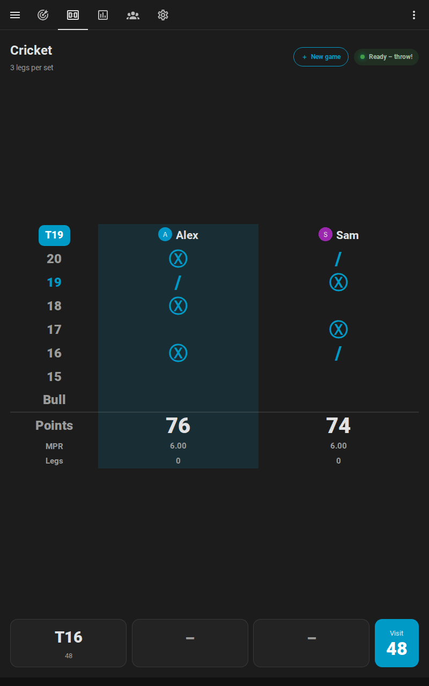

# Scoreboard at the board

[← Documentation](README.md) · [Deutsch](de/anzeigetafel.md)

A tablet or a TV next to the board turns your darts room into a stage: the score large enough to read from the oche, the checkout route of the player at the board, the next game chosen right there, a caller, and between games a leaderboard. Everything runs in Home Assistant; the screen only needs a browser.


**On this page:** [What you need](#what-you-need) · [Set up the screen](#set-up-the-screen) · [Landscape, portrait and TV](#landscape-portrait-and-tv) · [Choose the next game](#choose-the-next-game) · [During the game](#during-the-game) · [The caller](#the-caller) · [Between games: idle mode](#between-games-idle-mode) · [Tips](#tips) · [If something is off](#if-something-is-off)

## What you need

- **A screen with a browser:** a tablet on the wall, a TV with a browser or a small PC, an old phone. Anything that opens your Home Assistant works.
- **A Home Assistant user for the screen.** A user of its own, without administrator rights, keeps the screen from changing your settings. The screen shows the dashboard in that user's language: English or German, other languages in English.
- **The integration's cards,** which load by themselves. There is nothing to install on the screen.

## Set up the screen

1. **Create the dashboard.** Go to **Settings → Dashboards → Add dashboard → Autodarts**. The [automatic dashboard](cards.md#automatic-dashboard) has a *Scoreboard* view that shows the [scoreboard card](cards.md#scoreboard-card) across the whole screen.
2. **Open the view on the screen.** Sign in as the screen's user and open the dashboard's *Scoreboard* view. Its address ends in `/scoreboard`; bookmark it or put it on the home screen of the tablet.
3. **Go full screen.** Use the browser's full-screen mode or a kiosk browser that opens the address at start. Keep the screen awake while it is on the charger, in the settings of the tablet or the kiosk browser.
4. **Switch on what you like.** Open the dashboard's menu (⋮) → **Edit dashboard** → **Take control** to change the card, or build a view of your own: a view in panel mode with the scoreboard card and `full_height: true`. Useful options are the [caller](#the-caller), the games of the [new game screen](#choose-the-next-game) and the panels of [idle mode](#between-games-idle-mode):

```yaml
type: custom:autodarts-scoreboard-card
full_height: true
caller: true
lobby_games: ["301", "501", cricket, killer, around_the_clock]
idle_after: 300
idle_panels: [leaderboard, today, last_match, clock]
```

The [card guide](cards.md#scoreboard-card) lists every option.

## Landscape, portrait and TV

The scoreboard adapts to the shape of the screen. With `full_height: true` it fills the screen below the toolbar, and on a phone it leaves room for the browser's address bar.

<table>
  <tr>
    <td width="62%"></td>
    <td width="38%"></td>
  </tr>
  <tr>
    <td align="center">Landscape tablet or TV</td>
    <td align="center">Portrait tablet</td>
  </tr>
</table>

- **Landscape tablet or TV:** the best choice for X01 and the party games, whose player tiles sit side by side.
- **Portrait tablet:** fine for Cricket, whose chalkboard is tall, and for one or two players.
- **Distance:** the remaining score is the largest text on the screen and grows with it. The bigger the screen, the farther away it reads, so a TV also serves the people watching.

## Choose the next game

Tap **New game** below the score between games, or at the top right at any time. The screen also opens by itself a few seconds after a match or a training game ends, with the last choice ready for a rematch; a dart thrown instead closes it again.


1. **Game:** X01, the Cricket games, the party games and the training games, grouped. `lobby_games` limits the choice to the games you play.
2. **Players:** tap a name to add the player, ▲ and ▼ to change the order, ✕ to remove them. Players [linked to a person](statistics.md#players-and-persons) who is at home come first, with their picture. Type a new name, or add a guest without one. In X01, − and + beside a player set a [start score](games.md#start-scores-handicap) of their own.
3. **Format and options:** legs per set and sets to win; double out and double in for X01; the [bull-off](games.md#bull-off); *Teams* for four players of X01 or Cricket.
4. **Start.** The scoreboard shows the game at once. During a game, *End game* stops it after a second tap.


The screen starts the game with [`autodarts.start_game`](entities.md#start-a-practice-game-autodartsstart_game), exactly like an automation or a voice command would. The [games guide](games.md#start-a-game) shows the other ways.

## During the game

The scoreboard always shows what is being played, and the player at the board is outlined:

| Game | The scoreboard shows |
| --- | --- |
| X01 | Every player's or team's remaining score, legs, sets and average; the checkout route, a bust or the game shot of the player at the board |
| Cricket games | A large chalkboard with the marks of every player or team, the points and the marks per round; the next open number in the top-left corner |
| Party games | The round and the target, every player's points, in Killer their number and lives, in Golf and Baseball a scorecard of every hole or inning |
| Bull-off | The distance of every player's dart from the center |
| Training games | The target in large type with the round, the points or the hit rate |

Along the bottom it shows the three darts of the current visit and their score, and when a match is decided, a banner names the winner until the next dart.

<table>
  <tr>
    <td width="50%"></td>
    <td width="50%"></td>
  </tr>
  <tr>
    <td width="50%"></td>
    <td width="50%"></td>
  </tr>
</table>

## The caller

With `caller: true`, the screen at the board calls the game itself, through the speaker of the tablet or the TV. It needs no speakers or text-to-speech in Home Assistant.

1. Switch on `caller` in the card's editor, or use the scoreboard of the automatic dashboard after **Take control**.
2. Browsers play sound only after a tap: tap **Caller** on the scoreboard once. The speaker symbol and the pressed button show that it is on; tap again to mute it.

It calls only what counts, in English or German, following the language of the screen's user:

- **X01:** the points of a visit, "No score" for a bust or a visit before the opening double, "you require 81" whenever the remaining score can be finished, the game shot of a leg and the match, and a fanfare for a 180.
- **Cricket games:** the marks of a visit, such as "5 marks". **Shanghai** and **Halve-It:** the points on the target; **Count-Up:** the points of the visit; **Baseball:** the runs.
- **Checkout training, 121 checkout and Catch 40:** what the next attempt requires.
- Darts after a bust or a game shot are not called. Killer, Golf and the other training games get no score calls.

`call_scores`, `call_checkouts`, `call_results` and `call_sounds` switch each kind of call on or off. Which voice speaks depends on the browser and the operating system: offline voices of the operating system keep the calls in your home; some browsers use online voices that send the text to their provider. For speakers in the room, use the [dart caller and practice caller blueprints](automations.md#which-caller) instead.

## Between games: idle mode

When no game runs, or a match or training game is decided, and nobody throws or taps for `idle_after` seconds (3 minutes by default), the scoreboard shows its panels in turn: the leaderboard, the personal bests of the board, today's darts towards the daily goal, the last match and a clock.


A dart, a new game or a tap anywhere ends idle mode. `idle_panels` chooses the panels and their order, `idle_interval` how long each one shows. On devices set to reduce motion, the panels change without fading. [All panels](cards.md#idle-mode).

## Tips

- **The live card on a second screen:** a phone or a second tablet with the [live card](cards.md#live-card) shows the board with every dart where it landed, next to the scoreboard.
- **Pictures of the players:** [link the players to persons](statistics.md#players-and-persons) of Home Assistant; the scoreboard, the new game screen and idle mode show their pictures, and players who are at home come first.
- **Light and sound:** the [light show](automations.md#light-show) and the [practice caller](automations.md#practice-caller) react to the same game, with the lights and speakers of your home.
- **Several boards:** every board gets its own *Scoreboard* view in the automatic dashboard; choose the board in the card's editor for a view of your own.
- **Accessibility:** the scoreboard follows your theme, announces the winner to screen readers, reads the Cricket marks as words and changes the panels of idle mode without fading when the device asks for reduced motion. [Accessibility](cards.md#accessibility).

## If something is off

| What you see | What helps |
| --- | --- |
| The caller stays silent | Tap **Caller** once after every reload of the page: browsers play sound only after a tap. Check the volume of the device. |
| The new game screen does not open | It never opens in the preview of the card editor, and not with `lobby: false`. |
| The screen shows an old version of the card after an update | Reload the page. In the Home Assistant app, use *Settings → Companion app → Debugging → Reset frontend cache*. |
| Idle mode starts during a game | Idle mode waits for `idle_after` seconds without darts and taps, and only when no game runs or the game is decided. Raise `idle_after`, or set `idle: false`. |
| No picture next to a name | The player is not linked to a person, or the person has no picture. See [players and persons](statistics.md#players-and-persons). |

More help: [troubleshooting](troubleshooting.md).
