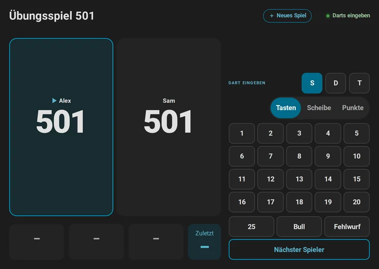
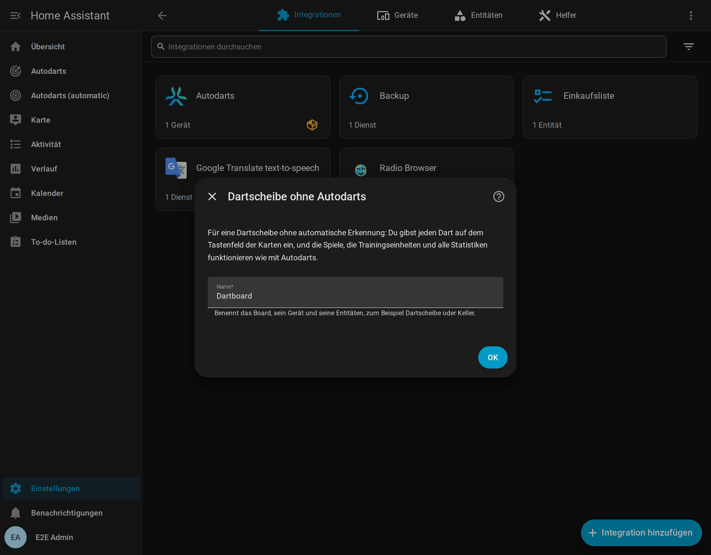
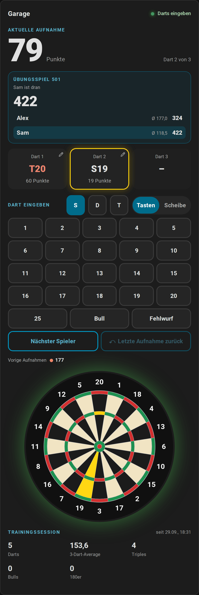

# Spielen ohne Autodarts

[← Dokumentation](README.de.md) · [English](without-autodarts.md)

Kein Autodarts an deinem Board? Die Integration funktioniert mit jeder Steeldartscheibe: Du gibst jeden Dart selbst auf einem Tastenfeld ein, auf einem Tablet neben dem Board oder auf deinem Handy, und bekommst alle Spiele, die Trainingseinheiten und alle Statistiken, genau wie mit automatischer Erkennung.

**Auf dieser Seite:** [Für wen](#für-wen) · [Einrichten](#einrichten) · [Darts eingeben](#darts-eingeben) · [Was alles funktioniert](#was-alles-funktioniert) · [Was anders ist](#was-anders-ist) · [Mehrere Boards](#mehrere-boards)

## Für wen

- **Eine Dartscheibe ohne Kameras.** Spiele X01 mit Anzeigetafel und Checkout-Weg, Cricket auf einer Kreidetafel, Partyspiele für bis zu acht und Turniere, und verfolge deine Averages, ohne eine automatische Erkennung zu kaufen.
- **Ein zweites Board,** etwa im Keller oder bei Freunden, neben einem Autodarts-Board im Wohnzimmer. Jedes Board führt eigene Statistiken.
- **Zum Ausprobieren,** bevor ein Autodarts-System kommt. Nichts davon braucht ein Konto oder das Internet.

## Einrichten

Installiere zuerst die Integration: Die Schritte 1 bis 3 von [Vom Start bis zur Anzeigetafel](getting-started.de.md) zeigen, wie es mit Home Assistant und HACS geht.

1. Wähle den Knopf oben, oder öffne **Einstellungen → Geräte & Dienste → Integration hinzufügen → Autodarts**.
2. Wähle **Dartscheibe ohne Autodarts: jeden Dart selbst eingeben**.
3. Gib dem Board einen Namen, etwa *Keller*, und wähle **Übermitteln**. Die Integration legt ein Gerät mit diesem Namen an, mit den Entitäten der Spiele, des Trainings und der Statistiken.
4. Lege das Dashboard an: **Einstellungen → Dashboards → Dashboard hinzufügen → Autodarts**. Seine Ansichten *Live* und *Anzeigetafel* haben das Tastenfeld.

## Darts eingeben

An einer Dartscheibe ohne Autodarts zeigen die Live-Karte und die Anzeigetafel das Tastenfeld unter der Aufnahme, ohne dass du eine Option einschalten musst:

- **Ein Dart:** Tippe **S**, **D** oder **T**, dann die Zahl. **25**, **Bull** und **Fehlwurf** haben eigene Tasten. Jeder Dart beginnt wieder als Single.
- **Wo er steckt:** **Scheibe** oben im Tastenfeld zeigt die Scheibe statt der Tasten. Tippe, wo der Dart steckt, und das Feld ergibt sich aus der Stelle. So eingegebene Darts zählen auch für die [Dart-Positionen und ihre Streuung](statistics.de.md#trefferbild-und-dart-positionen). Auf dem Handy zielt ein Finger mit einer Lupe, und zwei Finger zoomen, wie beim [Korrigieren eines Darts](scoreboard.de.md#darts-korrigieren-und-eingeben).
- **Die Aufnahme:** Nach dem dritten Dart sagt der Status *Aufnahme komplett*. **Nächster Spieler** beendet die Aufnahme; er braucht einen zweiten Tipp, damit ein versehentlicher Tipp nie weitergibt. Ohne Dart gibt er weiter, was als Aufnahme mit drei Fehlwürfen zählt.
- **Ein Fehler:** Tippe auf einen Dart der Aufnahme, um ihn in ein anderes Feld zu legen. Solange kein Dart der nächsten Aufnahme eingegeben ist, nimmt der gebogene Pfeil von **Letzte Aufnahme zurück** die letzte Aufnahme zurück, samt dem Spiel, wie es war.

Die [Aktionen](entities.de.md#dart-eingeben-autodartsthrow_dart) `autodarts.throw_dart`, `autodarts.next_player` und `autodarts.undo_visit` tun dasselbe aus einer Automation, einem Skript oder einem eigenen Knopf; bei mehreren Boards nennst du die `config_entry_id` des Boards.

## Was alles funktioniert

Alles, was die Integration mit Darts macht, denn dafür hat sie die Kameras nie gebraucht:

- **Jedes Spiel:** X01 von 101 bis 1001 mit Legs, Sätzen, Double-In und -Out, dem Checkout-Weg und Stellwürfen, dem Ausbullen, Teams und Handicaps; die vier Cricket-Spiele; die sechs Partyspiele für bis zu acht; die acht Trainingsspiele; der [Bot](games.de.md#gegen-den-bot-spielen) und [Turniere](games.de.md#turniere).
- **Jede Statistik:** Trainingseinheiten, Bestleistungen, das Tagesziel und die Serie, Spielerprofile mit ihren Abzeichen, Erfolge, Trends, Doppel, die Bestenliste, der Wochenbericht, der Trainingskalender und der Export. Von Hand eingegebene Darts zählen für alles wie erkannte.
- **Der Bildschirm am Board:** die [Anzeigetafel](scoreboard.de.md) mit dem Bildschirm für ein neues Spiel, dem Caller, den Feiern und dem Ruhemodus.
- **Automationen:** Die Board-Ereignisse, etwa `visit_completed` oder `leg_won`, kommen wie mit einem Board, mit `manual: true` und der Quelle `manual`, daher funktionieren die [Blueprints](automations.de.md#blueprints) für Lichtshow, Caller und Berichte unverändert.

## Was anders ist

| | Mit Autodarts | Ohne Autodarts |
| --- | --- | --- |
| Darts | Von den Kameras erkannt, mit einem Tipp korrigiert | Auf dem Tastenfeld eingegeben |
| Status | Bereit, Entnahme, Erkennung gestoppt und mehr | *Darts eingeben* und *Aufnahme komplett*; der Sensor *Erkennungsstatus* zeigt *Eingabe von Hand* |
| Tastenfeld | Eine Option, solange *Übungsspiel manuelle Eingabe* an ist | Immer da, außer `keypad: false` einer Karte blendet es aus |
| Darts der Aufnahme | Von Hand eingegebene Darts bekommen einen gestrichelten Rahmen | Kein Rahmen, weil jeder Dart von Hand kommt; Korrekturen behalten ihren Stift |
| Entitäten | Spiele, Training und Statistiken, dazu Erkennung, Verbindung, Bewegung, Kameras, Board-Einstellungen und der Board-PC | Spiele, Training und Statistiken |
| Automatisches Dashboard | Ansichten *Live*, *Anzeigetafel*, *Training*, *Spieler*, *Spieleinstellungen* und *Board* | Keine Ansicht *Board*: Es gibt keine Erkennung, Kamera oder Board-PC |
| Board-Status-Karte | Erkennung, Verbindungen, Board-PC, Kameras und Wartung | Ein Hinweis, dass das Board nichts davon hat |
| Dart-Positionen | Für jeden erkannten Dart | Für Darts, die auf der Scheibe des Tastenfelds eingegeben sind |
| Erkennungsqualität, Kalibrierung, Online-Matches | Ja | Nein |

Ein Bildschirm, der nur die Anzeigetafel zeigt, etwa ein Fernseher ohne Touch, blendet das Tastenfeld mit der Option `keypad: false` der Karte aus; siehe [Dashboard-Karten](cards.de.md#darts-korrigieren-und-eingeben).

## Mehrere Boards

Jede Dartscheibe ohne Autodarts ist ein eigener Eintrag und ein eigenes Gerät, mit eigenen Entitäten, Spielen und Statistiken, ebenso jedes Autodarts-Board daneben. Das automatische Dashboard gibt jedem Board seine Ansichten. Die Aktionen der Integration brauchen dann die `config_entry_id` des Boards, wie bei mehreren Autodarts-Boards.

Um ein Board samt seinen Statistiken zu entfernen, lösche seinen Eintrag unter **Einstellungen → Geräte & Dienste → Autodarts**.
