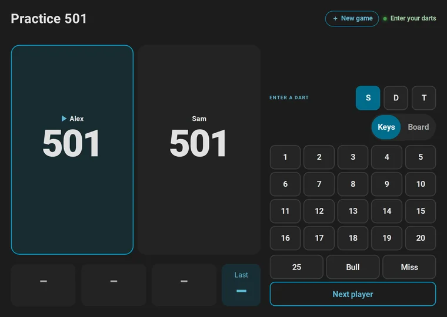
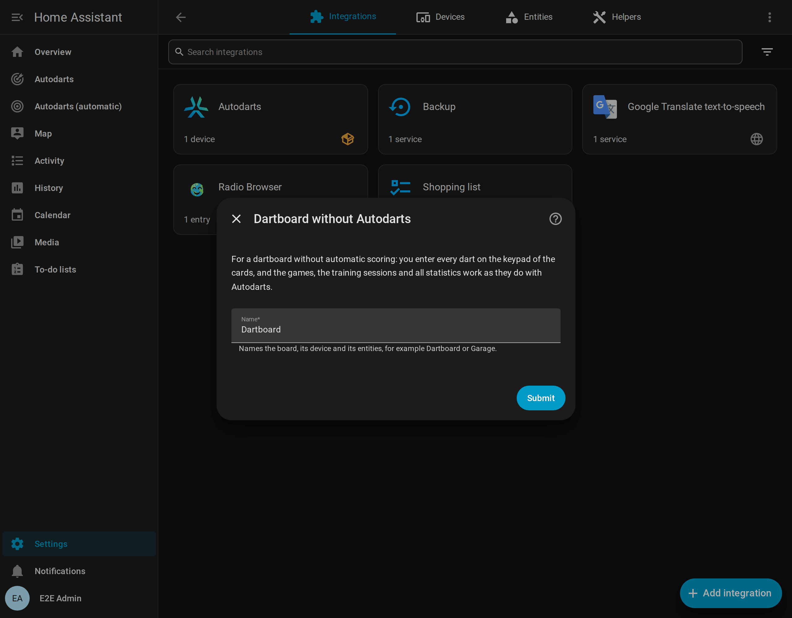
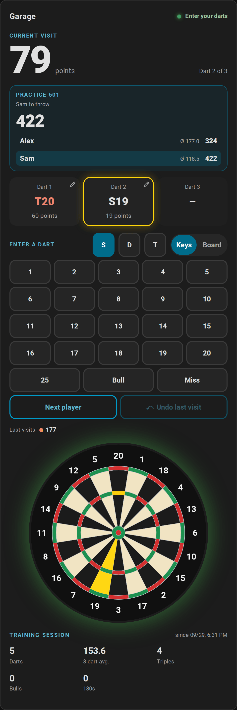

# Play without Autodarts

[← Documentation](README.md) · [Deutsch](without-autodarts.de.md)

No Autodarts at your board? The integration works for any steel dartboard: you enter every dart yourself on a keypad, on a tablet next to the board or on your phone, and you get every game, the training sessions and all statistics, just as with automatic scoring.

**On this page:** [Who it is for](#who-it-is-for) · [Set up](#set-up) · [Enter your darts](#enter-your-darts) · [What works](#what-works) · [What is different](#what-is-different) · [Several boards](#several-boards)

## Who it is for

- **A dartboard without cameras.** Play X01 with a scoreboard and a checkout route, Cricket on a chalkboard, party games for up to eight and tournaments, and follow your averages, without buying automatic scoring.
- **A second board,** for example in the garage or at a friend's, next to an Autodarts board in the living room. Each board keeps statistics of its own.
- **Trying it out** before an Autodarts system arrives. Nothing of it needs an account or the internet.

## Set up

Install the integration first: steps 1 to 3 of [From zero to the scoreboard](getting-started.md) show how, with Home Assistant and HACS.

1. Select the button above, or open **Settings → Devices & services → Add integration → Autodarts**.
2. Choose **Dartboard without Autodarts: enter every dart yourself**.
3. Give the board a name, such as *Garage*, and select **Submit**. The integration creates a device with this name and the entities of the games, the training and the statistics.
4. Create the dashboard: **Settings → Dashboards → Add dashboard → Autodarts**. Its *Live* and *Scoreboard* views have the keypad.

## Enter your darts

On a dartboard without Autodarts, the live card and the scoreboard show the keypad below the visit, without any option to switch on:

- **A dart:** tap **S**, **D** or **T**, then the number. **25**, **Bull** and **Miss** have keys of their own. Every dart starts as a single again.
- **Where it is:** **Board** at the top of the keypad shows the board instead of the keys. Tap where the dart is, and the bed follows from the spot. Darts entered this way also count for the [dart positions and their grouping](statistics.md#heatmap-and-dart-positions). On a phone, a finger aims with a loupe and two fingers zoom, as when [correcting a dart](scoreboard.md#correct-and-enter-darts).
- **The visit:** after the third dart the status says *Visit complete*. **Next player** ends the visit; it takes a second tap, so a stray tap never passes the turn. Without a dart, it passes, which counts as a visit of three misses.
- **A mistake:** tap a dart of the visit to put it into another bed. While no dart of the next visit is in, the curved arrow of **Undo** takes the last visit back, with the game as it was.

The [actions](entities.md#enter-a-dart-autodartsthrow_dart) `autodarts.throw_dart`, `autodarts.next_player` and `autodarts.undo_visit` do the same from an automation, a script or a button of your own; with several boards, name the board's `config_entry_id`.

## What works

Everything the integration does with darts, because it never needed the cameras for it:

- **Every game:** X01 from 101 to 1001 with legs, sets, double in and out, the checkout route and setup hints, the bull-off, teams and handicaps; the four Cricket games; the six party games for up to eight; the eight training games; the [bot](games.md#playing-against-the-bot) and [tournaments](games.md#tournaments).
- **Every statistic:** training sessions, personal bests, the daily goal and the streak, player profiles with their badges, achievements, trends, doubles, the leaderboard, the weekly report, the training calendar and the export. Darts entered by hand count for all of them like detected ones.
- **The screen at the board:** the [scoreboard](scoreboard.md) with the new game screen, the caller, celebrations and idle mode.
- **Automations:** the board events, such as `visit_completed` or `leg_won`, come as with a board, with `manual: true` and the source `manual`, so the light show, the callers and the reports [blueprints](automations.md#blueprints) work as they are.

## What is different

| | With Autodarts | Without Autodarts |
| --- | --- | --- |
| Darts | Detected by the cameras, corrected with a tap | Entered on the keypad |
| Status | Ready, takeout, detection stopped and more | *Enter your darts* and *Visit complete*; the sensor *Detection status* reads *Entered by hand* |
| Keypad | An option, while *Practice manual entry* is on | Always there, unless a card's `keypad: false` hides it |
| Darts of the visit | Darts entered by hand get a dashed frame | No frame, because every dart is entered by hand; corrections keep their pencil |
| Entities | Games, training and statistics, plus detection, connection, motion, cameras, board settings and the board PC | Games, training and statistics |
| Automatic dashboard | Views *Live*, *Scoreboard*, *Training*, *Players*, *Game settings* and *Board* | No *Board* view: there is no detection, camera or board PC |
| Board status card | Detection, connections, board PC, cameras and maintenance | A note that the board has none of them |
| Dart positions | For every detected dart | For darts entered on the keypad's board |
| Detection quality, calibration, online matches | Yes | No |

A screen that only shows the scoreboard, such as a TV without touch, hides the keypad with the card's option `keypad: false`; see the [card guide](cards.md#correcting-and-entering-darts).

## Several boards

Each dartboard without Autodarts is an entry and a device of its own, with its own entities, games and statistics, and so is each Autodarts board beside them. The automatic dashboard gives every board its views. The actions of the integration then need the board's `config_entry_id`, as with several Autodarts boards.

To remove a board and its statistics, delete its entry in **Settings → Devices & services → Autodarts**.
